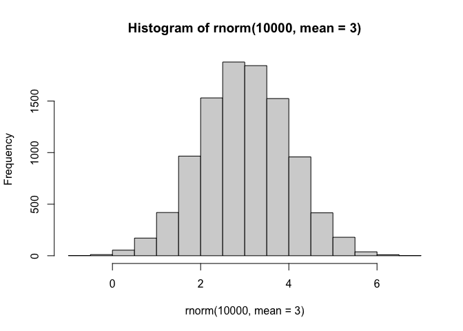
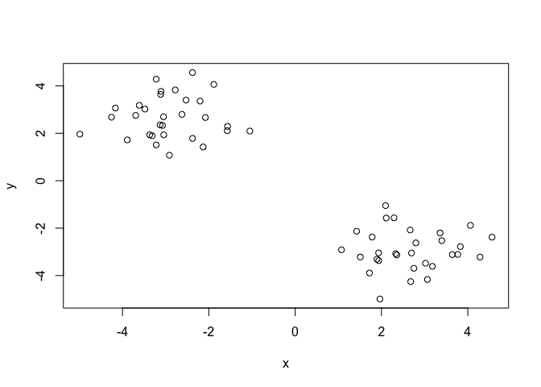
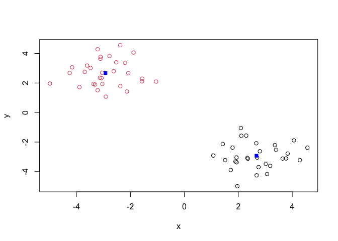
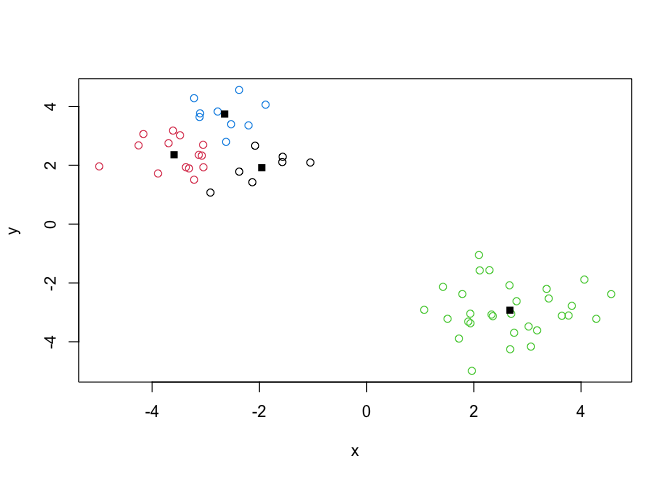
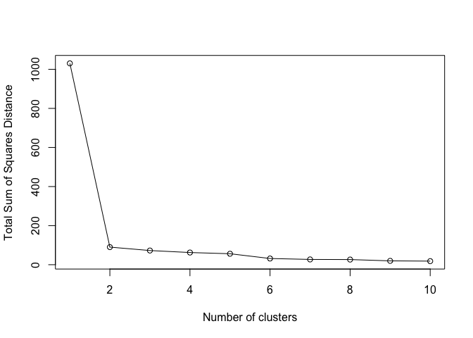
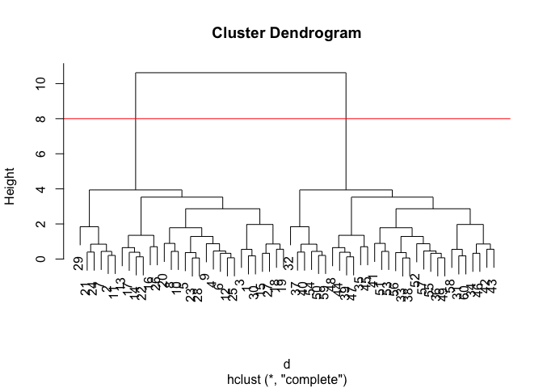
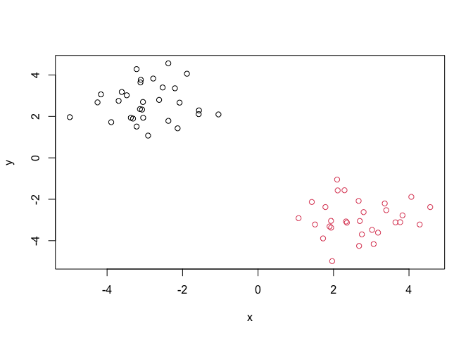
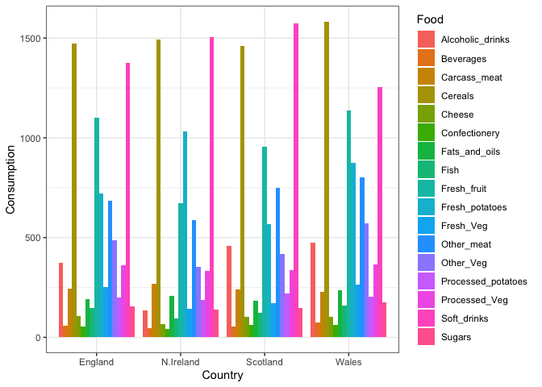

# Class 7: Machine Learning 1
Erin Jang (PID: A17713992)

- [Background](#background)
- [K-means clustering](#k-means-clustering)
- [Hierarchical Clustering](#hierarchical-clustering)
- [Principal Component Analysis
  (PCA)](#principal-component-analysis-pca)
  - [Analysis of UK food data](#analysis-of-uk-food-data)
- [Data Import](#data-import)
- [Tidy the data](#tidy-the-data)
- [Exploratory analysis](#exploratory-analysis)
- [PCA to the rescue](#pca-to-the-rescue)

## Background

Today we will explore some core machine learning methods that are very
popular in bioinformatics. These include **clustering** and
**dimensionallity reduction**.

## K-means clustering

The main function in “base” R for K-means clusterin is called
`kmeans()`.

Before we go too deep let’s make up some “simple” data that we can
cluster and know if we are getting a good answer or not. To do this we
can use the `rnorm()` function:

``` r
hist( rnorm(10000, mean = 3) )
```



``` r
rnorm(30, -3)
```

     [1] -1.4544632 -2.9955998 -3.2742822 -0.6517099 -3.5773743 -3.4881618
     [7] -2.1487235 -3.8717344 -5.4329613 -3.9409693 -3.9752888 -4.0064391
    [13] -3.1688413 -3.0509979 -3.4256988 -3.5866838 -2.5657855 -1.5894374
    [19] -1.7453780 -0.5113478 -2.6665733 -2.6450419 -4.5248353 -5.4073077
    [25] -2.8270360 -3.6266812 -3.3628541 -2.7713235 -4.9560185 -3.4265130

``` r
rnorm(30, +3)
```

     [1] 2.404681 2.302713 4.887535 2.272818 3.385297 1.717213 2.652087 2.710826
     [9] 3.735980 3.969147 3.326852 3.289926 3.027821 4.575226 2.620139 4.210518
    [17] 3.033211 2.697987 2.553365 3.242144 1.045994 1.990569 3.852803 4.928533
    [25] 2.885208 2.183694 2.816414 3.381893 3.923687 1.971513

``` r
x <- c( rnorm(30, -3), rnorm(30, +3) )
x
```

     [1] -1.572598 -3.610710 -1.048876 -3.217534 -3.049250 -3.043772 -3.694009
     [8] -2.375788 -3.890131 -2.131079 -3.479348 -3.312830 -3.218189 -3.106758
    [15] -2.202184 -1.883946 -2.777478 -2.079511 -2.621332 -2.913114 -4.253137
    [22] -3.115685 -3.072815 -4.162999 -3.370378 -2.377836 -2.527295 -3.129488
    [29] -4.987354 -1.565257  2.291050  1.963760  2.354180  3.397233  4.562138
    [36]  1.936657  3.064351  2.329968  3.642113  2.677669  1.074076  2.797445
    [43]  2.665529  3.828262  4.061769  3.357493  3.767000  4.283694  1.895598
    [50]  3.021174  1.424874  1.722742  1.785305  2.751653  1.933984  2.696608
    [57]  1.510033  2.095265  3.179777  2.110256

``` r
rev(x)
```

     [1]  2.110256  3.179777  2.095265  1.510033  2.696608  1.933984  2.751653
     [8]  1.785305  1.722742  1.424874  3.021174  1.895598  4.283694  3.767000
    [15]  3.357493  4.061769  3.828262  2.665529  2.797445  1.074076  2.677669
    [22]  3.642113  2.329968  3.064351  1.936657  4.562138  3.397233  2.354180
    [29]  1.963760  2.291050 -1.565257 -4.987354 -3.129488 -2.527295 -2.377836
    [36] -3.370378 -4.162999 -3.072815 -3.115685 -4.253137 -2.913114 -2.621332
    [43] -2.079511 -2.777478 -1.883946 -2.202184 -3.106758 -3.218189 -3.312830
    [50] -3.479348 -2.131079 -3.890131 -2.375788 -3.694009 -3.043772 -3.049250
    [57] -3.217534 -1.048876 -3.610710 -1.572598

``` r
z <- cbind(x=x, y=rev(x))
plot(z)
```



``` r
p <- 1:5
rbind(p, p)
```

      [,1] [,2] [,3] [,4] [,5]
    p    1    2    3    4    5
    p    1    2    3    4    5

Now we can run `kmeans()` on this input `z` and see what the results
look like.

``` r
km <- kmeans(z, centers = 2)
km 
```

    K-means clustering with 2 clusters of sizes 30, 30

    Cluster means:
              x         y
    1  2.672722 -2.926356
    2 -2.926356  2.672722

    Clustering vector:
     [1] 2 2 2 2 2 2 2 2 2 2 2 2 2 2 2 2 2 2 2 2 2 2 2 2 2 2 2 2 2 2 1 1 1 1 1 1 1 1
    [39] 1 1 1 1 1 1 1 1 1 1 1 1 1 1 1 1 1 1 1 1 1 1

    Within cluster sum of squares by cluster:
    [1] 45.03387 45.03387
     (between_SS / total_SS =  91.3 %)

    Available components:

    [1] "cluster"      "centers"      "totss"        "withinss"     "tot.withinss"
    [6] "betweenss"    "size"         "iter"         "ifault"      

``` r
attributes(km)
```

    $names
    [1] "cluster"      "centers"      "totss"        "withinss"     "tot.withinss"
    [6] "betweenss"    "size"         "iter"         "ifault"      

    $class
    [1] "kmeans"

> Q. How many points are in each cluster?

``` r
km$size 
```

    [1] 30 30

> Q. What “component of your result object details cluster
> assigment/membership?

``` r
km$cluster
```

     [1] 2 2 2 2 2 2 2 2 2 2 2 2 2 2 2 2 2 2 2 2 2 2 2 2 2 2 2 2 2 2 1 1 1 1 1 1 1 1
    [39] 1 1 1 1 1 1 1 1 1 1 1 1 1 1 1 1 1 1 1 1 1 1

> Q. What “component of your result object details cluster center?

``` r
km$centers
```

              x         y
    1  2.672722 -2.926356
    2 -2.926356  2.672722

> Q. Plot `z` colored by the kmeans cluster assignment and add cluster
> centers as blue points.

``` r
plot(z, col = km$cluster)
points(km$centers, col = "blue", pch = 15)
```



> Q. Run a K-means clustering and plot the results asking for 4
> clusters?

``` r
km4 <- kmeans(z, centers = 4)
plot(z, col = km4$cluster)
points(km4$centers, col = "black", pch = 15)
```



> **N.B.** You need to tell K-means the number of clusters (i.e. set
> `centers=2`)!!

One approach is to try different values for `centers` and then pick the
best…

``` r
ans <- NULL
for(i in 1:10) {
  km <- kmeans(z, centers = i)
  ans <- c(ans, km$tot.withinss)
}

plot(ans, type = "o", xlab = "Number of clusters", ylab = "Total Sum of Squares Distance")
```



## Hierarchical Clustering

The main function in “base” R for Hierarchical Clustering is called
`hclust()`

This function does not take your “raw” data for clustering. You must
first build a “distance matrix” from your data and pass this as input to
`hclust()`

``` r
d <- dist(z)
hc <- hclust(d)
hc
```


    Call:
    hclust(d = d)

    Cluster method   : complete 
    Distance         : euclidean 
    Number of objects: 60 

There is a bespoke `plot()` method for `hclust()` result objects.

``` r
plot(hc)
abline(h = 8, col = "red")
```



Once we hav eour `hclust()` object (our “tree” of “cluster dendrogram”)
we can *“cut”* the tree to reveal the clustering pattern.

``` r
cutree(hc, h = 8)
```

     [1] 1 1 1 1 1 1 1 1 1 1 1 1 1 1 1 1 1 1 1 1 1 1 1 1 1 1 1 1 1 1 2 2 2 2 2 2 2 2
    [39] 2 2 2 2 2 2 2 2 2 2 2 2 2 2 2 2 2 2 2 2 2 2

``` r
cutree(hc, k = 4)
```

     [1] 1 2 1 1 1 1 2 1 1 1 2 1 1 1 1 1 1 1 1 1 2 1 1 2 1 1 1 1 2 1 3 4 3 3 3 3 4 3
    [39] 3 4 3 3 3 3 3 3 3 3 3 4 3 3 3 4 3 3 3 3 4 3

> Q. Make a plot of `z` with your hclust results (i.e. colored by
> cluster membership)

``` r
grps <- cutree(hc, k = 2)
plot(z, col = grps)
```



## Principal Component Analysis (PCA)

PCA is a dimensionality reduction method that is popular for revealing
patterns in complex datasets.

### Analysis of UK food data

Let’s look at some data on the eating habits of folks from the UK to see
if there are patterns and trends that have some regions being distinct
from others.

## Data Import

The data is made available in CSV format so we can use the `read.csv()`
function for import to R:

``` r
url <- "https://tinyurl.com/UK-foods"
x <- read.csv(url)
x
```

                         X England Wales Scotland N.Ireland
    1               Cheese     105   103      103        66
    2        Carcass_meat      245   227      242       267
    3          Other_meat      685   803      750       586
    4                 Fish     147   160      122        93
    5       Fats_and_oils      193   235      184       209
    6               Sugars     156   175      147       139
    7      Fresh_potatoes      720   874      566      1033
    8           Fresh_Veg      253   265      171       143
    9           Other_Veg      488   570      418       355
    10 Processed_potatoes      198   203      220       187
    11      Processed_Veg      360   365      337       334
    12        Fresh_fruit     1102  1137      957       674
    13            Cereals     1472  1582     1462      1494
    14           Beverages      57    73       53        47
    15        Soft_drinks     1374  1256     1572      1506
    16   Alcoholic_drinks      375   475      458       135
    17      Confectionery       54    64       62        41

## Tidy the data

Fix anything that went wrong with data import.

> Q1. How many rows and columns are in your new data frame named x? What
> R functions could you use to answer this questions?

``` r
dim(x)
```

    [1] 17  5

``` r
head(x) 
```

                   X England Wales Scotland N.Ireland
    1         Cheese     105   103      103        66
    2  Carcass_meat      245   227      242       267
    3    Other_meat      685   803      750       586
    4           Fish     147   160      122        93
    5 Fats_and_oils      193   235      184       209
    6         Sugars     156   175      147       139

``` r
rownames(x) <- x[,1]
x <- x[,-1]
head(x)
```

                   England Wales Scotland N.Ireland
    Cheese             105   103      103        66
    Carcass_meat       245   227      242       267
    Other_meat         685   803      750       586
    Fish               147   160      122        93
    Fats_and_oils      193   235      184       209
    Sugars             156   175      147       139

``` r
dim(x)
```

    [1] 17  4

``` r
x <- read.csv(url, row.names=1)
head(x)
```

                   England Wales Scotland N.Ireland
    Cheese             105   103      103        66
    Carcass_meat       245   227      242       267
    Other_meat         685   803      750       586
    Fish               147   160      122        93
    Fats_and_oils      193   235      184       209
    Sugars             156   175      147       139

> Q2. Which approach to solving the ‘row-names problem’ mentioned above
> do you prefer and why? Is one approach more robust than another under
> certain circumstances?

The approach of setting the row.names() argument is better. The other
approach using x \<- x\[,-1\] causes the data frame to be cut down every
time the command is run. When dealing with especially large dataframes,
it will be much more efficient to set the row.names() argument.

## Exploratory analysis

Make some plots to help make sense of obvious trends…

``` r
barplot(as.matrix(x), beside=T, col=rainbow(nrow(x)))
```


> Q3: Changing what optional argument in the above barplot() function
> results in the following plot?

Changing the “beside” argument results in the following plot.

``` r
barplot(as.matrix(x), beside=FALSE, col=rainbow(nrow(x)))
```


``` r
library(tidyr)

# Convert data to long format for ggplot with `pivot_longer()`
x_long <- x |> 
          tibble::rownames_to_column("Food") |> 
          pivot_longer(cols = -Food, 
                       names_to = "Country", 
                       values_to = "Consumption")

dim(x_long)
```

    [1] 68  3

``` r
head(x_long)
```

    # A tibble: 6 × 3
      Food            Country   Consumption
      <chr>           <chr>           <int>
    1 "Cheese"        England           105
    2 "Cheese"        Wales             103
    3 "Cheese"        Scotland          103
    4 "Cheese"        N.Ireland          66
    5 "Carcass_meat " England           245
    6 "Carcass_meat " Wales             227

``` r
library(ggplot2)
ggplot(x_long) +
  aes(x = Country, y = Consumption, fill = Food) +
  geom_col(position = "dodge") +
  theme_bw()
```



> Q4: Changing what optional argument in the above ggplot() code results
> in a stacked barplot figure?

Changing the geom_col() function’s from position = “dodge” to position =
“stack” results in a stacked barplot figure.

``` r
ggplot(x_long) +
  aes(x = Country, y = Consumption, fill = Food) +
  geom_col(position = "stack") +
  theme_bw()
```


> Q5: We can use the pairs() function to generate all pairwise plots for
> our countries. Can you make sense of the following code and resulting
> figure? What does it mean if a given point lies on the diagonal for a
> given plot?

``` r
pairs(x, col=rainbow(nrow(x)), pch=16)
```


The orientation of country name determines the x and y values. For
example, the plots in the top row have England as the y-axis and the
x-axis is Wales, Scotland, and N. Ireland, respectively. If a given
point lies on the diagonal, it indicates a perfect correlation between
the two variables.

``` r
library(pheatmap)

pheatmap( as.matrix(x) )
```


> Q6. Based on the pairs and heatmap figures, which countries cluster
> together and what does this suggest about their food consumption
> patterns? Can you easily tell what the main differences between N.
> Ireland and the other countries of the UK in terms of this data-set?

Based on the figures, England and Wales seem to cluster together,
suggesting that they have similar food consumption patterns,
particularly in having less consumption of specific meats. The heatmap
shows that the main differences between N. Ireland and the other
countries are lower alcoholic consumption, lower fresh fruit, and more
“other meat”.

> **Key-point**: Even relatively small datasets can prove challenging to
> interpret.

## PCA to the rescue

The main function in “base” R for PCA is called `prcomp()`. This
function wants the “observations” to be rows and the “variables” to be
columns.

So here we need to take the transpose of our `x` input object.

``` r
pca <- prcomp(t(x))
summary(pca)
```

    Importance of components:
                                PC1      PC2      PC3       PC4
    Standard deviation     324.1502 212.7478 73.87622 3.176e-14
    Proportion of Variance   0.6744   0.2905  0.03503 0.000e+00
    Cumulative Proportion    0.6744   0.9650  1.00000 1.000e+00

The returned `pca` object has commponents that we can use to make our
main result figures:

``` r
attributes(pca)
```

    $names
    [1] "sdev"     "rotation" "center"   "scale"    "x"       

    $class
    [1] "prcomp"

The main result figure from this analysis is called a **“PC score
plot”** (a.k.a. an “ordination plot”, “PC plot” or simply “PC1 vs PC2
plot”).

This plot shows how samples (n this case countries) relate to each
other.

``` r
library(ggplot2)

ggplot(pca$x) +
  aes(PC1, PC2) +
  geom_point()
```


``` r
mycols <- c("orange", "red", "blue", "darkgreen")

ggplot(pca$x) +
  aes(PC1, PC2) +
  geom_point(col = mycols)
```


``` r
pca$x
```

                     PC1         PC2        PC3           PC4
    England   -144.99315   -2.532999 105.768945 -4.894696e-14
    Wales     -240.52915 -224.646925 -56.475555  5.700024e-13
    Scotland   -91.86934  286.081786 -44.415495 -7.460785e-13
    N.Ireland  477.39164  -58.901862  -4.877895  2.321303e-13

``` r
ggplot(pca$x) +
  aes(PC1, PC2, label=row.names(pca$x)) +
  geom_point(col = mycols) +
  geom_text(size = 3, vjust = 2, col = mycols)
```


``` r
ggplot(pca$rotation) +
  aes(PC1, row.names(pca$rotation)) +
  geom_col()
```


Note: In PCA, score plots and loading plots focus on providing more
in-depth visualizations. Score plots focus on the observations, or the
samples, while loading plots focus on the variables.
