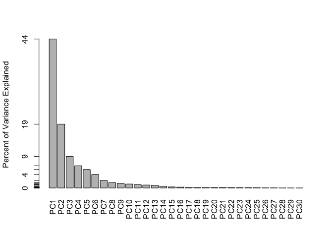
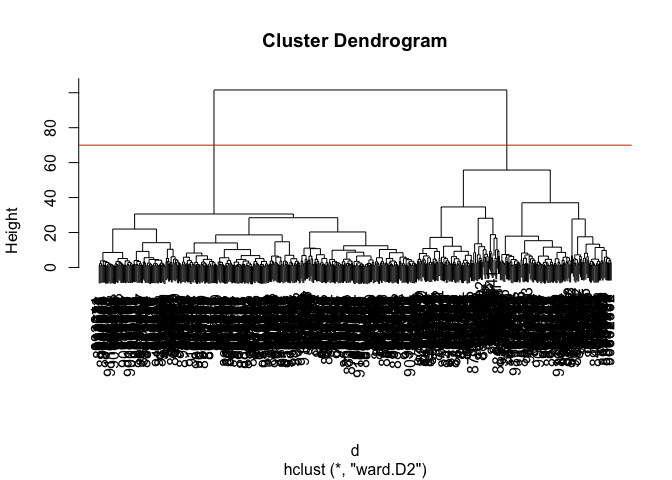
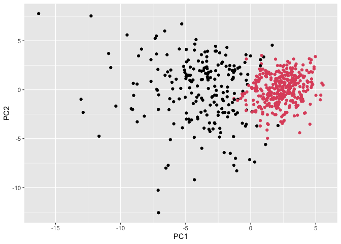

# Class 08: Breast Cancer Mini Project
Erin Jang (PID: A17713992)

- [Background](#background)
- [Data Import](#data-import)
- [Exploratory data analysis](#exploratory-data-analysis)
- [Principal Component Analysis
  (PCA)](#principal-component-analysis-pca)
  - [Variance explained](#variance-explained)
  - [Communicating PCA results](#communicating-pca-results)
- [Hierarchical clustering](#hierarchical-clustering)
- [Combining methods](#combining-methods)
- [Prediction](#prediction)
- [About this document](#about-this-document)

## Background

The goal of this mini-project is for you to explore a complete analysis
using the unsupervised learning techniques covered in class.

Today we will analyze a data-set from fine needle aspiration (FNA) of a
breast mass.

## Data Import

The data is made available as a CSV file for download. We can read this
in using `read.csv()`:

``` r
wisc.df <- read.csv("WisconsinCancer.csv", row.names = 1)
```

``` r
head(wisc.df, 3)
```

             diagnosis radius_mean texture_mean perimeter_mean area_mean
    842302           M       17.99        10.38          122.8      1001
    842517           M       20.57        17.77          132.9      1326
    84300903         M       19.69        21.25          130.0      1203
             smoothness_mean compactness_mean concavity_mean concave.points_mean
    842302           0.11840          0.27760         0.3001             0.14710
    842517           0.08474          0.07864         0.0869             0.07017
    84300903         0.10960          0.15990         0.1974             0.12790
             symmetry_mean fractal_dimension_mean radius_se texture_se perimeter_se
    842302          0.2419                0.07871    1.0950     0.9053        8.589
    842517          0.1812                0.05667    0.5435     0.7339        3.398
    84300903        0.2069                0.05999    0.7456     0.7869        4.585
             area_se smoothness_se compactness_se concavity_se concave.points_se
    842302    153.40      0.006399        0.04904      0.05373           0.01587
    842517     74.08      0.005225        0.01308      0.01860           0.01340
    84300903   94.03      0.006150        0.04006      0.03832           0.02058
             symmetry_se fractal_dimension_se radius_worst texture_worst
    842302       0.03003             0.006193        25.38         17.33
    842517       0.01389             0.003532        24.99         23.41
    84300903     0.02250             0.004571        23.57         25.53
             perimeter_worst area_worst smoothness_worst compactness_worst
    842302             184.6       2019           0.1622            0.6656
    842517             158.8       1956           0.1238            0.1866
    84300903           152.5       1709           0.1444            0.4245
             concavity_worst concave.points_worst symmetry_worst
    842302            0.7119               0.2654         0.4601
    842517            0.2416               0.1860         0.2750
    84300903          0.4504               0.2430         0.3613
             fractal_dimension_worst
    842302                   0.11890
    842517                   0.08902
    84300903                 0.08758

Make sure we remove or exclude the `diagnosis` column from the data-set
that we use for further analysis - this is the expert diagnosis as
either M or B.

``` r
# We can use -1 here to remove the first column
wisc.data <- wisc.df[,-1]
diagnosis <- as.factor( wisc.df$diagnosis ) 
```

## Exploratory data analysis

> Q1. How many observations are in this dataset?

``` r
nrow(wisc.data)
```

    [1] 569

There are 569 observations.

> Q2. How many of the observations have a malignant diagnosis?

``` r
table(wisc.df$diagnosis)
```


      B   M 
    357 212 

212 observations have a malignant diagnosis.

> Q3. How many variables/features in the data are suffixed with \_mean?

We can use the `grep()` function to help us here:

``` r
colnames(wisc.data)
```

     [1] "radius_mean"             "texture_mean"           
     [3] "perimeter_mean"          "area_mean"              
     [5] "smoothness_mean"         "compactness_mean"       
     [7] "concavity_mean"          "concave.points_mean"    
     [9] "symmetry_mean"           "fractal_dimension_mean" 
    [11] "radius_se"               "texture_se"             
    [13] "perimeter_se"            "area_se"                
    [15] "smoothness_se"           "compactness_se"         
    [17] "concavity_se"            "concave.points_se"      
    [19] "symmetry_se"             "fractal_dimension_se"   
    [21] "radius_worst"            "texture_worst"          
    [23] "perimeter_worst"         "area_worst"             
    [25] "smoothness_worst"        "compactness_worst"      
    [27] "concavity_worst"         "concave.points_worst"   
    [29] "symmetry_worst"          "fractal_dimension_worst"

``` r
length(grep("_mean", colnames(wisc.data), value = TRUE))
```

    [1] 10

There are 10 variables in the data suffixed with \_mean.

## Principal Component Analysis (PCA)

We need to scale our data before PCA with the `scale-TRUE` argument to
`prcomp()`.

``` r
wisc.pr <- prcomp(wisc.data, scale = TRUE)
summary(wisc.pr)
```

    Importance of components:
                              PC1    PC2     PC3     PC4     PC5     PC6     PC7
    Standard deviation     3.6444 2.3857 1.67867 1.40735 1.28403 1.09880 0.82172
    Proportion of Variance 0.4427 0.1897 0.09393 0.06602 0.05496 0.04025 0.02251
    Cumulative Proportion  0.4427 0.6324 0.72636 0.79239 0.84734 0.88759 0.91010
                               PC8    PC9    PC10   PC11    PC12    PC13    PC14
    Standard deviation     0.69037 0.6457 0.59219 0.5421 0.51104 0.49128 0.39624
    Proportion of Variance 0.01589 0.0139 0.01169 0.0098 0.00871 0.00805 0.00523
    Cumulative Proportion  0.92598 0.9399 0.95157 0.9614 0.97007 0.97812 0.98335
                              PC15    PC16    PC17    PC18    PC19    PC20   PC21
    Standard deviation     0.30681 0.28260 0.24372 0.22939 0.22244 0.17652 0.1731
    Proportion of Variance 0.00314 0.00266 0.00198 0.00175 0.00165 0.00104 0.0010
    Cumulative Proportion  0.98649 0.98915 0.99113 0.99288 0.99453 0.99557 0.9966
                              PC22    PC23   PC24    PC25    PC26    PC27    PC28
    Standard deviation     0.16565 0.15602 0.1344 0.12442 0.09043 0.08307 0.03987
    Proportion of Variance 0.00091 0.00081 0.0006 0.00052 0.00027 0.00023 0.00005
    Cumulative Proportion  0.99749 0.99830 0.9989 0.99942 0.99969 0.99992 0.99997
                              PC29    PC30
    Standard deviation     0.02736 0.01153
    Proportion of Variance 0.00002 0.00000
    Cumulative Proportion  1.00000 1.00000

> Q4. From your results, what proportion of the original variance is
> captured by the first principal component (PC1)?

44.27% is captured by the first principal component.

> Q5. How many principal components (PCs) are required to describe at
> least 70% of the original variance in the data?

The first three principal components are required to describe at least
70% of the original variance in the data.

> Q6. How many principal components (PCs) are required to describe at
> least 90% of the original variance in the data?

The first seven principal components are required to describe at least
90% of the original variance in the data.

``` r
biplot(wisc.pr)
```


> Q7. What stands out to you about this plot? Is it easy or difficult to
> understand? Why?

This plot is incredibly difficult to understand as conclusions cannot be
made from the plot with everything crowded together.

``` r
library(ggplot2)

ggplot(wisc.pr$x) +
  aes(PC1, PC2, col=diagnosis) +
  geom_point()
```


> Q8. Generate a similar plot for principal components 1 and 3. What do
> you notice about these plots?

``` r
ggplot(wisc.pr$x) +
  aes(PC1, PC3, col=diagnosis) +
  geom_point()
```


For both plots, the malignant observations are towards the left of the
graph whereas the benign are assembled towards the right. This presents
a separation between the benign and malignant samples.

### Variance explained

``` r
pr.var <- wisc.pr$sdev^2
head(pr.var)
```

    [1] 13.281608  5.691355  2.817949  1.980640  1.648731  1.207357

``` r
# Variance explained by each principal component: pve
pve <- pr.var / sum(pr.var)

# Plot variance explained for each principal component
plot(c(1,pve), xlab = "Principal Component", 
     ylab = "Proportion of Variance Explained", 
     ylim = c(0, 1), type = "o")
```


``` r
# Alternative scree plot of the same data, note data driven y-axis
barplot(pve, ylab = "Percent of Variance Explained",
     names.arg=paste0("PC",1:length(pve)), las=2, axes = FALSE)
axis(2, at=pve, labels=round(pve,2)*100 )
```



``` r
## ggplot based graph
#install.packages("factoextra")
library(factoextra)
```

    Welcome to factoextra!

    Want to learn more? See two factoextra-related books at https://www.datanovia.com/en/product/practical-guide-to-principal-component-methods-in-r/

``` r
fviz_eig(wisc.pr, addlabels = TRUE)
```


### Communicating PCA results

> Q9. For the first principal component, what is the component of the
> loading vector (i.e. wisc.pr\$rotation\[,1\]) for the feature
> concave.points_mean? This tells us how much this original feature
> contributes to the first PC. Are there any features with larger
> contributions than this one?

``` r
wisc.pr$rotation["concave.points_mean", 1]
```

    [1] -0.2608538

The loading of concave.points_mean on PC1 is −0.2609, which indicates a
strong contribution to the first principal component. There are other
features with larger contributions, such as radius_mean.

## Hierarchical clustering

``` r
# Scale the wisc.data data using the "scale()" function
# Next, calculate the (Euclidean) distances between all pairs of observations in the new scaled dataset and assign the result to data.dist.
wisc.hclust <- hclust(dist(scale(wisc.data)))
plot(wisc.hclust)
```


> Q10. Using the plot() and abline() functions, what is the height at
> which the clustering model has 4 clusters?

``` r
plot(wisc.hclust)
abline(h = 19, col = "red", lty = 2)
```


``` r
wisc.hclust.clusters <- cutree(wisc.hclust, k = 4)
table(wisc.hclust.clusters, diagnosis)
```

                        diagnosis
    wisc.hclust.clusters   B   M
                       1  12 165
                       2   2   5
                       3 343  40
                       4   0   2

> Q12. Which method gives your favorite results for the same data.dist
> dataset? Explain your reasoning.

The ward.D2 method gives the best results for this dataset. It produces
more clearly separated clusters compared to methods like “single”,
“complete”, and “average”. Because ward.D2 minimizes variance within
clusters, it forms spherical clusters, which aligns well with the
structure of this data and results in better separation of malignant and
benign samples.

## Combining methods

``` r
d <- dist(wisc.pr$x[,1:7])
wisc.pr.hclust <- hclust(d, method = "ward.D2")
plot(wisc.pr.hclust)
abline(h = 70, col = "red")
```



``` r
grps <- cutree(wisc.pr.hclust, k = 2)
table(grps)
```

    grps
      1   2 
    216 353 

How does this clustering `grps` correspond to the expert `diagnosis`?

``` r
table(grps, diagnosis)
```

        diagnosis
    grps   B   M
       1  28 188
       2 329  24

``` r
ggplot(wisc.pr$x) +
  aes(PC1, PC2) +
  geom_point(col=grps)
```



``` r
wisc.pr.hclust.clusters <- cutree(wisc.pr.hclust, k=2)
```

> Q13. How well does the newly created hclust model with two clusters
> separate out the two “M” and “B” diagnoses?

``` r
table(wisc.pr.hclust.clusters, diagnosis)
```

                           diagnosis
    wisc.pr.hclust.clusters   B   M
                          1  28 188
                          2 329  24

The newly created hclust model with two clusters separate out the two
diagnoses pretty well with only 52 miscalculations. This shows an
approximately 91% accuracy.

> Q14. How well do the hierarchical clustering models you created in the
> previous sections (i.e. without first doing PCA) do in terms of
> separating the diagnoses? Again, use the table() function to compare
> the output of each model (wisc.hclust.clusters and
> wisc.pr.hclust.clusters) with the vector containing the actual
> diagnoses.

``` r
table(wisc.hclust.clusters, diagnosis)
```

                        diagnosis
    wisc.hclust.clusters   B   M
                       1  12 165
                       2   2   5
                       3 343  40
                       4   0   2

The hierarchical clustering model without PCA performs worse at
separating malignant and benign samples. The clusters are more
fragmented and show greater mixing of diagnoses.

## Prediction

``` r
#url <- "new_samples.csv"
url <- "https://tinyurl.com/new-samples-CSV"
new <- read.csv(url)
npc <- predict(wisc.pr, newdata=new)
npc
```

               PC1       PC2        PC3        PC4       PC5        PC6        PC7
    [1,]  2.576616 -3.135913  1.3990492 -0.7631950  2.781648 -0.8150185 -0.3959098
    [2,] -4.754928 -3.009033 -0.1660946 -0.6052952 -1.140698 -1.2189945  0.8193031
                PC8       PC9       PC10      PC11      PC12      PC13     PC14
    [1,] -0.2307350 0.1029569 -0.9272861 0.3411457  0.375921 0.1610764 1.187882
    [2,] -0.3307423 0.5281896 -0.4855301 0.7173233 -1.185917 0.5893856 0.303029
              PC15       PC16        PC17        PC18        PC19       PC20
    [1,] 0.3216974 -0.1743616 -0.07875393 -0.11207028 -0.08802955 -0.2495216
    [2,] 0.1299153  0.1448061 -0.40509706  0.06565549  0.25591230 -0.4289500
               PC21       PC22       PC23       PC24        PC25         PC26
    [1,]  0.1228233 0.09358453 0.08347651  0.1223396  0.02124121  0.078884581
    [2,] -0.1224776 0.01732146 0.06316631 -0.2338618 -0.20755948 -0.009833238
                 PC27        PC28         PC29         PC30
    [1,]  0.220199544 -0.02946023 -0.015620933  0.005269029
    [2,] -0.001134152  0.09638361  0.002795349 -0.019015820

``` r
plot(wisc.pr$x[,1:2], col=grps)
points(npc[,1], npc[,2], col="blue", pch=16, cex=3)
text(npc[,1], npc[,2], c(1,2), col="white")
```


> Q16. Which of these new patients should we prioritize for follow up
> based on your results?

Patient 1 should be prioritized for follow up based on these results, as
their PCA projection is closer to the malignant cluster, while Patient 2
appears more consistent with benign samples.

## About this document

``` r
sessionInfo()
```

    R version 4.6.0 (2026-04-24)
    Platform: x86_64-apple-darwin20
    Running under: macOS Sequoia 15.4.1

    Matrix products: default
    BLAS:   /Library/Frameworks/R.framework/Versions/4.6-x86_64/Resources/lib/libRblas.0.dylib 
    LAPACK: /Library/Frameworks/R.framework/Versions/4.6-x86_64/Resources/lib/libRlapack.dylib;  LAPACK version 3.12.1

    locale:
    [1] en_US.UTF-8/en_US.UTF-8/en_US.UTF-8/C/en_US.UTF-8/en_US.UTF-8

    time zone: America/Los_Angeles
    tzcode source: internal

    attached base packages:
    [1] stats     graphics  grDevices utils     datasets  methods   base     

    other attached packages:
    [1] factoextra_2.0.0 ggplot2_4.0.3   

    loaded via a namespace (and not attached):
     [1] gtable_0.3.6       jsonlite_2.0.0     dplyr_1.2.1        compiler_4.6.0    
     [5] ggsignif_0.6.4     tidyselect_1.2.1   Rcpp_1.1.1-1.1     tidyr_1.3.2       
     [9] scales_1.4.0       yaml_2.3.12        fastmap_1.2.0      R6_2.6.1          
    [13] ggpubr_0.6.3       labeling_0.4.3     generics_0.1.4     Formula_1.2-5     
    [17] knitr_1.51         backports_1.5.1    ggrepel_0.9.8      tibble_3.3.1      
    [21] car_3.1-5          pillar_1.11.1      RColorBrewer_1.1-3 rlang_1.2.0       
    [25] broom_1.0.13       xfun_0.57          S7_0.2.2           otel_0.2.0        
    [29] cli_3.6.6          withr_3.0.2        magrittr_2.0.5     digest_0.6.39     
    [33] grid_4.6.0         rstudioapi_0.18.0  lifecycle_1.0.5    vctrs_0.7.3       
    [37] rstatix_0.7.3      evaluate_1.0.5     glue_1.8.1         farver_2.1.2      
    [41] abind_1.4-8        carData_3.0-6      rmarkdown_2.31     purrr_1.2.2       
    [45] tools_4.6.0        pkgconfig_2.0.3    htmltools_0.5.9   
