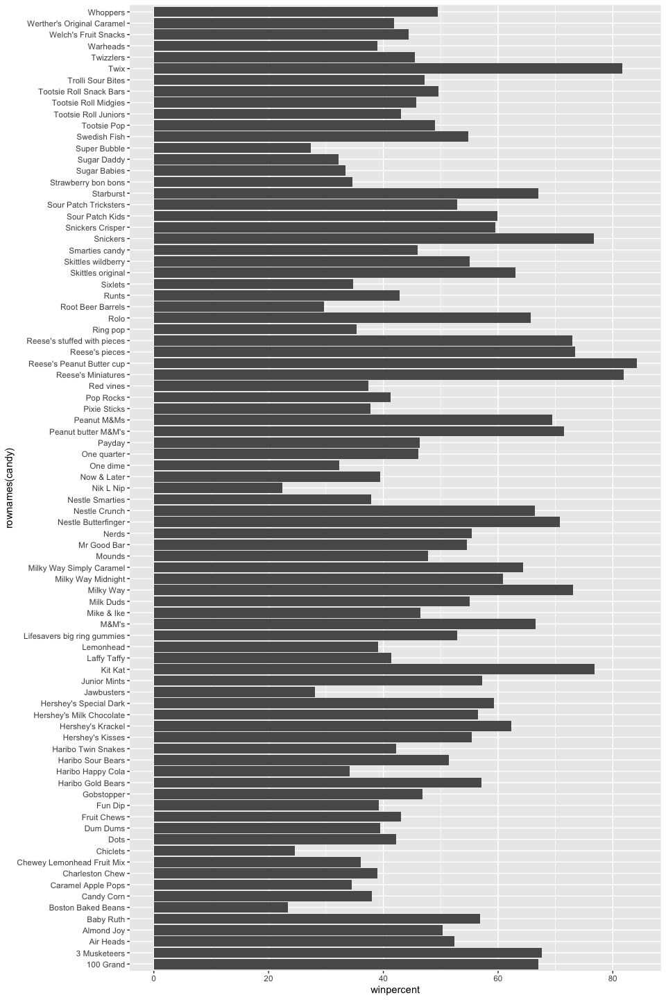
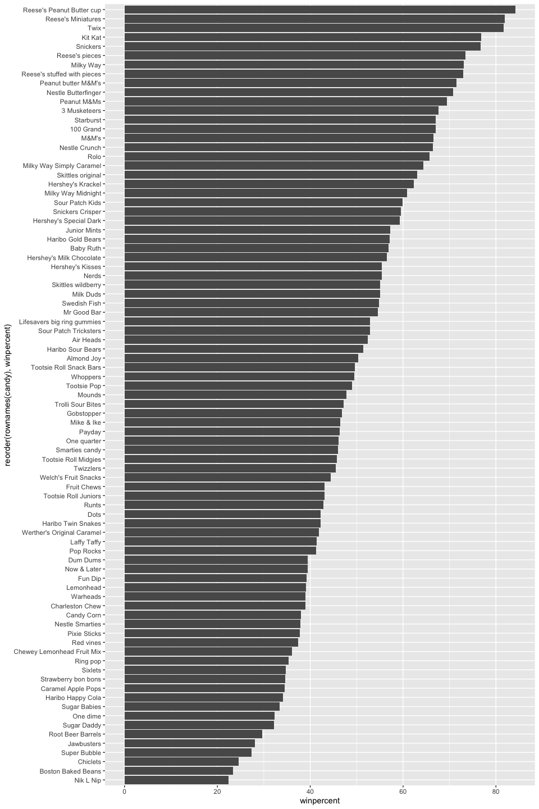
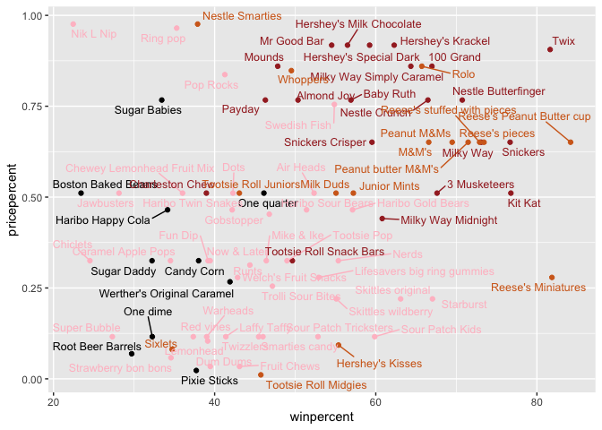
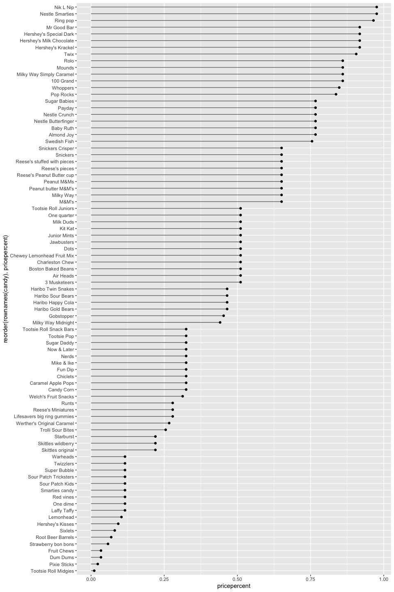
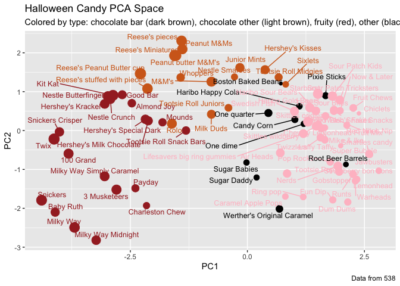

# Class 09: Candy Mini-Project
Erin Jang (PID: A17713992)

- [Background](#background)
- [Importing candy data](#importing-candy-data)
  - [What is in the dataset?](#what-is-in-the-dataset)
  - [What is your favorite candy?](#what-is-your-favorite-candy)
- [Exploratory analysis](#exploratory-analysis)
- [Overall candy rankings](#overall-candy-rankings)
  - [Time to add some useful color](#time-to-add-some-useful-color)
- [Taking a look at pricepercent](#taking-a-look-at-pricepercent)
  - [Optional](#optional)
- [Exploring the correlation
  structure](#exploring-the-correlation-structure)
- [Principal Component Analysis](#principal-component-analysis)
- [Summary](#summary)

## Background

In this mini-project, you will explore FiveThirtyEight’s Halloween Candy
dataset.

Today we are taking a detor to analyze a fun dataset (that we have more
intrinsic insight into) with the most useful analysis method we have
learned thus far - Principal Component Analysis (PCA).

## Importing candy data

The data is all related to halloween candy and is from the 538 website.

``` r
candy_file <- "candy-data.txt"

candy = read.csv(candy_file, row.names = 1)
head(candy)
```

                 chocolate fruity caramel peanutyalmondy nougat crispedricewafer
    100 Grand            1      0       1              0      0                1
    3 Musketeers         1      0       0              0      1                0
    One dime             0      0       0              0      0                0
    One quarter          0      0       0              0      0                0
    Air Heads            0      1       0              0      0                0
    Almond Joy           1      0       0              1      0                0
                 hard bar pluribus sugarpercent pricepercent winpercent
    100 Grand       0   1        0        0.732        0.860   66.97173
    3 Musketeers    0   1        0        0.604        0.511   67.60294
    One dime        0   0        0        0.011        0.116   32.26109
    One quarter     0   0        0        0.011        0.511   46.11650
    Air Heads       0   0        0        0.906        0.511   52.34146
    Almond Joy      0   1        0        0.465        0.767   50.34755

### What is in the dataset?

> Q1. How many different candy types are in this dataset?

``` r
nrow(candy)
```

    [1] 85

There are 85 different candy types.

> Q2. How many fruity candy types are in the dataset?

``` r
sum(candy$fruity)
```

    [1] 38

There are 38 fruity candy types.

### What is your favorite candy?

``` r
candy["Twix", ]$winpercent
```

    [1] 81.64291

> Q3. What is your favorite candy (other than Twix) in the dataset and
> what is it’s winpercent value?

``` r
candy["3 Musketeers", ]$winpercent
```

    [1] 67.60294

My favorite candy is 3 Musketeers and its winpercent value is 67.60294.

> Q4. What is the winpercent value for “Kit Kat”?

``` r
candy["Kit Kat", ]$winpercent
```

    [1] 76.7686

The winpercent value for Kit Kat is 76.7686.

> Q5. What is the winpercent value for “Tootsie Roll Snack Bars”?

``` r
candy["Tootsie Roll Snack Bars", ]$winpercent
```

    [1] 49.6535

The winpercent value for Tootsie Roll Snack Bars is 49.6535.

There is a useful `skim()` package.

``` r
# install.packages("skimr")
library("skimr")
skim(candy)
```

|                                                  |       |
|:-------------------------------------------------|:------|
| Name                                             | candy |
| Number of rows                                   | 85    |
| Number of columns                                | 12    |
| \_\_\_\_\_\_\_\_\_\_\_\_\_\_\_\_\_\_\_\_\_\_\_   |       |
| Column type frequency:                           |       |
| numeric                                          | 12    |
| \_\_\_\_\_\_\_\_\_\_\_\_\_\_\_\_\_\_\_\_\_\_\_\_ |       |
| Group variables                                  | None  |

Data summary

**Variable type: numeric**

| skim_variable | n_missing | complete_rate | mean | sd | p0 | p25 | p50 | p75 | p100 | hist |
|:---|---:|---:|---:|---:|---:|---:|---:|---:|---:|:---|
| chocolate | 0 | 1 | 0.44 | 0.50 | 0.00 | 0.00 | 0.00 | 1.00 | 1.00 | ▇▁▁▁▆ |
| fruity | 0 | 1 | 0.45 | 0.50 | 0.00 | 0.00 | 0.00 | 1.00 | 1.00 | ▇▁▁▁▆ |
| caramel | 0 | 1 | 0.16 | 0.37 | 0.00 | 0.00 | 0.00 | 0.00 | 1.00 | ▇▁▁▁▂ |
| peanutyalmondy | 0 | 1 | 0.16 | 0.37 | 0.00 | 0.00 | 0.00 | 0.00 | 1.00 | ▇▁▁▁▂ |
| nougat | 0 | 1 | 0.08 | 0.28 | 0.00 | 0.00 | 0.00 | 0.00 | 1.00 | ▇▁▁▁▁ |
| crispedricewafer | 0 | 1 | 0.08 | 0.28 | 0.00 | 0.00 | 0.00 | 0.00 | 1.00 | ▇▁▁▁▁ |
| hard | 0 | 1 | 0.18 | 0.38 | 0.00 | 0.00 | 0.00 | 0.00 | 1.00 | ▇▁▁▁▂ |
| bar | 0 | 1 | 0.25 | 0.43 | 0.00 | 0.00 | 0.00 | 0.00 | 1.00 | ▇▁▁▁▂ |
| pluribus | 0 | 1 | 0.52 | 0.50 | 0.00 | 0.00 | 1.00 | 1.00 | 1.00 | ▇▁▁▁▇ |
| sugarpercent | 0 | 1 | 0.48 | 0.28 | 0.01 | 0.22 | 0.47 | 0.73 | 0.99 | ▇▇▇▇▆ |
| pricepercent | 0 | 1 | 0.47 | 0.29 | 0.01 | 0.26 | 0.47 | 0.65 | 0.98 | ▇▇▇▇▆ |
| winpercent | 0 | 1 | 50.32 | 14.71 | 22.45 | 39.14 | 47.83 | 59.86 | 84.18 | ▃▇▆▅▂ |

> Q6. Is there any variable/column that looks to be on a different scale
> to the majority of the other columns in the dataset?

The sugarpercent looks to be on a different scale as it represents the
percentile of the sugar content, not a value of 0 or 1.

> Q7. What do you think a zero and one represent for the
> candy\$chocolate column?

A zero represents that the candy is not a chocolate, whereas a one
represents that the candy is a chocolate.

## Exploratory analysis

> Q8. Plot a histogram of winpercent values using both base R and
> ggplot2.

Histogram using base R:

``` r
hist(candy$winpercent)
```


Histogram using ggplot2:

``` r
library(ggplot2)
ggplot(candy, aes(winpercent)) +
  geom_histogram(bins = 20)
```


> Q9. Is the distribution of winpercent values symmetrical?

No, the distribution of winpercent values is not symmetrical.

> Q10. Is the center of the distribution above or below 50%?

``` r
summary(candy$winpercent)
```

       Min. 1st Qu.  Median    Mean 3rd Qu.    Max. 
      22.45   39.14   47.83   50.32   59.86   84.18 

If we calculate by mean, the center of the distribution is slightly
above 50%. However, if we calculate by median, which seems to be more
appropriate based on the histogram, the center of the distribution is
slightly below 50%.

> Q11. On average is chocolate candy higher or lower ranked than fruit
> candy?

``` r
mean(candy$winpercent[as.logical(candy$chocolate)])
```

    [1] 60.92153

``` r
mean(candy$winpercent[as.logical(candy$fruit)])
```

    [1] 44.11974

``` r
## choc.ind <- as.logical(candy$chocolate)
## choc.candy <- candy[choc.ind, ]
## choc.win <- choc.candy$winpercent
## mean(choc.win)
```

On average, chocolate candy is higher ranked than fruit candy.

> Q12. Is this difference statistically significant?

``` r
t.test(
  candy$winpercent[as.logical(candy$chocolate)],
  candy$winpercent[as.logical(candy$fruit)]
)
```


        Welch Two Sample t-test

    data:  candy$winpercent[as.logical(candy$chocolate)] and candy$winpercent[as.logical(candy$fruit)]
    t = 6.2582, df = 68.882, p-value = 2.871e-08
    alternative hypothesis: true difference in means is not equal to 0
    95 percent confidence interval:
     11.44563 22.15795
    sample estimates:
    mean of x mean of y 
     60.92153  44.11974 

This difference is statistically significant as the p-value is less than
0.05.

## Overall candy rankings

> Q13. What are the five least liked candy types in this set?

``` r
head(candy[ order(candy$winpercent), ], 5)
```

                       chocolate fruity caramel peanutyalmondy nougat
    Nik L Nip                  0      1       0              0      0
    Boston Baked Beans         0      0       0              1      0
    Chiclets                   0      1       0              0      0
    Super Bubble               0      1       0              0      0
    Jawbusters                 0      1       0              0      0
                       crispedricewafer hard bar pluribus sugarpercent pricepercent
    Nik L Nip                         0    0   0        1        0.197        0.976
    Boston Baked Beans                0    0   0        1        0.313        0.511
    Chiclets                          0    0   0        1        0.046        0.325
    Super Bubble                      0    0   0        0        0.162        0.116
    Jawbusters                        0    1   0        1        0.093        0.511
                       winpercent
    Nik L Nip            22.44534
    Boston Baked Beans   23.41782
    Chiclets             24.52499
    Super Bubble         27.30386
    Jawbusters           28.12744

The five least liked candies are Nik L Nip, Boston Baked Beans,
Chiclets, Super Bubble, and Jawbusters.

> Q14. What are the top 5 all time favorite candy types out of this set?

``` r
tail(candy[ order(candy$winpercent), ], 5)
```

                              chocolate fruity caramel peanutyalmondy nougat
    Snickers                          1      0       1              1      1
    Kit Kat                           1      0       0              0      0
    Twix                              1      0       1              0      0
    Reese's Miniatures                1      0       0              1      0
    Reese's Peanut Butter cup         1      0       0              1      0
                              crispedricewafer hard bar pluribus sugarpercent
    Snickers                                 0    0   1        0        0.546
    Kit Kat                                  1    0   1        0        0.313
    Twix                                     1    0   1        0        0.546
    Reese's Miniatures                       0    0   0        0        0.034
    Reese's Peanut Butter cup                0    0   0        0        0.720
                              pricepercent winpercent
    Snickers                         0.651   76.67378
    Kit Kat                          0.511   76.76860
    Twix                             0.906   81.64291
    Reese's Miniatures               0.279   81.86626
    Reese's Peanut Butter cup        0.651   84.18029

The top 5 all time favorite candy types out of this set are Reese’s
Peanut Butter cup, Reese’s Miniatures, Twix, Kit Kat, and Snickers.

> Q15. Make a first barplot of candy ranking based on winpercent values.

``` r
ggplot(candy) +
  aes(winpercent, rownames(candy)) +
  geom_col()
```



> Q16. This is quite ugly, use the reorder() function to get the bars
> sorted by winpercent?

``` r
ggplot(candy) +
  aes(winpercent, reorder(rownames(candy), winpercent)) +
  geom_col()
```



### Time to add some useful color

``` r
my_cols = rep("black", nrow(candy))
## chocolate candy in chocolate color
my_cols[as.logical(candy$chocolate)] = "chocolate"
## candy bars in brown
my_cols[as.logical(candy$bar)] = "brown"
## fruity candy in pink
my_cols[as.logical(candy$fruity)] = "pink"

ggplot(candy) + 
  aes(winpercent, reorder(rownames(candy),winpercent)) +
  geom_col(fill=my_cols) +
  ylab("")
```


> Q17. What is the worst ranked chocolate candy?

Sixlets is the worst ranked chocolate candy.

> Q18. What is the best ranked fruity candy?

Starbursts is the best ranked fruity candy.

## Taking a look at pricepercent

``` r
library(ggrepel)

# How about a plot of win vs price
ggplot(candy) +
  aes(x = winpercent, y = pricepercent, label = rownames(candy)) +
  geom_point(col = my_cols) + 
  geom_text_repel(col = my_cols, size = 3.3, max.overlaps = 25)
```



> Q19. Which candy type is the highest ranked in terms of winpercent for
> the least money - i.e. offers the most bang for your buck?

``` r
head(candy[order(-candy$winpercent / candy$pricepercent), ], 5)
```

                         chocolate fruity caramel peanutyalmondy nougat
    Tootsie Roll Midgies         1      0       0              0      0
    Pixie Sticks                 0      0       0              0      0
    Fruit Chews                  0      1       0              0      0
    Dum Dums                     0      1       0              0      0
    Strawberry bon bons          0      1       0              0      0
                         crispedricewafer hard bar pluribus sugarpercent
    Tootsie Roll Midgies                0    0   0        1        0.174
    Pixie Sticks                        0    0   0        1        0.093
    Fruit Chews                         0    0   0        1        0.127
    Dum Dums                            0    1   0        0        0.732
    Strawberry bon bons                 0    1   0        1        0.569
                         pricepercent winpercent
    Tootsie Roll Midgies        0.011   45.73675
    Pixie Sticks                0.023   37.72234
    Fruit Chews                 0.034   43.08892
    Dum Dums                    0.034   39.46056
    Strawberry bon bons         0.058   34.57899

Tootsie Roll Midgies is the highest ranked in terms of winpercent for
the least money.

> Q20. What are the top 5 most expensive candy types in the dataset and
> of these which is the least popular?

``` r
ord <- order(candy$pricepercent, decreasing = TRUE)
top5 <- head( candy[ord,c(11,12)], n=5 )

top5[order(top5$winpercent), ]
```

                             pricepercent winpercent
    Nik L Nip                       0.976   22.44534
    Ring pop                        0.965   35.29076
    Nestle Smarties                 0.976   37.88719
    Hershey's Milk Chocolate        0.918   56.49050
    Hershey's Krackel               0.918   62.28448

The least popular of the top 5 most expensive candy types in the dataset
are Nik L Nip, Ring pop, Nestle Smarties, Hershey’s Milk Chocolate, and
Hershey’s Krackel.

### Optional

``` r
ggplot(candy) +
  aes(pricepercent, reorder(rownames(candy), pricepercent)) +
  geom_segment(aes(yend = reorder(rownames(candy), pricepercent), 
                   xend = 0), col="gray40") +
    geom_point()
```



## Exploring the correlation structure

``` r
library(corrplot)
```

    corrplot 0.95 loaded

``` r
cij <- cor(candy)
corrplot(cij)
```


> Q22. Examining this plot what two variables are anti-correlated
> (i.e. have minus values)?

Chocolate and fruity are strongly anti-correlated. This makes sense
because candies are typically one or the other, not both.

> Q23. Use your corrplot result to make a prediction: which variables do
> you expect will have the largest contributions (i.e. loadings) to PC1
> (i.e., drive the most separation between candies along the first
> principal component)?

I expect chocolate, bar, and peanutyalmondy to have strong positive
loadings, and fruity, hard, and pluribus to have strong negative
loadings on PC1, showing a major separation between chocolate candies
and fruity candies.

## Principal Component Analysis

In this case we want to be sure to set `scale = TRUE` argument for
`prcomp()` because we have one variable, `winpercent`, that is on a very
difference scale than all others and would otherwise dominate our PCA
results.

``` r
candy_file <- "candy-data.txt"
candy = read.csv(candy_file, row.names = 1)
pca <- prcomp(candy, scale = TRUE)
summary(pca)
```

    Importance of components:
                              PC1    PC2    PC3     PC4    PC5     PC6     PC7
    Standard deviation     2.0788 1.1378 1.1092 1.07533 0.9518 0.81923 0.81530
    Proportion of Variance 0.3601 0.1079 0.1025 0.09636 0.0755 0.05593 0.05539
    Cumulative Proportion  0.3601 0.4680 0.5705 0.66688 0.7424 0.79830 0.85369
                               PC8     PC9    PC10    PC11    PC12
    Standard deviation     0.74530 0.67824 0.62349 0.43974 0.39760
    Proportion of Variance 0.04629 0.03833 0.03239 0.01611 0.01317
    Cumulative Proportion  0.89998 0.93832 0.97071 0.98683 1.00000

First major result figures is the “score plot” of PC1 vs PC2 - how he
different candy are related to each other on our new PC axis:

``` r
plot(pca$x[,1:2])
```


``` r
plot(pca$x[,1:2], col=my_cols, pch=16)
```


``` r
my_data <- cbind(candy, pca$x[,1:3])
p <- ggplot(my_data) + 
        aes(x = PC1, y = PC2, 
            size = winpercent/100,  
            text = rownames(my_data),
            label = rownames(my_data)) +
        geom_point(col = my_cols)
p
```


``` r
library(ggrepel)

p + geom_text_repel(size=3.3, col=my_cols, max.overlaps = 40)  + 
  theme(legend.position = "none") +
  labs(title="Halloween Candy PCA Space",
       subtitle="Colored by type: chocolate bar (dark brown), chocolate other (light brown), fruity (red), other (black)",
       caption="Data from 538")
```



``` r
## library(plotly)
## ggplotly(p)
```

The second major results figure from PCA is the so-called “loadings
plot”.

> Q24. Complete the code to generate the loadings plot above. What
> original variables are picked up strongly by PC1 in the positive
> direction? Do these make sense to you? Where did you see this
> relationship highlighted previously?

``` r
ggplot(pca$rotation) +
  aes(x = PC1,
      reorder(row.names(pca$rotation), PC1)) +
  geom_col()
```


The variables fruity, pluribus, and hard were picked up strongly by PC1
in the positive direction. This makes sense as this relationship was
previously highlighted when looking at the correlation structure graph.

## Summary

> Q25. Based on your exploratory analysis, correlation findings, and PCA
> results, what combination of characteristics appears to make a
> “winning” candy? How do these different analyses (visualization,
> correlation, PCA) support or complement each other in reaching this
> conclusion?

A “winning” candy in this dataset is typically chocolate, especially in
bar form, frequently with ingredients such as peanuts, caramel, or
nougat. These candies tend to have higher winpercent values, meaning
they are more consistently preferred. The exploratory analysis supports
this by showing that chocolate candies have higher average winpercent
than fruit ones. In addition, the correlation analysis further
emphasizes that chocolate is positively associated with winpercent as
well as bar and peanutyalmondy, while fruity has a negative correlation.
Finally, the PCA results shows that the PC1 separates candies along a
chocolate vs fruity axis. Variables including chocolate, bar, and
peanutyalmondy move strongly in the positive direction, while fruity and
hard go in the opposite direction.
