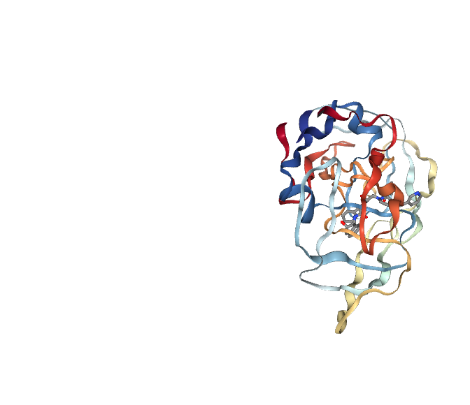
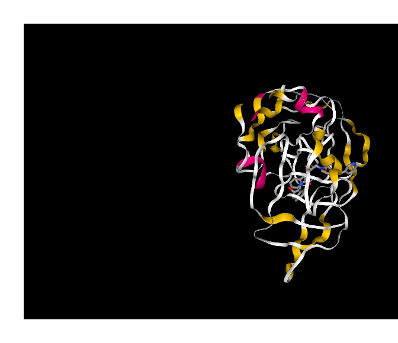
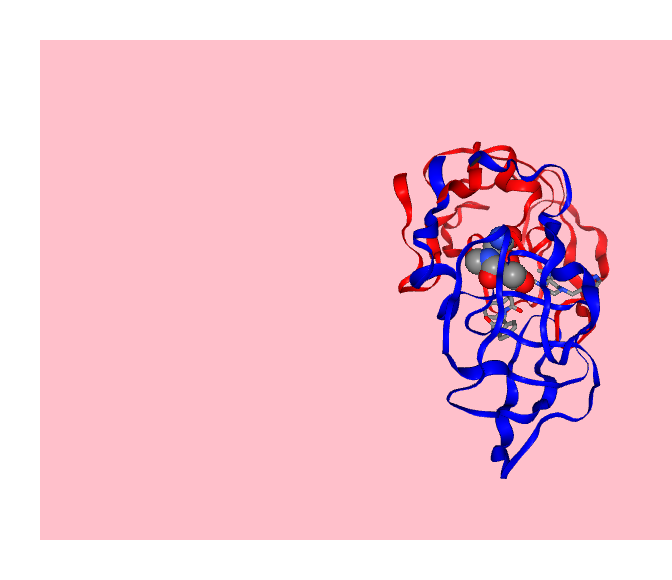
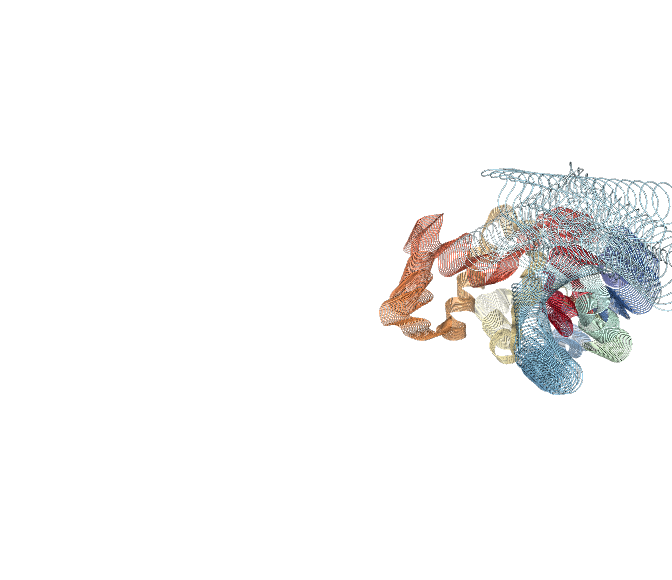
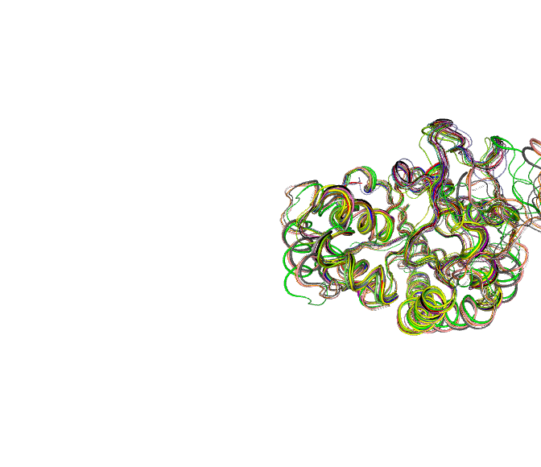
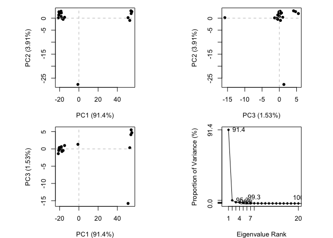
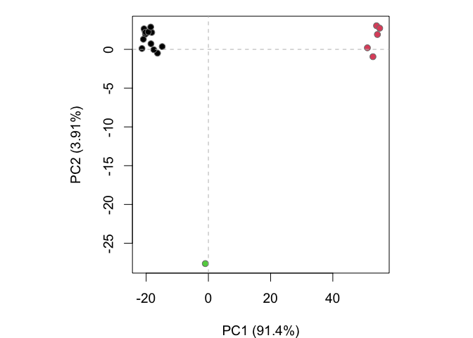
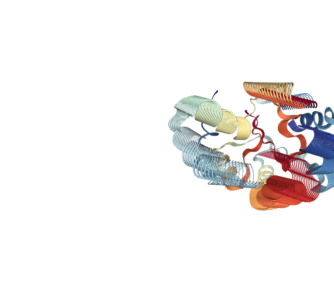
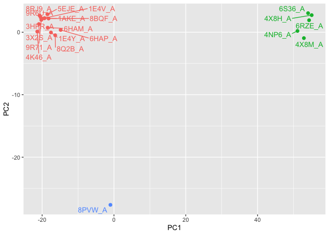

# Class 10: Structural Bioinformatics 1
Erin Jang (PID: A17713992)

- [](#section)
- [PDB statistics](#pdb-statistics)
- [Visualizing PDB data with
  Mol-star](#visualizing-pdb-data-with-mol-star)
- [Getting started with the Bio3D
  package](#getting-started-with-the-bio3d-package)
- [Predict the flexibility of a given
  structure](#predict-the-flexibility-of-a-given-structure)
- [Comparative analysis of the ADK
  family](#comparative-analysis-of-the-adk-family)
- [Principal component analysis](#principal-component-analysis)

## 

The main repository of high-resolution structural data on biomolecules
is called the **Protein Data Bank** (PDB).

## PDB statistics

What is in the PDB in terms of molecule type and structure determination
method?

Read a CSV file of current PDB stats obtained from
https://www.rcsb.org/stats/summary

``` r
pdb <- read.csv("Data Export Summary.csv")
pdb
```

               Molecular.Type   X.ray     EM    NMR Integrative Multiple.methods
    1          Protein (only) 180,758 23,111 12,813         348              229
    2 Protein/Oligosaccharide  10,488  3,741     34           8               11
    3              Protein/NA   9,205  6,751    287          26                8
    4     Nucleic acid (only)   3,154    250  1,578           3               15
    5                   Other     178     27     35           4                0
    6  Oligosaccharide (only)      11      0      6           0                1
      Neutron Other   Total
    1      84    32 217,375
    2       1     0  14,283
    3       0     0  16,277
    4       3     1   5,004
    5       0     0     244
    6       0     4      22

``` r
pdb$X.ray
```

    [1] "180,758" "10,488"  "9,205"   "3,154"   "178"     "11"     

This print ot above `pdb$X.ray` is “character” not “numeric”. Therefore
I can’t do math with it. We need to fix this…

Two functions that can help here are `sub()` and `as.numeric()`

``` r
# We want to get rid (or sub out) commas:
x <- pdb$X.ray
tmp <- sub(",", "", x)
sum(as.numeric(tmp))
```

    [1] 203794

We could make a function to do this:

``` r
rm.comma <- function(x) {
  tmp <- sub(",", "", x)
  sum(as.numeric(tmp))
}
```

``` r
n.tot <- rm.comma(pdb$Total)
n.xray <- rm.comma(pdb$X.ray)
n.em <- rm.comma(pdb$EM)

n.xray/n.tot * 100
```

    [1] 80.48577

``` r
n.em/n.tot * 100
```

    [1] 13.38046

> Q1. What percentage of structures in the PDB are solved by X-Ray and
> Electron Microscopy?

80.49% of structures in the PDB are solved by X-Ray and 13.38% by
Electron Microscopy.

We could also use a different import function for this CSV that speaks
American (i.e. deals with commas in numbers in a comma separated value
file)

``` r
library(readr)

pdb <- read_csv("Data Export Summary.csv")
```

    Rows: 6 Columns: 9
    ── Column specification ────────────────────────────────────────────────────────
    Delimiter: ","
    chr (1): Molecular Type
    dbl (4): Integrative, Multiple methods, Neutron, Other
    num (4): X-ray, EM, NMR, Total

    ℹ Use `spec()` to retrieve the full column specification for this data.
    ℹ Specify the column types or set `show_col_types = FALSE` to quiet this message.

> Q2. How many total protein structures are there in the dataset? What
> proportion of structures in the PDB are protein?

``` r
pdb$Total[1]
```

    [1] 217375

The total number of protein sequences in UniProt is 202,554,314.

``` r
217375 / 202554314 * 100
```

    [1] 0.1073169

> **Key-point**: We have a very, very small structural coverage of known
> proteins (~0.1%). Most structures we know about (~80%) come from one
> method (X-ray crystallography).

> Q3: Type HIV in the PDB website search box on the home page and
> determine how many HIV-1 protease structures are in the current PDB?

There are 783 HIV-1 protease structures in the current PDB.

## Visualizing PDB data with Mol-star

Main stand alone web version with all features is at
https://molstar.org/viewer/.


> Q4: Water molecules normally have 3 atoms. Why do we see just one atom
> per water molecule in this structure?

The hydrogen atoms are usually not visible, especially at 2.00 Å
resolution, so each water molecule is shown only by its oxygen atom.


> Q5: There is a critical “conserved” water molecule in the binding
> site. Can you identify this water molecule? What residue number does
> this water molecule have?

The critical “conserved” water molecule in the binding site is residue
308. It bridges interactions within the active site.

> Q6: Generate and save a figure clearly showing the two distinct chains
> of HIV-protease along with the ligand. You might also consider showing
> the catalytic residues ASP 25 in each chain and the critical water (we
> recommend “Ball & Stick” for these side-chains). Add this figure to
> your Quarto document.


## Getting started with the Bio3D package

Bio3D is an R package from CRAN for structural bioinformatics.

``` r
library(bio3d)
pdb <- read.pdb("1hsg")
```

      Note: Accessing on-line PDB file

``` r
pdb
```


     Call:  read.pdb(file = "1hsg")

       Total Models#: 1
         Total Atoms#: 1686,  XYZs#: 5058  Chains#: 2  (values: A B)

         Protein Atoms#: 1514  (residues/Calpha atoms#: 198)
         Nucleic acid Atoms#: 0  (residues/phosphate atoms#: 0)

         Non-protein/nucleic Atoms#: 172  (residues: 128)
         Non-protein/nucleic resid values: [ HOH (127), MK1 (1) ]

       Protein sequence:
          PQITLWQRPLVTIKIGGQLKEALLDTGADDTVLEEMSLPGRWKPKMIGGIGGFIKVRQYD
          QILIEICGHKAIGTVLVGPTPVNIIGRNLLTQIGCTLNFPQITLWQRPLVTIKIGGQLKE
          ALLDTGADDTVLEEMSLPGRWKPKMIGGIGGFIKVRQYDQILIEICGHKAIGTVLVGPTP
          VNIIGRNLLTQIGCTLNF

    + attr: atom, xyz, seqres, helix, sheet,
            calpha, remark, call

> Q7: How many amino acid residues are there in this pdb object?

There are 198 residues in this pdb object.

> Q8: Name one of the two non-protein residues?

One of the two non-protein residues is water (HOH).

> Q9: How many protein chains are in this structure?

There are 2 protein chains in this structure.

``` r
attributes(pdb)
```

    $names
    [1] "atom"   "xyz"    "seqres" "helix"  "sheet"  "calpha" "remark" "call"  

    $class
    [1] "pdb" "sse"

``` r
head(pdb$atom)
```

      type eleno elety  alt resid chain resno insert      x      y     z o     b
    1 ATOM     1     N <NA>   PRO     A     1   <NA> 29.361 39.686 5.862 1 38.10
    2 ATOM     2    CA <NA>   PRO     A     1   <NA> 30.307 38.663 5.319 1 40.62
    3 ATOM     3     C <NA>   PRO     A     1   <NA> 29.760 38.071 4.022 1 42.64
    4 ATOM     4     O <NA>   PRO     A     1   <NA> 28.600 38.302 3.676 1 43.40
    5 ATOM     5    CB <NA>   PRO     A     1   <NA> 30.508 37.541 6.342 1 37.87
    6 ATOM     6    CG <NA>   PRO     A     1   <NA> 29.296 37.591 7.162 1 38.40
      segid elesy charge
    1  <NA>     N   <NA>
    2  <NA>     C   <NA>
    3  <NA>     C   <NA>
    4  <NA>     O   <NA>
    5  <NA>     C   <NA>
    6  <NA>     C   <NA>

There are lots of functions that can work with these `pdb` objects:

``` r
head(pdbseq(pdb))
```

      1   2   3   4   5   6 
    "P" "Q" "I" "T" "L" "W" 

``` r
library(bio3dview)

view.pdb(pdb)
```

    Warning in basename(x): expanded path length 136572 would be too long for
    ATOM      1  N   PRO A   1      29.361  39.686   5.862  1.00 38.10           N  
    ATOM      2  CA  PRO A   1      30.307  38.663   5.319  1.00 40.62           C  
    ATOM      3  C   PRO A   1      29.760  38.071   4.022  1.00 42.64           C  
    ATOM      4  O   PRO A   1      28.600  38.302   3.676  1.00 43.40           O  
    ATOM      5  CB  PRO A   1      30.508  37.541   6.342  1.00 37.87           C  
    ATOM      6  CG  PRO A   1      29.296  37.591   7.162  1.00 38.40           C  
    ATOM      7  CD  PRO A   1      28.778  39.015   7.019  1.00 38.74           C  
    ATOM      8  N   GLN A   2      30.607  37.334   3.305  1.00 41.76           N  
    ATOM      9  CA  GLN A   2      30.158  36.492   2.199  1.00 41.30           C  
    ATOM     10  C   GLN A   2      30.298  35.041   2.643  1.00 41.38           C  
    ATOM     11  O   GLN A   2      31.401  34.494   2.763  1.00 43.09           O  
    ATOM     12  CB  GLN A   2      30.970  36.738   0.926  1.0 [... truncated]



Let’s try a custom view

``` r
view.pdb(pdb, 
         colorScheme="sse", 
         backgroundColor = "black")
```

    Warning in basename(x): expanded path length 136572 would be too long for
    ATOM      1  N   PRO A   1      29.361  39.686   5.862  1.00 38.10           N  
    ATOM      2  CA  PRO A   1      30.307  38.663   5.319  1.00 40.62           C  
    ATOM      3  C   PRO A   1      29.760  38.071   4.022  1.00 42.64           C  
    ATOM      4  O   PRO A   1      28.600  38.302   3.676  1.00 43.40           O  
    ATOM      5  CB  PRO A   1      30.508  37.541   6.342  1.00 37.87           C  
    ATOM      6  CG  PRO A   1      29.296  37.591   7.162  1.00 38.40           C  
    ATOM      7  CD  PRO A   1      28.778  39.015   7.019  1.00 38.74           C  
    ATOM      8  N   GLN A   2      30.607  37.334   3.305  1.00 41.76           N  
    ATOM      9  CA  GLN A   2      30.158  36.492   2.199  1.00 41.30           C  
    ATOM     10  C   GLN A   2      30.298  35.041   2.643  1.00 41.38           C  
    ATOM     11  O   GLN A   2      31.401  34.494   2.763  1.00 43.09           O  
    ATOM     12  CB  GLN A   2      30.970  36.738   0.926  1.0 [... truncated]



> Q. Create a custom view of HIV-Pr highlighting the active site ASP
> residues (`resno=25`), the two chains (in your choice of colors), and
> the ligand all on a custom color background?

``` r
library(bio3dview)
library(NGLVieweR)

active.site <- atom.select(pdb, resno = 25)

view.pdb(pdb,
         cols = c("red", "blue"),
         highlight = active.site,
         highlight.style = "spacefill",
         backgroundColor = "pink") |>
  setRock()
```

    Warning in basename(x): expanded path length 136572 would be too long for
    ATOM      1  N   PRO A   1      29.361  39.686   5.862  1.00 38.10           N  
    ATOM      2  CA  PRO A   1      30.307  38.663   5.319  1.00 40.62           C  
    ATOM      3  C   PRO A   1      29.760  38.071   4.022  1.00 42.64           C  
    ATOM      4  O   PRO A   1      28.600  38.302   3.676  1.00 43.40           O  
    ATOM      5  CB  PRO A   1      30.508  37.541   6.342  1.00 37.87           C  
    ATOM      6  CG  PRO A   1      29.296  37.591   7.162  1.00 38.40           C  
    ATOM      7  CD  PRO A   1      28.778  39.015   7.019  1.00 38.74           C  
    ATOM      8  N   GLN A   2      30.607  37.334   3.305  1.00 41.76           N  
    ATOM      9  CA  GLN A   2      30.158  36.492   2.199  1.00 41.30           C  
    ATOM     10  C   GLN A   2      30.298  35.041   2.643  1.00 41.38           C  
    ATOM     11  O   GLN A   2      31.401  34.494   2.763  1.00 43.09           O  
    ATOM     12  CB  GLN A   2      30.970  36.738   0.926  1.0 [... truncated]



## Predict the flexibility of a given structure

Let’s do a Normal Mode Analysis (NMA) to predict the flexibility of a
given `pdb` object:

``` r
adk <- read.pdb("6s36")
```

      Note: Accessing on-line PDB file
       PDB has ALT records, taking A only, rm.alt=TRUE

A quick structure summary

``` r
adk
```


     Call:  read.pdb(file = "6s36")

       Total Models#: 1
         Total Atoms#: 1898,  XYZs#: 5694  Chains#: 1  (values: A)

         Protein Atoms#: 1654  (residues/Calpha atoms#: 214)
         Nucleic acid Atoms#: 0  (residues/phosphate atoms#: 0)

         Non-protein/nucleic Atoms#: 244  (residues: 244)
         Non-protein/nucleic resid values: [ CL (3), HOH (238), MG (2), NA (1) ]

       Protein sequence:
          MRIILLGAPGAGKGTQAQFIMEKYGIPQISTGDMLRAAVKSGSELGKQAKDIMDAGKLVT
          DELVIALVKERIAQEDCRNGFLLDGFPRTIPQADAMKEAGINVDYVLEFDVPDELIVDKI
          VGRRVHAPSGRVYHVKFNPPKVEGKDDVTGEELTTRKDDQEETVRKRLVEYHQMTAPLIG
          YYSKEAEAGNTKYAKVDGTKPVAEVRADLEKILG

    + attr: atom, xyz, seqres, helix, sheet,
            calpha, remark, call

``` r
m <- nma(adk)
```

     Building Hessian...        Done in 0.035 seconds.
     Diagonalizing Hessian...   Done in 0.465 seconds.

``` r
plot(m)
```


View the results with an interactive structure view:

``` r
view.nma(m)
```

    Warning in basename(x): expanded path length 590110 would be too long for
    MODEL        1
    ATOM      1  CA  ALA     1     -19.326   9.682  18.832  1.00  0.00              
    ATOM      2  CA  ALA     2     -16.894   6.998  17.674  1.00  0.00              
    ATOM      3  CA  ALA     3     -18.316   5.203  14.643  1.00  0.00              
    ATOM      4  CA  ALA     4     -17.091   2.435  12.363  1.00  0.00              
    ATOM      5  CA  ALA     5     -18.775   2.508   8.937  1.00  0.00              
    ATOM      6  CA  ALA     6     -18.464  -0.698   6.902  1.00  0.00              
    ATOM      7  CA  ALA     7     -19.758  -1.475   3.453  1.00  0.00              
    ATOM      8  CA  ALA     8     -19.074  -3.493   0.350  1.00  0.00              
    ATOM      9  CA  ALA     9     -17.159  -1.879  -2.535  1.00  0.00              
    ATOM     10  CA  ALA    10     -19.711  -0.041  -4.657  1.00  0.00              
    ATOM     11  CA  ALA    11     -22.527   0.023  -2.105  1.00  0.00              
    ATOM     12  CA  ALA    12     -22.175   3.7 [... truncated]



Write out the results for viewing in Mol-star:

``` r
mktrj(m, file = "nma.pdb")
```

You can view quickly here or open the file made previously in Mol-star.

``` r
view.nma(m, pdb=adk)
```

    Warning in basename(x): expanded path length 590110 would be too long for
    MODEL        1
    ATOM      2  CA  MET A   1     -19.326   9.682  18.832  1.00 36.10           C  
    ATOM     11  CA AARG A   2     -16.894   6.998  17.674  0.50 26.59           C  
    ATOM     32  CA  ILE A   3     -18.316   5.203  14.643  1.00 21.76           C  
    ATOM     40  CA  ILE A   4     -17.091   2.435  12.363  1.00 20.57           C  
    ATOM     48  CA  LEU A   5     -18.775   2.508   8.937  1.00 19.08           C  
    ATOM     56  CA  LEU A   6     -18.464  -0.698   6.902  1.00 24.62           C  
    ATOM     64  CA  GLY A   7     -19.758  -1.475   3.453  1.00 25.04           C  
    ATOM     68  CA  ALA A   8     -19.074  -3.493   0.350  1.00 26.93           C  
    ATOM     73  CA  PRO A   9     -17.159  -1.879  -2.535  1.00 27.11           C  
    ATOM     80  CA  GLY A  10     -19.711  -0.041  -4.657  1.00 30.50           C  
    ATOM     84  CA  ALA A  11     -22.527   0.023  -2.105  1.00 31.59           C  
    ATOM     89  CA  GLY A  12     -22.175   3.7 [... truncated]


## Comparative analysis of the ADK family

``` r
# Install packages in the R console NOT your Rmd/Quarto file
# install.packages("bio3d")
# install.packages("NGLVieweR")

#install.packages("remotes")
#remotes::install_github("bioboot/bio3dview")

#install.packages("BiocManager")
#BiocManager::install("msa)
```

> Q10. Which of the packages above is found only on BioConductor and not
> CRAN?

The package only found on BioConductor is “msa”.

> Q11. Which of the above packages is not found on BioConductor or CRAN?

The package not found on BioConductor or CRAN is bio3dview.(It is
installed from GitHub).

> Q12. True or False? Functions from the pak package can be used to
> install packages from GitHub and BitBucket?

True.

Our first step is find a sequence for this family. We will use the
database iD “1ake_A” here:

``` r
id <- "1ake_A"

aa <- get.seq(id)
```

    Warning in get.seq(id): Removing existing file: seqs.fasta

    Fetching... Please wait. Done.

``` r
aa
```

                 1        .         .         .         .         .         60 
    pdb|1AKE|A   MRIILLGAPGAGKGTQAQFIMEKYGIPQISTGDMLRAAVKSGSELGKQAKDIMDAGKLVT
                 1        .         .         .         .         .         60 

                61        .         .         .         .         .         120 
    pdb|1AKE|A   DELVIALVKERIAQEDCRNGFLLDGFPRTIPQADAMKEAGINVDYVLEFDVPDELIVDRI
                61        .         .         .         .         .         120 

               121        .         .         .         .         .         180 
    pdb|1AKE|A   VGRRVHAPSGRVYHVKFNPPKVEGKDDVTGEELTTRKDDQEETVRKRLVEYHQMTAPLIG
               121        .         .         .         .         .         180 

               181        .         .         .   214 
    pdb|1AKE|A   YYSKEAEAGNTKYAKVDGTKPVAEVRADLEKILG
               181        .         .         .   214 

    Call:
      read.fasta(file = outfile)

    Class:
      fasta

    Alignment dimensions:
      1 sequence rows; 214 position columns (214 non-gap, 0 gap) 

    + attr: id, ali, call

> Q13. How many amino acids are in this sequence, i.e. how long is this
> sequence?

There are 214 amino acids in this seuquence.

Search for related sequences in the database

``` r
blast <- blast.pdb(aa)
```

     Searching ... please wait (updates every 5 seconds) RID = 1BX0541U014 
     ...........
     Reporting 96 hits

``` r
hits <- plot(blast)
```

      * Possible cutoff values:    260 3 
                Yielding Nhits:    20 96 

      * Chosen cutoff value of:    260 
                Yielding Nhits:    20 


``` r
hits$pdb.id
```

     [1] "1AKE_A" "8BQF_A" "4X8M_A" "6S36_A" "9R6U_A" "9R71_A" "8Q2B_A" "8RJ9_A"
     [9] "6RZE_A" "4X8H_A" "3HPR_A" "1E4V_A" "5EJE_A" "1E4Y_A" "3X2S_A" "6HAP_A"
    [17] "6HAM_A" "8PVW_A" "4K46_A" "4NP6_A"

``` r
# Download releated PDB files
files <- get.pdb(hits$pdb.id, path="pdbs", split=TRUE, gzip=TRUE)
```

    Warning in get.pdb(hits$pdb.id, path = "pdbs", split = TRUE, gzip = TRUE):
    pdbs/1AKE.pdb.gz exists. Skipping download

    Warning in get.pdb(hits$pdb.id, path = "pdbs", split = TRUE, gzip = TRUE):
    pdbs/8BQF.pdb.gz exists. Skipping download

    Warning in get.pdb(hits$pdb.id, path = "pdbs", split = TRUE, gzip = TRUE):
    pdbs/4X8M.pdb.gz exists. Skipping download

    Warning in get.pdb(hits$pdb.id, path = "pdbs", split = TRUE, gzip = TRUE):
    pdbs/6S36.pdb.gz exists. Skipping download

    Warning in get.pdb(hits$pdb.id, path = "pdbs", split = TRUE, gzip = TRUE):
    pdbs/9R6U.pdb.gz exists. Skipping download

    Warning in get.pdb(hits$pdb.id, path = "pdbs", split = TRUE, gzip = TRUE):
    pdbs/9R71.pdb.gz exists. Skipping download

    Warning in get.pdb(hits$pdb.id, path = "pdbs", split = TRUE, gzip = TRUE):
    pdbs/8Q2B.pdb.gz exists. Skipping download

    Warning in get.pdb(hits$pdb.id, path = "pdbs", split = TRUE, gzip = TRUE):
    pdbs/8RJ9.pdb.gz exists. Skipping download

    Warning in get.pdb(hits$pdb.id, path = "pdbs", split = TRUE, gzip = TRUE):
    pdbs/6RZE.pdb.gz exists. Skipping download

    Warning in get.pdb(hits$pdb.id, path = "pdbs", split = TRUE, gzip = TRUE):
    pdbs/4X8H.pdb.gz exists. Skipping download

    Warning in get.pdb(hits$pdb.id, path = "pdbs", split = TRUE, gzip = TRUE):
    pdbs/3HPR.pdb.gz exists. Skipping download

    Warning in get.pdb(hits$pdb.id, path = "pdbs", split = TRUE, gzip = TRUE):
    pdbs/1E4V.pdb.gz exists. Skipping download

    Warning in get.pdb(hits$pdb.id, path = "pdbs", split = TRUE, gzip = TRUE):
    pdbs/5EJE.pdb.gz exists. Skipping download

    Warning in get.pdb(hits$pdb.id, path = "pdbs", split = TRUE, gzip = TRUE):
    pdbs/1E4Y.pdb.gz exists. Skipping download

    Warning in get.pdb(hits$pdb.id, path = "pdbs", split = TRUE, gzip = TRUE):
    pdbs/3X2S.pdb.gz exists. Skipping download

    Warning in get.pdb(hits$pdb.id, path = "pdbs", split = TRUE, gzip = TRUE):
    pdbs/6HAP.pdb.gz exists. Skipping download

    Warning in get.pdb(hits$pdb.id, path = "pdbs", split = TRUE, gzip = TRUE):
    pdbs/6HAM.pdb.gz exists. Skipping download

    Warning in get.pdb(hits$pdb.id, path = "pdbs", split = TRUE, gzip = TRUE):
    pdbs/8PVW.pdb.gz exists. Skipping download

    Warning in get.pdb(hits$pdb.id, path = "pdbs", split = TRUE, gzip = TRUE):
    pdbs/4K46.pdb.gz exists. Skipping download

    Warning in get.pdb(hits$pdb.id, path = "pdbs", split = TRUE, gzip = TRUE):
    pdbs/4NP6.pdb.gz exists. Skipping download


      |                                                                            
      |                                                                      |   0%
      |                                                                            
      |====                                                                  |   5%
      |                                                                            
      |=======                                                               |  10%
      |                                                                            
      |==========                                                            |  15%
      |                                                                            
      |==============                                                        |  20%
      |                                                                            
      |==================                                                    |  25%
      |                                                                            
      |=====================                                                 |  30%
      |                                                                            
      |========================                                              |  35%
      |                                                                            
      |============================                                          |  40%
      |                                                                            
      |================================                                      |  45%
      |                                                                            
      |===================================                                   |  50%
      |                                                                            
      |======================================                                |  55%
      |                                                                            
      |==========================================                            |  60%
      |                                                                            
      |==============================================                        |  65%
      |                                                                            
      |=================================================                     |  70%
      |                                                                            
      |====================================================                  |  75%
      |                                                                            
      |========================================================              |  80%
      |                                                                            
      |============================================================          |  85%
      |                                                                            
      |===============================================================       |  90%
      |                                                                            
      |==================================================================    |  95%
      |                                                                            
      |======================================================================| 100%

Align and supperpose all these ADK structures

``` r
# Align releated PDBs
pdbs <- pdbaln(files, fit = TRUE, exefile="msa")
```

    Reading PDB files:
    pdbs/split_chain/1AKE_A.pdb
    pdbs/split_chain/8BQF_A.pdb
    pdbs/split_chain/4X8M_A.pdb
    pdbs/split_chain/6S36_A.pdb
    pdbs/split_chain/9R6U_A.pdb
    pdbs/split_chain/9R71_A.pdb
    pdbs/split_chain/8Q2B_A.pdb
    pdbs/split_chain/8RJ9_A.pdb
    pdbs/split_chain/6RZE_A.pdb
    pdbs/split_chain/4X8H_A.pdb
    pdbs/split_chain/3HPR_A.pdb
    pdbs/split_chain/1E4V_A.pdb
    pdbs/split_chain/5EJE_A.pdb
    pdbs/split_chain/1E4Y_A.pdb
    pdbs/split_chain/3X2S_A.pdb
    pdbs/split_chain/6HAP_A.pdb
    pdbs/split_chain/6HAM_A.pdb
    pdbs/split_chain/8PVW_A.pdb
    pdbs/split_chain/4K46_A.pdb
    pdbs/split_chain/4NP6_A.pdb
       PDB has ALT records, taking A only, rm.alt=TRUE
    .   PDB has ALT records, taking A only, rm.alt=TRUE
    ..   PDB has ALT records, taking A only, rm.alt=TRUE
    .   PDB has ALT records, taking A only, rm.alt=TRUE
    .   PDB has ALT records, taking A only, rm.alt=TRUE
    .   PDB has ALT records, taking A only, rm.alt=TRUE
    .   PDB has ALT records, taking A only, rm.alt=TRUE
    .   PDB has ALT records, taking A only, rm.alt=TRUE
    ..   PDB has ALT records, taking A only, rm.alt=TRUE
    ..   PDB has ALT records, taking A only, rm.alt=TRUE
    ....   PDB has ALT records, taking A only, rm.alt=TRUE
    .   PDB has ALT records, taking A only, rm.alt=TRUE
    .   PDB has ALT records, taking A only, rm.alt=TRUE
    ..

    Extracting sequences

    pdb/seq: 1   name: pdbs/split_chain/1AKE_A.pdb 
       PDB has ALT records, taking A only, rm.alt=TRUE
    pdb/seq: 2   name: pdbs/split_chain/8BQF_A.pdb 
       PDB has ALT records, taking A only, rm.alt=TRUE
    pdb/seq: 3   name: pdbs/split_chain/4X8M_A.pdb 
    pdb/seq: 4   name: pdbs/split_chain/6S36_A.pdb 
       PDB has ALT records, taking A only, rm.alt=TRUE
    pdb/seq: 5   name: pdbs/split_chain/9R6U_A.pdb 
       PDB has ALT records, taking A only, rm.alt=TRUE
    pdb/seq: 6   name: pdbs/split_chain/9R71_A.pdb 
       PDB has ALT records, taking A only, rm.alt=TRUE
    pdb/seq: 7   name: pdbs/split_chain/8Q2B_A.pdb 
       PDB has ALT records, taking A only, rm.alt=TRUE
    pdb/seq: 8   name: pdbs/split_chain/8RJ9_A.pdb 
       PDB has ALT records, taking A only, rm.alt=TRUE
    pdb/seq: 9   name: pdbs/split_chain/6RZE_A.pdb 
       PDB has ALT records, taking A only, rm.alt=TRUE
    pdb/seq: 10   name: pdbs/split_chain/4X8H_A.pdb 
    pdb/seq: 11   name: pdbs/split_chain/3HPR_A.pdb 
       PDB has ALT records, taking A only, rm.alt=TRUE
    pdb/seq: 12   name: pdbs/split_chain/1E4V_A.pdb 
    pdb/seq: 13   name: pdbs/split_chain/5EJE_A.pdb 
       PDB has ALT records, taking A only, rm.alt=TRUE
    pdb/seq: 14   name: pdbs/split_chain/1E4Y_A.pdb 
    pdb/seq: 15   name: pdbs/split_chain/3X2S_A.pdb 
    pdb/seq: 16   name: pdbs/split_chain/6HAP_A.pdb 
    pdb/seq: 17   name: pdbs/split_chain/6HAM_A.pdb 
       PDB has ALT records, taking A only, rm.alt=TRUE
    pdb/seq: 18   name: pdbs/split_chain/8PVW_A.pdb 
       PDB has ALT records, taking A only, rm.alt=TRUE
    pdb/seq: 19   name: pdbs/split_chain/4K46_A.pdb 
       PDB has ALT records, taking A only, rm.alt=TRUE
    pdb/seq: 20   name: pdbs/split_chain/4NP6_A.pdb 

``` r
pdbs
```

                                    1        .         .         .         40 
    [Truncated_Name:1]1AKE_A.pdb    --MRIILLGAPGAGKGTQAQFIMEKYGIPQISTGDMLRAA
    [Truncated_Name:2]8BQF_A.pdb    --MRIILLGAPGAGKGTQAQFIMEKYGIPQISTGDMLRAA
    [Truncated_Name:3]4X8M_A.pdb    --MRIILLGAPGAGKGTQAQFIMEKYGIPQISTGDMLRAA
    [Truncated_Name:4]6S36_A.pdb    --MRIILLGAPGAGKGTQAQFIMEKYGIPQISTGDMLRAA
    [Truncated_Name:5]9R6U_A.pdb    --MRIILLGAPGAGKGTQAQFIMEKYGIPQISTGDMLRAA
    [Truncated_Name:6]9R71_A.pdb    --MRIILLGAPGAGKGTQAQFIMEKYGIPQISTGDMLRAA
    [Truncated_Name:7]8Q2B_A.pdb    --MRIILLGAPGAGKGTQAQFIMEKYGIPQISTGDMLRAA
    [Truncated_Name:8]8RJ9_A.pdb    --MRIILLGAPGAGKGTQAQFIMEKYGIPQISTGDMLRAA
    [Truncated_Name:9]6RZE_A.pdb    --MRIILLGAPGAGKGTQAQFIMEKYGIPQISTGDMLRAA
    [Truncated_Name:10]4X8H_A.pdb   --MRIILLGAPGAGKGTQAQFIMEKYGIPQISTGDMLRAA
    [Truncated_Name:11]3HPR_A.pdb   --MRIILLGAPGAGKGTQAQFIMEKYGIPQISTGDMLRAA
    [Truncated_Name:12]1E4V_A.pdb   --MRIILLGAPVAGKGTQAQFIMEKYGIPQISTGDMLRAA
    [Truncated_Name:13]5EJE_A.pdb   --MRIILLGAPGAGKGTQAQFIMEKYGIPQISTGDMLRAA
    [Truncated_Name:14]1E4Y_A.pdb   --MRIILLGALVAGKGTQAQFIMEKYGIPQISTGDMLRAA
    [Truncated_Name:15]3X2S_A.pdb   --MRIILLGAPGAGKGTQAQFIMEKYGIPQISTGDMLRAA
    [Truncated_Name:16]6HAP_A.pdb   --MRIILLGAPGAGKGTQAQFIMEKYGIPQISTGDMLRAA
    [Truncated_Name:17]6HAM_A.pdb   --MRIILLGAPGAGKGTQAQFIMEKYGIPQISTGDMLRAA
    [Truncated_Name:18]8PVW_A.pdb   --MRIILLGAPGAGKGTQAQFIMEKYGIPQISTGDMLRAA
    [Truncated_Name:19]4K46_A.pdb   --MRIILLGAPGAGKGTQAQFIMAKFGIPQISTGDMLRAA
    [Truncated_Name:20]4NP6_A.pdb   NAMRIILLGAPGAGKGTQAQFIMEKFGIPQISTGDMLRAA
                                      ********  *********** *^************** 
                                    1        .         .         .         40 

                                   41        .         .         .         80 
    [Truncated_Name:1]1AKE_A.pdb    VKSGSELGKQAKDIMDAGKLVTDELVIALVKERIAQEDCR
    [Truncated_Name:2]8BQF_A.pdb    VKSGSELGKQAKDIMDAGKLVTDELVIALVKERIAQE---
    [Truncated_Name:3]4X8M_A.pdb    VKSGSELGKQAKDIMDAGKLVTDELVIALVKERIAQEDCR
    [Truncated_Name:4]6S36_A.pdb    VKSGSELGKQAKDIMDAGKLVTDELVIALVKERIAQEDCR
    [Truncated_Name:5]9R6U_A.pdb    VKSGSELGAQAKDIMDAGKLVTDELVIALVKERIAQEDCR
    [Truncated_Name:6]9R71_A.pdb    VKSGSELGKQAKDIMDAGKLVTDELVIALVKERIAQEDCR
    [Truncated_Name:7]8Q2B_A.pdb    VKSGSELGKQAKDIMDAGKLVTDELVIALVKERIAQEDCR
    [Truncated_Name:8]8RJ9_A.pdb    VKSGSELGKQAKDIMDAGKLVTDELVIALVKERIAQEDCR
    [Truncated_Name:9]6RZE_A.pdb    VKSGSELGKQAKDIMDAGKLVTDELVIALVKERIAQEDCR
    [Truncated_Name:10]4X8H_A.pdb   VKSGSELGKQAKDIMDAGKLVTDELVIALVKERIAQEDCR
    [Truncated_Name:11]3HPR_A.pdb   VKSGSELGKQAKDIMDAGKLVTDELVIALVKERIAQEDCR
    [Truncated_Name:12]1E4V_A.pdb   VKSGSELGKQAKDIMDAGKLVTDELVIALVKERIAQEDCR
    [Truncated_Name:13]5EJE_A.pdb   VKSGSELGKQAKDIMDACKLVTDELVIALVKERIAQEDCR
    [Truncated_Name:14]1E4Y_A.pdb   VKSGSELGKQAKDIMDAGKLVTDELVIALVKERIAQEDCR
    [Truncated_Name:15]3X2S_A.pdb   VKSGSELGKQAKDIMDCGKLVTDELVIALVKERIAQEDSR
    [Truncated_Name:16]6HAP_A.pdb   VKSGSELGKQAKDIMDAGKLVTDELVIALVRERICQEDSR
    [Truncated_Name:17]6HAM_A.pdb   IKSGSELGKQAKDIMDAGKLVTDEIIIALVKERICQEDSR
    [Truncated_Name:18]8PVW_A.pdb   VKSGSELGKQAKDIMDAGKLVTDELVIALVKERIAQEDCR
    [Truncated_Name:19]4K46_A.pdb   IKAGTELGKQAKSVIDAGQLVSDDIILGLVKERIAQDDCA
    [Truncated_Name:20]4NP6_A.pdb   IKAGTELGKQAKAVIDAGQLVSDDIILGLIKERIAQADCE
                                    ^* *^*** *** ^^*   **^*^^^^^*^^*** *     
                                   41        .         .         .         80 

                                   81        .         .         .         120 
    [Truncated_Name:1]1AKE_A.pdb    NGFLLDGFPRTIPQADAMKEAGINVDYVLEFDVPDELIVD
    [Truncated_Name:2]8BQF_A.pdb    -GFLLDGFPRTIPQADAMKEAGINVDYVIEFDVPDELIVD
    [Truncated_Name:3]4X8M_A.pdb    NGFLLDGFPRTIPQADAMKEAGINVDYVLEFDVPDELIVD
    [Truncated_Name:4]6S36_A.pdb    NGFLLDGFPRTIPQADAMKEAGINVDYVLEFDVPDELIVD
    [Truncated_Name:5]9R6U_A.pdb    NGFLLDGFPRTIPQADAMKEAGINVDYVLEFDVPDELIVD
    [Truncated_Name:6]9R71_A.pdb    NGFLLDGFPRTIPQADAMKEAGINVDYVLEFDVPDALIVD
    [Truncated_Name:7]8Q2B_A.pdb    NGFLLDGFPRTIPQADAMKEAGINVDYVLEFDVPDELIVD
    [Truncated_Name:8]8RJ9_A.pdb    NGFLLAGFPRTIPQADAMKEAGINVDYVLEFDVPDELIVD
    [Truncated_Name:9]6RZE_A.pdb    NGFLLDGFPRTIPQADAMKEAGINVDYVLEFDVPDELIVD
    [Truncated_Name:10]4X8H_A.pdb   NGFLLDGFPRTIPQADAMKEAGINVDYVLEFDVPDELIVD
    [Truncated_Name:11]3HPR_A.pdb   NGFLLDGFPRTIPQADAMKEAGINVDYVLEFDVPDELIVD
    [Truncated_Name:12]1E4V_A.pdb   NGFLLDGFPRTIPQADAMKEAGINVDYVLEFDVPDELIVD
    [Truncated_Name:13]5EJE_A.pdb   NGFLLDGFPRTIPQADAMKEAGINVDYVLEFDVPDELIVD
    [Truncated_Name:14]1E4Y_A.pdb   NGFLLDGFPRTIPQADAMKEAGINVDYVLEFDVPDELIVD
    [Truncated_Name:15]3X2S_A.pdb   NGFLLDGFPRTIPQADAMKEAGINVDYVLEFDVPDELIVD
    [Truncated_Name:16]6HAP_A.pdb   NGFLLDGFPRTIPQADAMKEAGINVDYVLEFDVPDELIVD
    [Truncated_Name:17]6HAM_A.pdb   NGFLLDGFPRTIPQADAMKEAGINVDYVLEFDVPDELIVD
    [Truncated_Name:18]8PVW_A.pdb   NGFLLDGFPRTIPQADAMKEAGINVDYVLEFDVPDELIVD
    [Truncated_Name:19]4K46_A.pdb   KGFLLDGFPRTIPQADGLKEVGVVVDYVIEFDVADSVIVE
    [Truncated_Name:20]4NP6_A.pdb   KGFLLDGFPRTIPQADGLKEMGINVDYVIEFDVADDVIVE
                                     **** **********^^** *^ ****^**** * ^**^ 
                                   81        .         .         .         120 

                                  121        .         .         .         160 
    [Truncated_Name:1]1AKE_A.pdb    RIVGRRVHAPSGRVYHVKFNPPKVEGKDDVTGEELTTRKD
    [Truncated_Name:2]8BQF_A.pdb    RIVGRRVHAPSGRVYHVKFNPPKVEGKDDVTGEELTTRKD
    [Truncated_Name:3]4X8M_A.pdb    RIVGRRVHAPSGRVYHVKFNPPKVEGKDDVTGEELTTRKD
    [Truncated_Name:4]6S36_A.pdb    KIVGRRVHAPSGRVYHVKFNPPKVEGKDDVTGEELTTRKD
    [Truncated_Name:5]9R6U_A.pdb    RIVGRRVHAPSGRVYHVKFNPPKVEGKDDVTGEELTTRKD
    [Truncated_Name:6]9R71_A.pdb    RIVGRRVHAPSGRVYHVKFNPPKVEGKDDVTGEELTTRKD
    [Truncated_Name:7]8Q2B_A.pdb    RIVGRRVHAPSGRVYHVKFNPPKVEGKDDVTGEELTTRKA
    [Truncated_Name:8]8RJ9_A.pdb    RIVGRRVHAPSGRVYHVKFNPPKVEGKDDVTGEELTTRKD
    [Truncated_Name:9]6RZE_A.pdb    AIVGRRVHAPSGRVYHVKFNPPKVEGKDDVTGEELTTRKD
    [Truncated_Name:10]4X8H_A.pdb   RIVGRRVHAPSGRVYHVKFNPPKVEGKDDVTGEELTTRKD
    [Truncated_Name:11]3HPR_A.pdb   RIVGRRVHAPSGRVYHVKFNPPKVEGKDDGTGEELTTRKD
    [Truncated_Name:12]1E4V_A.pdb   RIVGRRVHAPSGRVYHVKFNPPKVEGKDDVTGEELTTRKD
    [Truncated_Name:13]5EJE_A.pdb   RIVGRRVHAPSGRVYHVKFNPPKVEGKDDVTGEELTTRKD
    [Truncated_Name:14]1E4Y_A.pdb   RIVGRRVHAPSGRVYHVKFNPPKVEGKDDVTGEELTTRKD
    [Truncated_Name:15]3X2S_A.pdb   RIVGRRVHAPSGRVYHVKFNPPKVEGKDDVTGEELTTRKD
    [Truncated_Name:16]6HAP_A.pdb   RIVGRRVHAPSGRVYHVKFNPPKVEGKDDVTGEELTTRKD
    [Truncated_Name:17]6HAM_A.pdb   RIVGRRVHAPSGRVYHVKFNPPKVEGKDDVTGEELTTRKD
    [Truncated_Name:18]8PVW_A.pdb   RILKR--GETSGRV-------------------------D
    [Truncated_Name:19]4K46_A.pdb   RMAGRRAHLASGRTYHNVYNPPKVEGKDDVTGEDLVIRED
    [Truncated_Name:20]4NP6_A.pdb   RMAGRRAHLPSGRTYHVVYNPPKVEGKDDVTGEDLVIRED
                                     ^  *     ***                            
                                  121        .         .         .         160 

                                  161        .         .         .         200 
    [Truncated_Name:1]1AKE_A.pdb    DQEETVRKRLVEYHQMTAPLIGYYSKEAEAGNTKYAKVDG
    [Truncated_Name:2]8BQF_A.pdb    DQEETVRKRLVEYHQMTAPLIGYYSKEAEAGNTKYAKVDG
    [Truncated_Name:3]4X8M_A.pdb    DQEETVRKRLVEWHQMTAPLIGYYSKEAEAGNTKYAKVDG
    [Truncated_Name:4]6S36_A.pdb    DQEETVRKRLVEYHQMTAPLIGYYSKEAEAGNTKYAKVDG
    [Truncated_Name:5]9R6U_A.pdb    DQEETVRKRLVEYHQMTAPLIGYYSKEAEAGNTKYAKVDG
    [Truncated_Name:6]9R71_A.pdb    DQEETVRKRLVEYHQMTAPLIGYYSKEAEAGNTKYAKVDG
    [Truncated_Name:7]8Q2B_A.pdb    DQEETVRKRLVEYHQMTAPLIGYYSKEAEAGNTKYAKVDG
    [Truncated_Name:8]8RJ9_A.pdb    DQEETVRKRLVEYHQMTAPLIGYYSKEAEAGNTKYAKVDG
    [Truncated_Name:9]6RZE_A.pdb    DQEETVRKRLVEYHQMTAPLIGYYSKEAEAGNTKYAKVDG
    [Truncated_Name:10]4X8H_A.pdb   DQEETVRKRLVEYHQMTAALIGYYSKEAEAGNTKYAKVDG
    [Truncated_Name:11]3HPR_A.pdb   DQEETVRKRLVEYHQMTAPLIGYYSKEAEAGNTKYAKVDG
    [Truncated_Name:12]1E4V_A.pdb   DQEETVRKRLVEYHQMTAPLIGYYSKEAEAGNTKYAKVDG
    [Truncated_Name:13]5EJE_A.pdb   DQEECVRKRLVEYHQMTAPLIGYYSKEAEAGNTKYAKVDG
    [Truncated_Name:14]1E4Y_A.pdb   DQEETVRKRLVEYHQMTAPLIGYYSKEAEAGNTKYAKVDG
    [Truncated_Name:15]3X2S_A.pdb   DQEETVRKRLCEYHQMTAPLIGYYSKEAEAGNTKYAKVDG
    [Truncated_Name:16]6HAP_A.pdb   DQEETVRKRLVEYHQMTAPLIGYYSKEAEAGNTKYAKVDG
    [Truncated_Name:17]6HAM_A.pdb   DQEETVRKRLVEYHQMTAPLIGYYSKEAEAGNTKYAKVDG
    [Truncated_Name:18]8PVW_A.pdb   DNEETVRKRLVEYHQMTAPLIGYYSKEAEAGNTKYAKVDG
    [Truncated_Name:19]4K46_A.pdb   DKEETVLARLGVYHNQTAPLIAYYGKEAEAGNTQYLKFDG
    [Truncated_Name:20]4NP6_A.pdb   DKEETVRARLNVYHTQTAPLIEYYGKEAAAGKTQYLKFDG
                                    * ** *  **  ^*  ** ** ** *** ** * * * ** 
                                  161        .         .         .         200 

                                  201        .     216 
    [Truncated_Name:1]1AKE_A.pdb    TKPVAEVRADLEKILG
    [Truncated_Name:2]8BQF_A.pdb    TKPVAEVRADLEKIL-
    [Truncated_Name:3]4X8M_A.pdb    TKPVAEVRADLEKILG
    [Truncated_Name:4]6S36_A.pdb    TKPVAEVRADLEKILG
    [Truncated_Name:5]9R6U_A.pdb    TKPVAEVRADLEKILG
    [Truncated_Name:6]9R71_A.pdb    TKPVAEVRADLEKILG
    [Truncated_Name:7]8Q2B_A.pdb    TKPVAEVRADLEKILG
    [Truncated_Name:8]8RJ9_A.pdb    TKPVAEVRADLEKILG
    [Truncated_Name:9]6RZE_A.pdb    TKPVAEVRADLEKILG
    [Truncated_Name:10]4X8H_A.pdb   TKPVAEVRADLEKILG
    [Truncated_Name:11]3HPR_A.pdb   TKPVAEVRADLEKILG
    [Truncated_Name:12]1E4V_A.pdb   TKPVAEVRADLEKILG
    [Truncated_Name:13]5EJE_A.pdb   TKPVAEVRADLEKILG
    [Truncated_Name:14]1E4Y_A.pdb   TKPVAEVRADLEKILG
    [Truncated_Name:15]3X2S_A.pdb   TKPVAEVRADLEKILG
    [Truncated_Name:16]6HAP_A.pdb   TKPVCEVRADLEKILG
    [Truncated_Name:17]6HAM_A.pdb   TKPVCEVRADLEKILG
    [Truncated_Name:18]8PVW_A.pdb   TKPVAEVRADLEKILG
    [Truncated_Name:19]4K46_A.pdb   TKAVAEVSAELEKALA
    [Truncated_Name:20]4NP6_A.pdb   TKQVSEVSADIAKALA
                                    ** * ** *^^ * *  
                                  201        .     216 

    Call:
      pdbaln(files = files, fit = TRUE, exefile = "msa")

    Class:
      pdbs, fasta

    Alignment dimensions:
      20 sequence rows; 216 position columns (182 non-gap, 34 gap) 

    + attr: xyz, resno, b, chain, id, ali, resid, sse, call

Quick interactive structural view

``` r
view.pdbs(pdbs)
```

    Warning in basename(x): expanded path length 17340 would be too long for
    ATOM      1  CA  MET A   1      26.091  52.849  39.889  1.00  0.00              
    ATOM      2  CA  ARG A   2      27.437  49.969  37.786  1.00  0.00              
    ATOM      3  CA  ILE A   3      24.961  47.988  35.671  1.00  0.00              
    ATOM      4  CA  ILE A   4      25.194  44.925  33.360  1.00  0.00              
    ATOM      5  CA  LEU A   5      22.428  44.503  30.712  1.00  0.00              
    ATOM      6  CA  LEU A   6      21.933  40.811  29.752  1.00  0.00              
    ATOM      7  CA  GLY A   7      19.604  39.512  26.973  1.00  0.00              
    ATOM      8  CA  ALA A   8      19.324  37.742  23.567  1.00  0.00              
    ATOM      9  CA  PRO A   9      20.108  39.651  20.294  1.00  0.00              
    ATOM     10  CA  GLY A  10      17.487  42.426  19.756  1.00  0.00              
    ATOM     11  CA  ALA A  11      15.960  42.201  23.284  1.00  0.00              
    ATOM     12  CA  GLY A  12      16.082  46.035  23.547  1.00 [... truncated]

    Warning in basename(x): expanded path length 16935 would be too long for
    ATOM      1  CA  MET A   1      26.009  52.803  39.842  1.00  0.00              
    ATOM      2  CA  ARG A   2      27.443  49.839  37.833  1.00  0.00              
    ATOM      3  CA  ILE A   3      24.894  47.919  35.662  1.00  0.00              
    ATOM      4  CA  ILE A   4      25.078  44.872  33.348  1.00  0.00              
    ATOM      5  CA  LEU A   5      22.244  44.445  30.783  1.00  0.00              
    ATOM      6  CA  LEU A   6      21.808  40.753  29.741  1.00  0.00              
    ATOM      7  CA  GLY A   7      19.605  39.419  26.928  1.00  0.00              
    ATOM      8  CA  ALA A   8      19.300  37.881  23.478  1.00  0.00              
    ATOM      9  CA  PRO A   9      20.220  39.792  20.316  1.00  0.00              
    ATOM     10  CA  GLY A  10      17.490  42.420  19.747  1.00  0.00              
    ATOM     11  CA  ALA A  11      16.070  42.223  23.295  1.00  0.00              
    ATOM     12  CA  GLY A  12      16.185  46.086  23.537  1.00 [... truncated]
    Warning in basename(x): expanded path length 16935 would be too long for
    ATOM      1  CA  MET A   1      26.009  52.803  39.842  1.00  0.00              
    ATOM      2  CA  ARG A   2      27.443  49.839  37.833  1.00  0.00              
    ATOM      3  CA  ILE A   3      24.894  47.919  35.662  1.00  0.00              
    ATOM      4  CA  ILE A   4      25.078  44.872  33.348  1.00  0.00              
    ATOM      5  CA  LEU A   5      22.244  44.445  30.783  1.00  0.00              
    ATOM      6  CA  LEU A   6      21.808  40.753  29.741  1.00  0.00              
    ATOM      7  CA  GLY A   7      19.605  39.419  26.928  1.00  0.00              
    ATOM      8  CA  ALA A   8      19.300  37.881  23.478  1.00  0.00              
    ATOM      9  CA  PRO A   9      20.220  39.792  20.316  1.00  0.00              
    ATOM     10  CA  GLY A  10      17.490  42.420  19.747  1.00  0.00              
    ATOM     11  CA  ALA A  11      16.070  42.223  23.295  1.00  0.00              
    ATOM     12  CA  GLY A  12      16.185  46.086  23.537  1.00 [... truncated]

    Warning in basename(x): expanded path length 17340 would be too long for
    ATOM      1  CA  MET A   1      26.764  52.391  39.761  1.00  0.00              
    ATOM      2  CA  ARG A   2      28.147  49.693  37.465  1.00  0.00              
    ATOM      3  CA  ILE A   3      25.482  47.950  35.382  1.00  0.00              
    ATOM      4  CA  ILE A   4      25.524  45.048  32.936  1.00  0.00              
    ATOM      5  CA  LEU A   5      22.727  45.104  30.357  1.00  0.00              
    ATOM      6  CA  LEU A   6      21.909  41.757  28.733  1.00  0.00              
    ATOM      7  CA  GLY A   7      19.146  40.959  26.250  1.00  0.00              
    ATOM      8  CA  ALA A   8      18.220  39.073  23.087  1.00  0.00              
    ATOM      9  CA  PRO A   9      18.647  40.652  19.634  1.00  0.00              
    ATOM     10  CA  GLY A  10      15.577  42.833  19.065  1.00  0.00              
    ATOM     11  CA  ALA A  11      14.520  42.767  22.717  1.00  0.00              
    ATOM     12  CA  GLY A  12      15.075  46.528  22.818  1.00 [... truncated]
    Warning in basename(x): expanded path length 17340 would be too long for
    ATOM      1  CA  MET A   1      26.764  52.391  39.761  1.00  0.00              
    ATOM      2  CA  ARG A   2      28.147  49.693  37.465  1.00  0.00              
    ATOM      3  CA  ILE A   3      25.482  47.950  35.382  1.00  0.00              
    ATOM      4  CA  ILE A   4      25.524  45.048  32.936  1.00  0.00              
    ATOM      5  CA  LEU A   5      22.727  45.104  30.357  1.00  0.00              
    ATOM      6  CA  LEU A   6      21.909  41.757  28.733  1.00  0.00              
    ATOM      7  CA  GLY A   7      19.146  40.959  26.250  1.00  0.00              
    ATOM      8  CA  ALA A   8      18.220  39.073  23.087  1.00  0.00              
    ATOM      9  CA  PRO A   9      18.647  40.652  19.634  1.00  0.00              
    ATOM     10  CA  GLY A  10      15.577  42.833  19.065  1.00  0.00              
    ATOM     11  CA  ALA A  11      14.520  42.767  22.717  1.00  0.00              
    ATOM     12  CA  GLY A  12      15.075  46.528  22.818  1.00 [... truncated]

    Warning in basename(x): expanded path length 17340 would be too long for
    ATOM      1  CA  MET A   1      26.594  52.601  39.133  1.00  0.00              
    ATOM      2  CA  ARG A   2      28.189  49.782  37.141  1.00  0.00              
    ATOM      3  CA  ILE A   3      25.532  47.995  35.098  1.00  0.00              
    ATOM      4  CA  ILE A   4      25.550  45.126  32.622  1.00  0.00              
    ATOM      5  CA  LEU A   5      22.548  45.208  30.263  1.00  0.00              
    ATOM      6  CA  LEU A   6      21.836  41.950  28.421  1.00  0.00              
    ATOM      7  CA  GLY A   7      19.146  41.165  25.906  1.00  0.00              
    ATOM      8  CA  ALA A   8      18.345  39.054  22.895  1.00  0.00              
    ATOM      9  CA  PRO A   9      18.870  40.516  19.404  1.00  0.00              
    ATOM     10  CA  GLY A  10      15.714  42.429  18.527  1.00  0.00              
    ATOM     11  CA  ALA A  11      14.290  42.679  22.043  1.00  0.00              
    ATOM     12  CA  GLY A  12      14.976  46.431  22.244  1.00 [... truncated]
    Warning in basename(x): expanded path length 17340 would be too long for
    ATOM      1  CA  MET A   1      26.594  52.601  39.133  1.00  0.00              
    ATOM      2  CA  ARG A   2      28.189  49.782  37.141  1.00  0.00              
    ATOM      3  CA  ILE A   3      25.532  47.995  35.098  1.00  0.00              
    ATOM      4  CA  ILE A   4      25.550  45.126  32.622  1.00  0.00              
    ATOM      5  CA  LEU A   5      22.548  45.208  30.263  1.00  0.00              
    ATOM      6  CA  LEU A   6      21.836  41.950  28.421  1.00  0.00              
    ATOM      7  CA  GLY A   7      19.146  41.165  25.906  1.00  0.00              
    ATOM      8  CA  ALA A   8      18.345  39.054  22.895  1.00  0.00              
    ATOM      9  CA  PRO A   9      18.870  40.516  19.404  1.00  0.00              
    ATOM     10  CA  GLY A  10      15.714  42.429  18.527  1.00  0.00              
    ATOM     11  CA  ALA A  11      14.290  42.679  22.043  1.00  0.00              
    ATOM     12  CA  GLY A  12      14.976  46.431  22.244  1.00 [... truncated]

    Warning in basename(x): expanded path length 17340 would be too long for
    ATOM      1  CA  MET A   1      25.885  53.058  40.012  1.00  0.00              
    ATOM      2  CA  ARG A   2      27.197  50.121  37.922  1.00  0.00              
    ATOM      3  CA  ILE A   3      24.804  48.064  35.763  1.00  0.00              
    ATOM      4  CA  ILE A   4      25.020  45.026  33.436  1.00  0.00              
    ATOM      5  CA  LEU A   5      22.331  44.369  30.796  1.00  0.00              
    ATOM      6  CA  LEU A   6      21.693  40.725  29.793  1.00  0.00              
    ATOM      7  CA  GLY A   7      19.504  39.278  27.030  1.00  0.00              
    ATOM      8  CA  ALA A   8      19.314  37.674  23.600  1.00  0.00              
    ATOM      9  CA  PRO A   9      20.060  39.544  20.342  1.00  0.00              
    ATOM     10  CA  GLY A  10      17.363  42.127  19.647  1.00  0.00              
    ATOM     11  CA  ALA A  11      15.915  42.058  23.183  1.00  0.00              
    ATOM     12  CA  GLY A  12      15.987  45.883  23.500  1.00 [... truncated]
    Warning in basename(x): expanded path length 17340 would be too long for
    ATOM      1  CA  MET A   1      25.885  53.058  40.012  1.00  0.00              
    ATOM      2  CA  ARG A   2      27.197  50.121  37.922  1.00  0.00              
    ATOM      3  CA  ILE A   3      24.804  48.064  35.763  1.00  0.00              
    ATOM      4  CA  ILE A   4      25.020  45.026  33.436  1.00  0.00              
    ATOM      5  CA  LEU A   5      22.331  44.369  30.796  1.00  0.00              
    ATOM      6  CA  LEU A   6      21.693  40.725  29.793  1.00  0.00              
    ATOM      7  CA  GLY A   7      19.504  39.278  27.030  1.00  0.00              
    ATOM      8  CA  ALA A   8      19.314  37.674  23.600  1.00  0.00              
    ATOM      9  CA  PRO A   9      20.060  39.544  20.342  1.00  0.00              
    ATOM     10  CA  GLY A  10      17.363  42.127  19.647  1.00  0.00              
    ATOM     11  CA  ALA A  11      15.915  42.058  23.183  1.00  0.00              
    ATOM     12  CA  GLY A  12      15.987  45.883  23.500  1.00 [... truncated]

    Warning in basename(x): expanded path length 17340 would be too long for
    ATOM      1  CA  MET A   1      26.336  53.102  39.673  1.00  0.00              
    ATOM      2  CA  ARG A   2      27.453  50.072  37.643  1.00  0.00              
    ATOM      3  CA  ILE A   3      24.920  48.062  35.654  1.00  0.00              
    ATOM      4  CA  ILE A   4      25.064  45.066  33.307  1.00  0.00              
    ATOM      5  CA  LEU A   5      22.383  44.572  30.650  1.00  0.00              
    ATOM      6  CA  LEU A   6      21.771  40.926  29.710  1.00  0.00              
    ATOM      7  CA  GLY A   7      19.604  39.525  26.953  1.00  0.00              
    ATOM      8  CA  ALA A   8      19.363  37.837  23.593  1.00  0.00              
    ATOM      9  CA  PRO A   9      20.121  39.758  20.399  1.00  0.00              
    ATOM     10  CA  GLY A  10      17.412  42.298  19.707  1.00  0.00              
    ATOM     11  CA  ALA A  11      15.974  42.151  23.223  1.00  0.00              
    ATOM     12  CA  GLY A  12      16.064  45.953  23.598  1.00 [... truncated]
    Warning in basename(x): expanded path length 17340 would be too long for
    ATOM      1  CA  MET A   1      26.336  53.102  39.673  1.00  0.00              
    ATOM      2  CA  ARG A   2      27.453  50.072  37.643  1.00  0.00              
    ATOM      3  CA  ILE A   3      24.920  48.062  35.654  1.00  0.00              
    ATOM      4  CA  ILE A   4      25.064  45.066  33.307  1.00  0.00              
    ATOM      5  CA  LEU A   5      22.383  44.572  30.650  1.00  0.00              
    ATOM      6  CA  LEU A   6      21.771  40.926  29.710  1.00  0.00              
    ATOM      7  CA  GLY A   7      19.604  39.525  26.953  1.00  0.00              
    ATOM      8  CA  ALA A   8      19.363  37.837  23.593  1.00  0.00              
    ATOM      9  CA  PRO A   9      20.121  39.758  20.399  1.00  0.00              
    ATOM     10  CA  GLY A  10      17.412  42.298  19.707  1.00  0.00              
    ATOM     11  CA  ALA A  11      15.974  42.151  23.223  1.00  0.00              
    ATOM     12  CA  GLY A  12      16.064  45.953  23.598  1.00 [... truncated]

    Warning in basename(x): expanded path length 17340 would be too long for
    ATOM      1  CA  MET A   1      26.292  53.130  40.000  1.00  0.00              
    ATOM      2  CA  ARG A   2      27.458  50.072  37.962  1.00  0.00              
    ATOM      3  CA  ILE A   3      24.878  48.118  35.897  1.00  0.00              
    ATOM      4  CA  ILE A   4      25.070  45.076  33.547  1.00  0.00              
    ATOM      5  CA  LEU A   5      22.349  44.642  30.864  1.00  0.00              
    ATOM      6  CA  LEU A   6      21.858  40.943  29.929  1.00  0.00              
    ATOM      7  CA  GLY A   7      19.767  39.676  26.995  1.00  0.00              
    ATOM      8  CA  ALA A   8      19.588  37.993  23.569  1.00  0.00              
    ATOM      9  CA  PRO A   9      21.101  39.899  20.601  1.00  0.00              
    ATOM     10  CA  GLY A  10      18.115  42.050  19.416  1.00  0.00              
    ATOM     11  CA  ALA A  11      16.162  42.059  22.763  1.00  0.00              
    ATOM     12  CA  GLY A  12      16.197  45.928  22.965  1.00 [... truncated]
    Warning in basename(x): expanded path length 17340 would be too long for
    ATOM      1  CA  MET A   1      26.292  53.130  40.000  1.00  0.00              
    ATOM      2  CA  ARG A   2      27.458  50.072  37.962  1.00  0.00              
    ATOM      3  CA  ILE A   3      24.878  48.118  35.897  1.00  0.00              
    ATOM      4  CA  ILE A   4      25.070  45.076  33.547  1.00  0.00              
    ATOM      5  CA  LEU A   5      22.349  44.642  30.864  1.00  0.00              
    ATOM      6  CA  LEU A   6      21.858  40.943  29.929  1.00  0.00              
    ATOM      7  CA  GLY A   7      19.767  39.676  26.995  1.00  0.00              
    ATOM      8  CA  ALA A   8      19.588  37.993  23.569  1.00  0.00              
    ATOM      9  CA  PRO A   9      21.101  39.899  20.601  1.00  0.00              
    ATOM     10  CA  GLY A  10      18.115  42.050  19.416  1.00  0.00              
    ATOM     11  CA  ALA A  11      16.162  42.059  22.763  1.00  0.00              
    ATOM     12  CA  GLY A  12      16.197  45.928  22.965  1.00 [... truncated]

    Warning in basename(x): expanded path length 17340 would be too long for
    ATOM      1  CA  MET A   1      25.950  52.850  39.782  1.00  0.00              
    ATOM      2  CA  ARG A   2      27.196  49.918  37.712  1.00  0.00              
    ATOM      3  CA  ILE A   3      24.772  47.896  35.575  1.00  0.00              
    ATOM      4  CA  ILE A   4      24.910  44.845  33.313  1.00  0.00              
    ATOM      5  CA  LEU A   5      22.088  44.317  30.820  1.00  0.00              
    ATOM      6  CA  LEU A   6      21.611  40.656  29.864  1.00  0.00              
    ATOM      7  CA  GLY A   7      19.496  39.249  27.057  1.00  0.00              
    ATOM      8  CA  ALA A   8      19.457  37.795  23.562  1.00  0.00              
    ATOM      9  CA  PRO A   9      20.408  39.856  20.530  1.00  0.00              
    ATOM     10  CA  GLY A  10      17.479  42.110  19.809  1.00  0.00              
    ATOM     11  CA  ALA A  11      16.078  41.995  23.352  1.00  0.00              
    ATOM     12  CA  GLY A  12      16.228  45.821  23.710  1.00 [... truncated]
    Warning in basename(x): expanded path length 17340 would be too long for
    ATOM      1  CA  MET A   1      25.950  52.850  39.782  1.00  0.00              
    ATOM      2  CA  ARG A   2      27.196  49.918  37.712  1.00  0.00              
    ATOM      3  CA  ILE A   3      24.772  47.896  35.575  1.00  0.00              
    ATOM      4  CA  ILE A   4      24.910  44.845  33.313  1.00  0.00              
    ATOM      5  CA  LEU A   5      22.088  44.317  30.820  1.00  0.00              
    ATOM      6  CA  LEU A   6      21.611  40.656  29.864  1.00  0.00              
    ATOM      7  CA  GLY A   7      19.496  39.249  27.057  1.00  0.00              
    ATOM      8  CA  ALA A   8      19.457  37.795  23.562  1.00  0.00              
    ATOM      9  CA  PRO A   9      20.408  39.856  20.530  1.00  0.00              
    ATOM     10  CA  GLY A  10      17.479  42.110  19.809  1.00  0.00              
    ATOM     11  CA  ALA A  11      16.078  41.995  23.352  1.00  0.00              
    ATOM     12  CA  GLY A  12      16.228  45.821  23.710  1.00 [... truncated]

    Warning in basename(x): expanded path length 17340 would be too long for
    ATOM      1  CA  MET A   1      26.926  52.755  39.454  1.00  0.00              
    ATOM      2  CA  ARG A   2      28.148  49.780  37.355  1.00  0.00              
    ATOM      3  CA  ILE A   3      25.518  48.030  35.221  1.00  0.00              
    ATOM      4  CA  ILE A   4      25.577  45.165  32.745  1.00  0.00              
    ATOM      5  CA  LEU A   5      22.609  45.338  30.338  1.00  0.00              
    ATOM      6  CA  LEU A   6      21.846  42.094  28.489  1.00  0.00              
    ATOM      7  CA  GLY A   7      19.207  41.270  25.919  1.00  0.00              
    ATOM      8  CA  ALA A   8      18.348  39.244  22.822  1.00  0.00              
    ATOM      9  CA  PRO A   9      18.962  40.723  19.359  1.00  0.00              
    ATOM     10  CA  GLY A  10      15.807  42.614  18.444  1.00  0.00              
    ATOM     11  CA  ALA A  11      14.426  42.776  21.991  1.00  0.00              
    ATOM     12  CA  GLY A  12      15.103  46.511  22.136  1.00 [... truncated]
    Warning in basename(x): expanded path length 17340 would be too long for
    ATOM      1  CA  MET A   1      26.926  52.755  39.454  1.00  0.00              
    ATOM      2  CA  ARG A   2      28.148  49.780  37.355  1.00  0.00              
    ATOM      3  CA  ILE A   3      25.518  48.030  35.221  1.00  0.00              
    ATOM      4  CA  ILE A   4      25.577  45.165  32.745  1.00  0.00              
    ATOM      5  CA  LEU A   5      22.609  45.338  30.338  1.00  0.00              
    ATOM      6  CA  LEU A   6      21.846  42.094  28.489  1.00  0.00              
    ATOM      7  CA  GLY A   7      19.207  41.270  25.919  1.00  0.00              
    ATOM      8  CA  ALA A   8      18.348  39.244  22.822  1.00  0.00              
    ATOM      9  CA  PRO A   9      18.962  40.723  19.359  1.00  0.00              
    ATOM     10  CA  GLY A  10      15.807  42.614  18.444  1.00  0.00              
    ATOM     11  CA  ALA A  11      14.426  42.776  21.991  1.00  0.00              
    ATOM     12  CA  GLY A  12      15.103  46.511  22.136  1.00 [... truncated]

    Warning in basename(x): expanded path length 17340 would be too long for
    ATOM      1  CA  MET A   1      27.070  52.649  39.229  1.00  0.00              
    ATOM      2  CA  ARG A   2      28.244  49.743  37.067  1.00  0.00              
    ATOM      3  CA  ILE A   3      25.555  47.979  35.032  1.00  0.00              
    ATOM      4  CA  ILE A   4      25.518  45.050  32.615  1.00  0.00              
    ATOM      5  CA  LEU A   5      22.569  45.136  30.212  1.00  0.00              
    ATOM      6  CA  LEU A   6      21.702  41.852  28.489  1.00  0.00              
    ATOM      7  CA  GLY A   7      18.950  40.946  26.043  1.00  0.00              
    ATOM      8  CA  ALA A   8      18.120  38.888  22.965  1.00  0.00              
    ATOM      9  CA  PRO A   9      18.785  40.376  19.494  1.00  0.00              
    ATOM     10  CA  GLY A  10      15.736  42.439  18.538  1.00  0.00              
    ATOM     11  CA  ALA A  11      14.298  42.601  22.046  1.00  0.00              
    ATOM     12  CA  GLY A  12      15.058  46.331  22.150  1.00 [... truncated]
    Warning in basename(x): expanded path length 17340 would be too long for
    ATOM      1  CA  MET A   1      27.070  52.649  39.229  1.00  0.00              
    ATOM      2  CA  ARG A   2      28.244  49.743  37.067  1.00  0.00              
    ATOM      3  CA  ILE A   3      25.555  47.979  35.032  1.00  0.00              
    ATOM      4  CA  ILE A   4      25.518  45.050  32.615  1.00  0.00              
    ATOM      5  CA  LEU A   5      22.569  45.136  30.212  1.00  0.00              
    ATOM      6  CA  LEU A   6      21.702  41.852  28.489  1.00  0.00              
    ATOM      7  CA  GLY A   7      18.950  40.946  26.043  1.00  0.00              
    ATOM      8  CA  ALA A   8      18.120  38.888  22.965  1.00  0.00              
    ATOM      9  CA  PRO A   9      18.785  40.376  19.494  1.00  0.00              
    ATOM     10  CA  GLY A  10      15.736  42.439  18.538  1.00  0.00              
    ATOM     11  CA  ALA A  11      14.298  42.601  22.046  1.00  0.00              
    ATOM     12  CA  GLY A  12      15.058  46.331  22.150  1.00 [... truncated]

    Warning in basename(x): expanded path length 17340 would be too long for
    ATOM      1  CA  MET A   1      26.434  52.839  39.971  1.00  0.00              
    ATOM      2  CA  ARG A   2      27.414  49.883  37.798  1.00  0.00              
    ATOM      3  CA  ILE A   3      24.943  47.903  35.698  1.00  0.00              
    ATOM      4  CA  ILE A   4      25.140  44.959  33.307  1.00  0.00              
    ATOM      5  CA  LEU A   5      22.459  44.482  30.644  1.00  0.00              
    ATOM      6  CA  LEU A   6      21.791  40.845  29.749  1.00  0.00              
    ATOM      7  CA  GLY A   7      19.635  39.255  27.071  1.00  0.00              
    ATOM      8  CA  ALA A   8      19.204  37.793  23.601  1.00  0.00              
    ATOM      9  CA  PRO A   9      19.988  39.600  20.324  1.00  0.00              
    ATOM     10  CA  GLY A  10      17.411  42.332  19.730  1.00  0.00              
    ATOM     11  CA  ALA A  11      16.015  42.075  23.258  1.00  0.00              
    ATOM     12  CA  GLY A  12      16.144  45.876  23.640  1.00 [... truncated]
    Warning in basename(x): expanded path length 17340 would be too long for
    ATOM      1  CA  MET A   1      26.434  52.839  39.971  1.00  0.00              
    ATOM      2  CA  ARG A   2      27.414  49.883  37.798  1.00  0.00              
    ATOM      3  CA  ILE A   3      24.943  47.903  35.698  1.00  0.00              
    ATOM      4  CA  ILE A   4      25.140  44.959  33.307  1.00  0.00              
    ATOM      5  CA  LEU A   5      22.459  44.482  30.644  1.00  0.00              
    ATOM      6  CA  LEU A   6      21.791  40.845  29.749  1.00  0.00              
    ATOM      7  CA  GLY A   7      19.635  39.255  27.071  1.00  0.00              
    ATOM      8  CA  ALA A   8      19.204  37.793  23.601  1.00  0.00              
    ATOM      9  CA  PRO A   9      19.988  39.600  20.324  1.00  0.00              
    ATOM     10  CA  GLY A  10      17.411  42.332  19.730  1.00  0.00              
    ATOM     11  CA  ALA A  11      16.015  42.075  23.258  1.00  0.00              
    ATOM     12  CA  GLY A  12      16.144  45.876  23.640  1.00 [... truncated]

    Warning in basename(x): expanded path length 17340 would be too long for
    ATOM      1  CA  MET A   1      26.169  52.665  39.983  1.00  0.00              
    ATOM      2  CA  ARG A   2      27.421  49.874  37.676  1.00  0.00              
    ATOM      3  CA  ILE A   3      24.867  47.934  35.638  1.00  0.00              
    ATOM      4  CA  ILE A   4      25.228  44.932  33.277  1.00  0.00              
    ATOM      5  CA  LEU A   5      22.456  44.545  30.631  1.00  0.00              
    ATOM      6  CA  LEU A   6      22.157  40.853  29.716  1.00  0.00              
    ATOM      7  CA  GLY A   7      19.842  39.396  26.994  1.00  0.00              
    ATOM      8  CA  ALA A   8      19.267  37.785  23.513  1.00  0.00              
    ATOM      9  CA  PRO A   9      20.049  39.447  20.186  1.00  0.00              
    ATOM     10  CA  VAL A  10      17.828  42.618  19.709  1.00  0.00              
    ATOM     11  CA  ALA A  11      16.154  42.333  23.069  1.00  0.00              
    ATOM     12  CA  GLY A  12      16.208  46.140  23.338  1.00 [... truncated]
    Warning in basename(x): expanded path length 17340 would be too long for
    ATOM      1  CA  MET A   1      26.169  52.665  39.983  1.00  0.00              
    ATOM      2  CA  ARG A   2      27.421  49.874  37.676  1.00  0.00              
    ATOM      3  CA  ILE A   3      24.867  47.934  35.638  1.00  0.00              
    ATOM      4  CA  ILE A   4      25.228  44.932  33.277  1.00  0.00              
    ATOM      5  CA  LEU A   5      22.456  44.545  30.631  1.00  0.00              
    ATOM      6  CA  LEU A   6      22.157  40.853  29.716  1.00  0.00              
    ATOM      7  CA  GLY A   7      19.842  39.396  26.994  1.00  0.00              
    ATOM      8  CA  ALA A   8      19.267  37.785  23.513  1.00  0.00              
    ATOM      9  CA  PRO A   9      20.049  39.447  20.186  1.00  0.00              
    ATOM     10  CA  VAL A  10      17.828  42.618  19.709  1.00  0.00              
    ATOM     11  CA  ALA A  11      16.154  42.333  23.069  1.00  0.00              
    ATOM     12  CA  GLY A  12      16.208  46.140  23.338  1.00 [... truncated]

    Warning in basename(x): expanded path length 17340 would be too long for
    ATOM      1  CA  MET A   1      26.206  52.988  39.647  1.00  0.00              
    ATOM      2  CA  ARG A   2      27.415  49.971  37.651  1.00  0.00              
    ATOM      3  CA  ILE A   3      24.919  47.976  35.573  1.00  0.00              
    ATOM      4  CA  ILE A   4      25.060  44.902  33.343  1.00  0.00              
    ATOM      5  CA  LEU A   5      22.315  44.372  30.765  1.00  0.00              
    ATOM      6  CA  LEU A   6      21.767  40.707  29.832  1.00  0.00              
    ATOM      7  CA  GLY A   7      19.630  39.546  26.936  1.00  0.00              
    ATOM      8  CA  ALA A   8      19.508  37.898  23.556  1.00  0.00              
    ATOM      9  CA  PRO A   9      20.500  39.786  20.407  1.00  0.00              
    ATOM     10  CA  GLY A  10      17.712  42.240  19.682  1.00  0.00              
    ATOM     11  CA  ALA A  11      16.205  42.131  23.183  1.00  0.00              
    ATOM     12  CA  GLY A  12      16.410  45.927  23.471  1.00 [... truncated]
    Warning in basename(x): expanded path length 17340 would be too long for
    ATOM      1  CA  MET A   1      26.206  52.988  39.647  1.00  0.00              
    ATOM      2  CA  ARG A   2      27.415  49.971  37.651  1.00  0.00              
    ATOM      3  CA  ILE A   3      24.919  47.976  35.573  1.00  0.00              
    ATOM      4  CA  ILE A   4      25.060  44.902  33.343  1.00  0.00              
    ATOM      5  CA  LEU A   5      22.315  44.372  30.765  1.00  0.00              
    ATOM      6  CA  LEU A   6      21.767  40.707  29.832  1.00  0.00              
    ATOM      7  CA  GLY A   7      19.630  39.546  26.936  1.00  0.00              
    ATOM      8  CA  ALA A   8      19.508  37.898  23.556  1.00  0.00              
    ATOM      9  CA  PRO A   9      20.500  39.786  20.407  1.00  0.00              
    ATOM     10  CA  GLY A  10      17.712  42.240  19.682  1.00  0.00              
    ATOM     11  CA  ALA A  11      16.205  42.131  23.183  1.00  0.00              
    ATOM     12  CA  GLY A  12      16.410  45.927  23.471  1.00 [... truncated]

    Warning in basename(x): expanded path length 17340 would be too long for
    ATOM      1  CA  MET A   1      26.470  53.073  40.047  1.00  0.00              
    ATOM      2  CA  ARG A   2      27.372  49.946  37.943  1.00  0.00              
    ATOM      3  CA  ILE A   3      24.805  47.939  35.973  1.00  0.00              
    ATOM      4  CA  ILE A   4      25.065  45.020  33.522  1.00  0.00              
    ATOM      5  CA  LEU A   5      22.295  44.779  30.878  1.00  0.00              
    ATOM      6  CA  LEU A   6      22.024  41.154  29.865  1.00  0.00              
    ATOM      7  CA  GLY A   7      19.348  39.827  27.537  1.00  0.00              
    ATOM      8  CA  ALA A   8      18.423  37.934  24.441  1.00  0.00              
    ATOM      9  CA  LEU A   9      19.199  39.236  21.021  1.00  0.00              
    ATOM     10  CA  VAL A  10      17.112  42.248  20.017  1.00  0.00              
    ATOM     11  CA  ALA A  11      15.347  42.365  23.436  1.00  0.00              
    ATOM     12  CA  GLY A  12      15.834  46.161  23.646  1.00 [... truncated]
    Warning in basename(x): expanded path length 17340 would be too long for
    ATOM      1  CA  MET A   1      26.470  53.073  40.047  1.00  0.00              
    ATOM      2  CA  ARG A   2      27.372  49.946  37.943  1.00  0.00              
    ATOM      3  CA  ILE A   3      24.805  47.939  35.973  1.00  0.00              
    ATOM      4  CA  ILE A   4      25.065  45.020  33.522  1.00  0.00              
    ATOM      5  CA  LEU A   5      22.295  44.779  30.878  1.00  0.00              
    ATOM      6  CA  LEU A   6      22.024  41.154  29.865  1.00  0.00              
    ATOM      7  CA  GLY A   7      19.348  39.827  27.537  1.00  0.00              
    ATOM      8  CA  ALA A   8      18.423  37.934  24.441  1.00  0.00              
    ATOM      9  CA  LEU A   9      19.199  39.236  21.021  1.00  0.00              
    ATOM     10  CA  VAL A  10      17.112  42.248  20.017  1.00  0.00              
    ATOM     11  CA  ALA A  11      15.347  42.365  23.436  1.00  0.00              
    ATOM     12  CA  GLY A  12      15.834  46.161  23.646  1.00 [... truncated]

    Warning in basename(x): expanded path length 17340 would be too long for
    ATOM      1  CA  MET A   1      26.318  52.948  39.518  1.00  0.00              
    ATOM      2  CA  ARG A   2      27.607  49.903  37.679  1.00  0.00              
    ATOM      3  CA  ILE A   3      25.007  47.987  35.714  1.00  0.00              
    ATOM      4  CA  ILE A   4      25.025  44.972  33.400  1.00  0.00              
    ATOM      5  CA  LEU A   5      22.465  44.494  30.650  1.00  0.00              
    ATOM      6  CA  LEU A   6      22.143  40.787  29.919  1.00  0.00              
    ATOM      7  CA  GLY A   7      20.072  39.724  26.945  1.00  0.00              
    ATOM      8  CA  ALA A   8      19.966  38.397  23.396  1.00  0.00              
    ATOM      9  CA  PRO A   9      20.372  40.256  20.073  1.00  0.00              
    ATOM     10  CA  GLY A  10      17.506  42.659  19.351  1.00  0.00              
    ATOM     11  CA  ALA A  11      16.395  42.374  23.007  1.00  0.00              
    ATOM     12  CA  GLY A  12      16.210  46.133  23.554  1.00 [... truncated]
    Warning in basename(x): expanded path length 17340 would be too long for
    ATOM      1  CA  MET A   1      26.318  52.948  39.518  1.00  0.00              
    ATOM      2  CA  ARG A   2      27.607  49.903  37.679  1.00  0.00              
    ATOM      3  CA  ILE A   3      25.007  47.987  35.714  1.00  0.00              
    ATOM      4  CA  ILE A   4      25.025  44.972  33.400  1.00  0.00              
    ATOM      5  CA  LEU A   5      22.465  44.494  30.650  1.00  0.00              
    ATOM      6  CA  LEU A   6      22.143  40.787  29.919  1.00  0.00              
    ATOM      7  CA  GLY A   7      20.072  39.724  26.945  1.00  0.00              
    ATOM      8  CA  ALA A   8      19.966  38.397  23.396  1.00  0.00              
    ATOM      9  CA  PRO A   9      20.372  40.256  20.073  1.00  0.00              
    ATOM     10  CA  GLY A  10      17.506  42.659  19.351  1.00  0.00              
    ATOM     11  CA  ALA A  11      16.395  42.374  23.007  1.00  0.00              
    ATOM     12  CA  GLY A  12      16.210  46.133  23.554  1.00 [... truncated]

    Warning in basename(x): expanded path length 17340 would be too long for
    ATOM      1  CA  MET A   1      26.116  53.012  39.537  1.00  0.00              
    ATOM      2  CA  ARG A   2      27.613  49.804  38.094  1.00  0.00              
    ATOM      3  CA  ILE A   3      25.113  47.534  36.323  1.00  0.00              
    ATOM      4  CA  ILE A   4      25.178  44.906  33.567  1.00  0.00              
    ATOM      5  CA  LEU A   5      22.528  44.573  30.857  1.00  0.00              
    ATOM      6  CA  LEU A   6      21.910  40.963  29.825  1.00  0.00              
    ATOM      7  CA  GLY A   7      19.562  39.733  27.134  1.00  0.00              
    ATOM      8  CA  ALA A   8      19.198  37.936  23.799  1.00  0.00              
    ATOM      9  CA  PRO A   9      20.117  39.873  20.633  1.00  0.00              
    ATOM     10  CA  GLY A  10      17.308  42.287  19.870  1.00  0.00              
    ATOM     11  CA  ALA A  11      15.833  42.247  23.381  1.00  0.00              
    ATOM     12  CA  GLY A  12      16.130  46.042  23.507  1.00 [... truncated]
    Warning in basename(x): expanded path length 17340 would be too long for
    ATOM      1  CA  MET A   1      26.116  53.012  39.537  1.00  0.00              
    ATOM      2  CA  ARG A   2      27.613  49.804  38.094  1.00  0.00              
    ATOM      3  CA  ILE A   3      25.113  47.534  36.323  1.00  0.00              
    ATOM      4  CA  ILE A   4      25.178  44.906  33.567  1.00  0.00              
    ATOM      5  CA  LEU A   5      22.528  44.573  30.857  1.00  0.00              
    ATOM      6  CA  LEU A   6      21.910  40.963  29.825  1.00  0.00              
    ATOM      7  CA  GLY A   7      19.562  39.733  27.134  1.00  0.00              
    ATOM      8  CA  ALA A   8      19.198  37.936  23.799  1.00  0.00              
    ATOM      9  CA  PRO A   9      20.117  39.873  20.633  1.00  0.00              
    ATOM     10  CA  GLY A  10      17.308  42.287  19.870  1.00  0.00              
    ATOM     11  CA  ALA A  11      15.833  42.247  23.381  1.00  0.00              
    ATOM     12  CA  GLY A  12      16.130  46.042  23.507  1.00 [... truncated]

    Warning in basename(x): expanded path length 17340 would be too long for
    ATOM      1  CA  MET A   1      26.314  52.908  40.159  1.00  0.00              
    ATOM      2  CA  ARG A   2      27.545  49.868  38.192  1.00  0.00              
    ATOM      3  CA  ILE A   3      25.068  47.968  35.948  1.00  0.00              
    ATOM      4  CA  ILE A   4      25.151  45.033  33.515  1.00  0.00              
    ATOM      5  CA  LEU A   5      22.470  44.392  30.788  1.00  0.00              
    ATOM      6  CA  LEU A   6      21.943  40.686  29.878  1.00  0.00              
    ATOM      7  CA  GLY A   7      19.631  39.343  27.144  1.00  0.00              
    ATOM      8  CA  ALA A   8      19.541  37.811  23.671  1.00  0.00              
    ATOM      9  CA  PRO A   9      20.708  39.972  20.704  1.00  0.00              
    ATOM     10  CA  GLY A  10      17.767  42.213  19.662  1.00  0.00              
    ATOM     11  CA  ALA A  11      16.129  42.197  23.080  1.00  0.00              
    ATOM     12  CA  GLY A  12      16.430  46.007  23.217  1.00 [... truncated]
    Warning in basename(x): expanded path length 17340 would be too long for
    ATOM      1  CA  MET A   1      26.314  52.908  40.159  1.00  0.00              
    ATOM      2  CA  ARG A   2      27.545  49.868  38.192  1.00  0.00              
    ATOM      3  CA  ILE A   3      25.068  47.968  35.948  1.00  0.00              
    ATOM      4  CA  ILE A   4      25.151  45.033  33.515  1.00  0.00              
    ATOM      5  CA  LEU A   5      22.470  44.392  30.788  1.00  0.00              
    ATOM      6  CA  LEU A   6      21.943  40.686  29.878  1.00  0.00              
    ATOM      7  CA  GLY A   7      19.631  39.343  27.144  1.00  0.00              
    ATOM      8  CA  ALA A   8      19.541  37.811  23.671  1.00  0.00              
    ATOM      9  CA  PRO A   9      20.708  39.972  20.704  1.00  0.00              
    ATOM     10  CA  GLY A  10      17.767  42.213  19.662  1.00  0.00              
    ATOM     11  CA  ALA A  11      16.129  42.197  23.080  1.00  0.00              
    ATOM     12  CA  GLY A  12      16.430  46.007  23.217  1.00 [... truncated]

    Warning in basename(x): expanded path length 15153 would be too long for
    ATOM      1  CA  MET A   1      26.897  52.651  40.386  1.00  0.00              
    ATOM      2  CA  ARG A   2      27.764  49.793  38.108  1.00  0.00              
    ATOM      3  CA  ILE A   3      25.108  48.043  36.066  1.00  0.00              
    ATOM      4  CA  ILE A   4      25.145  45.145  33.625  1.00  0.00              
    ATOM      5  CA  LEU A   5      22.334  44.809  31.004  1.00  0.00              
    ATOM      6  CA  LEU A   6      21.823  41.124  29.893  1.00  0.00              
    ATOM      7  CA  GLY A   7      19.616  39.709  27.109  1.00  0.00              
    ATOM      8  CA  ALA A   8      19.563  38.665  23.499  1.00  0.00              
    ATOM      9  CA  PRO A   9      20.693  41.033  20.778  1.00  0.00              
    ATOM     10  CA  GLY A  10      17.799  43.303  19.832  1.00  0.00              
    ATOM     11  CA  ALA A  11      16.141  42.856  23.223  1.00  0.00              
    ATOM     12  CA  GLY A  12      16.070  46.600  23.736  1.00 [... truncated]
    Warning in basename(x): expanded path length 15153 would be too long for
    ATOM      1  CA  MET A   1      26.897  52.651  40.386  1.00  0.00              
    ATOM      2  CA  ARG A   2      27.764  49.793  38.108  1.00  0.00              
    ATOM      3  CA  ILE A   3      25.108  48.043  36.066  1.00  0.00              
    ATOM      4  CA  ILE A   4      25.145  45.145  33.625  1.00  0.00              
    ATOM      5  CA  LEU A   5      22.334  44.809  31.004  1.00  0.00              
    ATOM      6  CA  LEU A   6      21.823  41.124  29.893  1.00  0.00              
    ATOM      7  CA  GLY A   7      19.616  39.709  27.109  1.00  0.00              
    ATOM      8  CA  ALA A   8      19.563  38.665  23.499  1.00  0.00              
    ATOM      9  CA  PRO A   9      20.693  41.033  20.778  1.00  0.00              
    ATOM     10  CA  GLY A  10      17.799  43.303  19.832  1.00  0.00              
    ATOM     11  CA  ALA A  11      16.141  42.856  23.223  1.00  0.00              
    ATOM     12  CA  GLY A  12      16.070  46.600  23.736  1.00 [... truncated]

    Warning in basename(x): expanded path length 17340 would be too long for
    ATOM      1  CA  MET A   1      26.171  53.242  39.807  1.00  0.00              
    ATOM      2  CA  ARG A   2      27.395  50.196  37.826  1.00  0.00              
    ATOM      3  CA  ILE A   3      24.961  48.167  35.752  1.00  0.00              
    ATOM      4  CA  ILE A   4      25.131  45.119  33.464  1.00  0.00              
    ATOM      5  CA  LEU A   5      22.439  44.551  30.826  1.00  0.00              
    ATOM      6  CA  LEU A   6      21.829  40.965  29.707  1.00  0.00              
    ATOM      7  CA  GLY A   7      19.575  39.590  26.955  1.00  0.00              
    ATOM      8  CA  ALA A   8      19.497  38.196  23.410  1.00  0.00              
    ATOM      9  CA  PRO A   9      20.888  40.373  20.610  1.00  0.00              
    ATOM     10  CA  GLY A  10      17.925  42.582  19.676  1.00  0.00              
    ATOM     11  CA  ALA A  11      16.274  42.256  23.102  1.00  0.00              
    ATOM     12  CA  GLY A  12      16.317  46.035  23.623  1.00 [... truncated]
    Warning in basename(x): expanded path length 17340 would be too long for
    ATOM      1  CA  MET A   1      26.171  53.242  39.807  1.00  0.00              
    ATOM      2  CA  ARG A   2      27.395  50.196  37.826  1.00  0.00              
    ATOM      3  CA  ILE A   3      24.961  48.167  35.752  1.00  0.00              
    ATOM      4  CA  ILE A   4      25.131  45.119  33.464  1.00  0.00              
    ATOM      5  CA  LEU A   5      22.439  44.551  30.826  1.00  0.00              
    ATOM      6  CA  LEU A   6      21.829  40.965  29.707  1.00  0.00              
    ATOM      7  CA  GLY A   7      19.575  39.590  26.955  1.00  0.00              
    ATOM      8  CA  ALA A   8      19.497  38.196  23.410  1.00  0.00              
    ATOM      9  CA  PRO A   9      20.888  40.373  20.610  1.00  0.00              
    ATOM     10  CA  GLY A  10      17.925  42.582  19.676  1.00  0.00              
    ATOM     11  CA  ALA A  11      16.274  42.256  23.102  1.00  0.00              
    ATOM     12  CA  GLY A  12      16.317  46.035  23.623  1.00 [... truncated]

    Warning in basename(x): expanded path length 17502 would be too long for
    ATOM      1  CA  ASN A  -1      29.003  55.923  45.386  1.00  0.00              
    ATOM      2  CA  ALA A   0      29.542  54.100  42.093  1.00  0.00              
    ATOM      3  CA  MSE A   1      27.327  52.137  39.719  1.00  0.00              
    ATOM      4  CA  ARG A   2      28.229  49.294  37.431  1.00  0.00              
    ATOM      5  CA  ILE A   3      25.693  47.243  35.467  1.00  0.00              
    ATOM      6  CA  ILE A   4      25.609  44.433  32.869  1.00  0.00              
    ATOM      7  CA  LEU A   5      22.708  44.425  30.484  1.00  0.00              
    ATOM      8  CA  LEU A   6      21.200  41.475  28.635  1.00  0.00              
    ATOM      9  CA  GLY A   7      18.241  41.206  26.326  1.00  0.00              
    ATOM     10  CA  ALA A   8      17.354  39.864  22.930  1.00  0.00              
    ATOM     11  CA  PRO A   9      18.395  41.182  19.490  1.00  0.00              
    ATOM     12  CA  GLY A  10      15.438  43.333  18.476  1.00 [... truncated]
    Warning in basename(x): expanded path length 17502 would be too long for
    ATOM      1  CA  ASN A  -1      29.003  55.923  45.386  1.00  0.00              
    ATOM      2  CA  ALA A   0      29.542  54.100  42.093  1.00  0.00              
    ATOM      3  CA  MSE A   1      27.327  52.137  39.719  1.00  0.00              
    ATOM      4  CA  ARG A   2      28.229  49.294  37.431  1.00  0.00              
    ATOM      5  CA  ILE A   3      25.693  47.243  35.467  1.00  0.00              
    ATOM      6  CA  ILE A   4      25.609  44.433  32.869  1.00  0.00              
    ATOM      7  CA  LEU A   5      22.708  44.425  30.484  1.00  0.00              
    ATOM      8  CA  LEU A   6      21.200  41.475  28.635  1.00  0.00              
    ATOM      9  CA  GLY A   7      18.241  41.206  26.326  1.00  0.00              
    ATOM     10  CA  ALA A   8      17.354  39.864  22.930  1.00  0.00              
    ATOM     11  CA  PRO A   9      18.395  41.182  19.490  1.00  0.00              
    ATOM     12  CA  GLY A  10      15.438  43.333  18.476  1.00 [... truncated]



``` r
# Vector containing PDB database codes
ids <- basename.pdb(pdbs$id)

anno <- pdb.annotate(ids)
unique(anno$source)
```

    [1] "Escherichia coli"                            
    [2] "Escherichia coli K-12"                       
    [3] "Escherichia coli O139:H28 str. E24377A"      
    [4] "Escherichia coli str. K-12 substr. MDS42"    
    [5] "Photobacterium profundum"                    
    [6] "Vibrio cholerae O1 biovar El Tor str. N16961"

``` r
anno
```

           structureId chainId macromoleculeType chainLength experimentalTechnique
    1AKE_A        1AKE       A           Protein         214                 X-ray
    8BQF_A        8BQF       A           Protein         234                 X-ray
    4X8M_A        4X8M       A           Protein         214                 X-ray
    6S36_A        6S36       A           Protein         214                 X-ray
    9R6U_A        9R6U       A           Protein         214                 X-ray
    9R71_A        9R71       A           Protein         214                 X-ray
    8Q2B_A        8Q2B       A           Protein         214                 X-ray
    8RJ9_A        8RJ9       A           Protein         214                 X-ray
    6RZE_A        6RZE       A           Protein         214                 X-ray
    4X8H_A        4X8H       A           Protein         214                 X-ray
    3HPR_A        3HPR       A           Protein         214                 X-ray
    1E4V_A        1E4V       A           Protein         214                 X-ray
    5EJE_A        5EJE       A           Protein         214                 X-ray
    1E4Y_A        1E4Y       A           Protein         214                 X-ray
    3X2S_A        3X2S       A           Protein         214                 X-ray
    6HAP_A        6HAP       A           Protein         214                 X-ray
    6HAM_A        6HAM       A           Protein         214                 X-ray
    8PVW_A        8PVW       A           Protein         187                 X-ray
    4K46_A        4K46       A           Protein         214                 X-ray
    4NP6_A        4NP6       A           Protein         217                 X-ray
           resolution       scopDomain                                        pfam
    1AKE_A      2.000 Adenylate kinase                      Adenylate kinase (ADK)
    8BQF_A      2.050             <NA> Adenylate kinase, active site lid (ADK_lid)
    4X8M_A      2.600             <NA>                      Adenylate kinase (ADK)
    6S36_A      1.600             <NA>                      Adenylate kinase (ADK)
    9R6U_A      1.770             <NA> Adenylate kinase, active site lid (ADK_lid)
    9R71_A      1.610             <NA>                      Adenylate kinase (ADK)
    8Q2B_A      1.760             <NA> Adenylate kinase, active site lid (ADK_lid)
    8RJ9_A      1.590             <NA>                      Adenylate kinase (ADK)
    6RZE_A      1.690             <NA> Adenylate kinase, active site lid (ADK_lid)
    4X8H_A      2.500             <NA>                      Adenylate kinase (ADK)
    3HPR_A      2.000             <NA>                      Adenylate kinase (ADK)
    1E4V_A      1.850 Adenylate kinase                      Adenylate kinase (ADK)
    5EJE_A      1.900             <NA>                      Adenylate kinase (ADK)
    1E4Y_A      1.850 Adenylate kinase                      Adenylate kinase (ADK)
    3X2S_A      2.800             <NA>                                        <NA>
    6HAP_A      2.700             <NA>                      Adenylate kinase (ADK)
    6HAM_A      2.550             <NA>                      Adenylate kinase (ADK)
    8PVW_A      2.000             <NA>                      Adenylate kinase (ADK)
    4K46_A      2.010             <NA>                      Adenylate kinase (ADK)
    4NP6_A      2.004             <NA>                      Adenylate kinase (ADK)
                   ligandId
    1AKE_A              AP5
    8BQF_A              AP5
    4X8M_A             <NA>
    6S36_A MG (2),NA,CL (3)
    9R6U_A       AP5,GOL,NA
    9R71_A              AP5
    8Q2B_A      MPO,SO4,AP5
    8RJ9_A          ADP (2)
    6RZE_A    CL (2),NA (3)
    4X8H_A             <NA>
    3HPR_A              AP5
    1E4V_A              AP5
    5EJE_A           CO,AP5
    1E4Y_A              AP5
    3X2S_A   AP5,MG,JPY (2)
    6HAP_A              AP5
    6HAM_A              AP5
    8PVW_A              AP5
    4K46_A      PO4,AMP,ADP
    4NP6_A             <NA>
                                                                                  ligandName
    1AKE_A                                                  BIS(ADENOSINE)-5'-PENTAPHOSPHATE
    8BQF_A                                                  BIS(ADENOSINE)-5'-PENTAPHOSPHATE
    4X8M_A                                                                              <NA>
    6S36_A                                     MAGNESIUM ION (2),SODIUM ION,CHLORIDE ION (3)
    9R6U_A                              BIS(ADENOSINE)-5'-PENTAPHOSPHATE,GLYCEROL,SODIUM ION
    9R71_A                                                  BIS(ADENOSINE)-5'-PENTAPHOSPHATE
    8Q2B_A 3[N-MORPHOLINO]PROPANE SULFONIC ACID,SULFATE ION,BIS(ADENOSINE)-5'-PENTAPHOSPHATE
    8RJ9_A                                                      ADENOSINE-5'-DIPHOSPHATE (2)
    6RZE_A                                                   CHLORIDE ION (2),SODIUM ION (3)
    4X8H_A                                                                              <NA>
    3HPR_A                                                  BIS(ADENOSINE)-5'-PENTAPHOSPHATE
    1E4V_A                                                  BIS(ADENOSINE)-5'-PENTAPHOSPHATE
    5EJE_A                                  COBALT (II) ION,BIS(ADENOSINE)-5'-PENTAPHOSPHATE
    1E4Y_A                                                  BIS(ADENOSINE)-5'-PENTAPHOSPHATE
    3X2S_A  BIS(ADENOSINE)-5'-PENTAPHOSPHATE,MAGNESIUM ION,N-(pyren-1-ylmethyl)acetamide (2)
    6HAP_A                                                  BIS(ADENOSINE)-5'-PENTAPHOSPHATE
    6HAM_A                                                  BIS(ADENOSINE)-5'-PENTAPHOSPHATE
    8PVW_A                                                  BIS(ADENOSINE)-5'-PENTAPHOSPHATE
    4K46_A                    PHOSPHATE ION,ADENOSINE MONOPHOSPHATE,ADENOSINE-5'-DIPHOSPHATE
    4NP6_A                                                                              <NA>
                                                 source
    1AKE_A                             Escherichia coli
    8BQF_A                             Escherichia coli
    4X8M_A                             Escherichia coli
    6S36_A                             Escherichia coli
    9R6U_A                             Escherichia coli
    9R71_A                             Escherichia coli
    8Q2B_A                             Escherichia coli
    8RJ9_A                             Escherichia coli
    6RZE_A                             Escherichia coli
    4X8H_A                             Escherichia coli
    3HPR_A                        Escherichia coli K-12
    1E4V_A                             Escherichia coli
    5EJE_A       Escherichia coli O139:H28 str. E24377A
    1E4Y_A                             Escherichia coli
    3X2S_A     Escherichia coli str. K-12 substr. MDS42
    6HAP_A       Escherichia coli O139:H28 str. E24377A
    6HAM_A                        Escherichia coli K-12
    8PVW_A                        Escherichia coli K-12
    4K46_A                     Photobacterium profundum
    4NP6_A Vibrio cholerae O1 biovar El Tor str. N16961
                                                                                                                                                                         structureTitle
    1AKE_A STRUCTURE OF THE COMPLEX BETWEEN ADENYLATE KINASE FROM ESCHERICHIA COLI AND THE INHIBITOR AP5A REFINED AT 1.9 ANGSTROMS RESOLUTION: A MODEL FOR A CATALYTIC TRANSITION STATE
    8BQF_A                                                                                                                                                Adenylate Kinase L107I MUTANT
    4X8M_A                                                                                                                   Crystal structure of E. coli Adenylate kinase Y171W mutant
    6S36_A                                                                                                                   Crystal structure of E. coli Adenylate kinase R119K mutant
    9R6U_A                                                                                     Crystal structure of E. coli Adenylate kinase K47A mutant in complex with inhibitor Ap5A
    9R71_A                                                                                   Crystal structure of E. coli Adenylate kinase E114A mutant in complex with inhibitor Ap5a.
    8Q2B_A                                              E. coli Adenylate Kinase variant D158A (AK D158A) showing significant changes to the stacking of catalytic arginine side chains
    8RJ9_A                                                        E. coli adenylate kinase Asp84Ala variant in complex with two ADP molecules as a result of enzymatic AP4A hydrolysis.
    6RZE_A                                                                                                                   Crystal structure of E. coli Adenylate kinase R119A mutant
    4X8H_A                                                                                                                   Crystal structure of E. coli Adenylate kinase P177A mutant
    3HPR_A                                                                                               Crystal structure of V148G adenylate kinase from E. coli, in complex with Ap5A
    1E4V_A                                                                                                       Mutant G10V of adenylate kinase from E. coli, modified in the Gly-loop
    5EJE_A                                                                                  Crystal structure of E. coli Adenylate kinase G56C/T163C double mutant in complex with Ap5a
    1E4Y_A                                                                                                        Mutant P9L of adenylate kinase from E. coli, modified in the Gly-loop
    3X2S_A                                                                                                                      Crystal structure of pyrene-conjugated adenylate kinase
    6HAP_A                                                                                                                                                             Adenylate kinase
    6HAM_A                                                                                                                                                             Adenylate kinase
    8PVW_A                                                                                                           Structure of a short E. coli adenylate kinase in complex with Ap5A
    4K46_A                                                                                                          Crystal Structure of Adenylate Kinase from Photobacterium profundum
    4NP6_A                                                                                                   Crystal Structure of Adenylate Kinase from Vibrio cholerae O1 biovar eltor
                                                        citation rObserved   rFree
    1AKE_A             Muller, C.W., et al. J Mol Biology (1992)   0.19600      NA
    8BQF_A  Scheerer, D., et al. Proc Natl Acad Sci U S A (2023)   0.22073 0.25789
    4X8M_A               Kovermann, M., et al. Nat Commun (2015)   0.24910 0.30890
    6S36_A                 Rogne, P., et al. Biochemistry (2019)   0.16320 0.23560
    9R6U_A              Mattsson, J., et al. Biochemistry (2025)        NA 0.22790
    9R71_A              Mattsson, J., et al. Biochemistry (2025)   0.19600 0.24400
    8Q2B_A               Nam, K., et al. J Chem Inf Model (2024)   0.18320 0.22440
    8RJ9_A                        Nam, K., et al. Sci Adv (2024)   0.15190 0.20290
    6RZE_A                 Rogne, P., et al. Biochemistry (2019)   0.18650 0.23500
    4X8H_A               Kovermann, M., et al. Nat Commun (2015)   0.19610 0.28950
    3HPR_A Schrank, T.P., et al. Proc Natl Acad Sci U S A (2009)   0.21000 0.24320
    1E4V_A                  Muller, C.W., et al. Proteins (1993)   0.19600      NA
    5EJE_A Kovermann, M., et al. Proc Natl Acad Sci U S A (2017)   0.18890 0.23580
    1E4Y_A                  Muller, C.W., et al. Proteins (1993)   0.17800      NA
    3X2S_A               Fujii, A., et al. Bioconjug Chem (2015)   0.20700 0.25600
    6HAP_A              Kantaev, R., et al. J Phys Chem B (2018)   0.22630 0.27760
    6HAM_A              Kantaev, R., et al. J Phys Chem B (2018)   0.20511 0.24325
    8PVW_A              Rodriguez, J.A., et al. To be published    0.18590 0.23440
    4K46_A                   Cho, Y.-J., et al. To be published    0.17000 0.22290
    4NP6_A                      Kim, Y., et al. To be published    0.18800 0.22200
             rWork spaceGroup
    1AKE_A 0.19600  P 21 2 21
    8BQF_A 0.21882  P 2 21 21
    4X8M_A 0.24630    C 1 2 1
    6S36_A 0.15940    C 1 2 1
    9R6U_A 0.19190  P 21 2 21
    9R71_A 0.19300  P 21 21 2
    8Q2B_A 0.18100   P 1 21 1
    8RJ9_A 0.15010  P 21 21 2
    6RZE_A 0.18190    C 1 2 1
    4X8H_A 0.19140    C 1 2 1
    3HPR_A 0.20620  P 21 21 2
    1E4V_A 0.19600  P 21 2 21
    5EJE_A 0.18630  P 21 2 21
    1E4Y_A 0.17800   P 1 21 1
    3X2S_A 0.20700 P 21 21 21
    6HAP_A 0.22370    I 2 2 2
    6HAM_A 0.20311       P 43
    8PVW_A 0.18340  P 2 21 21
    4K46_A 0.16730 P 21 21 21
    4NP6_A 0.18600       P 43

## Principal component analysis

PCA of all this structural data (x, y, and z atom coordinates):

``` r
pc <- pca(pdbs)
plot(pc)
```



``` r
# Calculate RMSD
rd <- rmsd(pdbs)
```

    Warning in rmsd(pdbs): No indices provided, using the 182 non NA positions

``` r
# Structure-based clustering
hc.rd <- hclust(dist(rd))
grps.rd <- cutree(hc.rd, k=3)

plot(pc, 1:2, col="grey50", bg=grps.rd, pch=21, cex=1)
```



Interactive view of the PC1 captured structural differences:

``` r
view.pca(pc)
```

    Warning in basename(x): expanded path length 501982 would be too long for
    MODEL        1
    ATOM      1  CA  ALA     1      26.417  52.833  39.777  1.00  0.00              
    ATOM      2  CA  ALA     2      27.634  49.876  37.714  1.00  0.00              
    ATOM      3  CA  ALA     3      25.090  47.935  35.655  1.00  0.00              
    ATOM      4  CA  ALA     4      25.212  44.981  33.256  1.00  0.00              
    ATOM      5  CA  ALA     5      22.437  44.653  30.666  1.00  0.00              
    ATOM      6  CA  ALA     6      21.828  41.101  29.497  1.00  0.00              
    ATOM      7  CA  ALA     7      19.459  39.916  26.810  1.00  0.00              
    ATOM      8  CA  ALA     8      19.045  38.273  23.448  1.00  0.00              
    ATOM      9  CA  ALA     9      19.910  40.076  20.230  1.00  0.00              
    ATOM     10  CA  ALA    10      17.099  42.478  19.433  1.00  0.00              
    ATOM     11  CA  ALA    11      15.601  42.393  22.927  1.00  0.00              
    ATOM     12  CA  ALA    12      15.880  46.1 [... truncated]



``` r
mktrj(pc, file = "pca.pdb")
```

``` r
#Plotting results with ggplot2
library(ggplot2)
library(ggrepel)

df <- data.frame(PC1=pc$z[,1], 
                 PC2=pc$z[,2], 
                 col=as.factor(grps.rd),
                 ids=ids)

p <- ggplot(df) + 
  aes(PC1, PC2, col=col, label=ids) +
  geom_point(size=2) +
  geom_text_repel(max.overlaps = 20) +
  theme(legend.position = "none")
p
```


