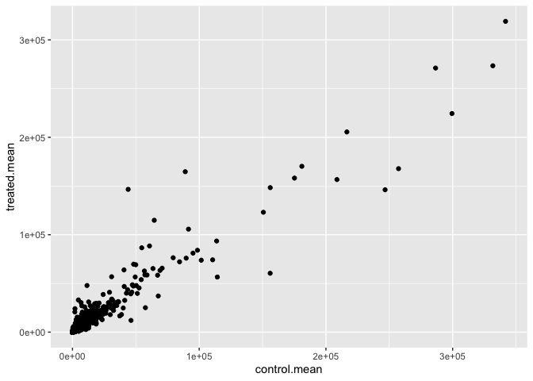
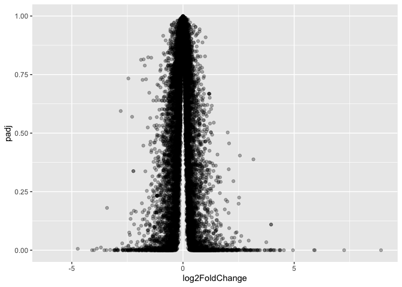
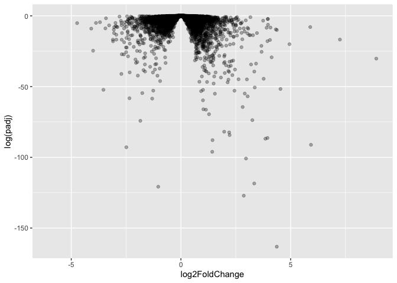
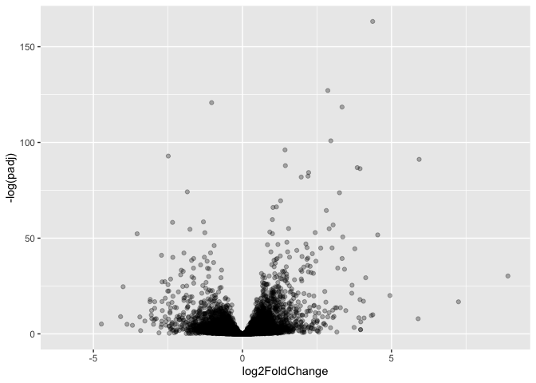
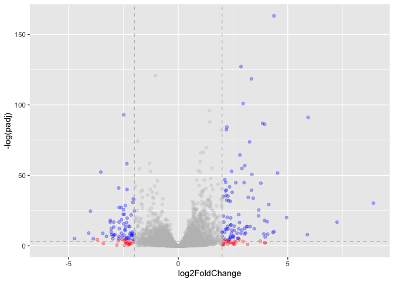

# Class 13: RNASeq analysis with DESeq
Erin Jang (PID: A17713992)

- [Background](#background)
- [Data Import](#data-import)
- [Toy differential gene expression](#toy-differential-gene-expression)
- [DESeq analysis](#deseq-analysis)
- [Volcano plot](#volcano-plot)
- [Save our results to date](#save-our-results-to-date)
- [Adding annotation data](#adding-annotation-data)
- [Pathway analysis](#pathway-analysis)
- [Save our annotated results](#save-our-annotated-results)

## Background

Today we’re going to do an RNA-seq analysis of a data set on the common
glucocorticoid steroid dexamethasone (dex), and we’ll use DESeq for this
analysis.

## Data Import

Let’s read the `count` data and `metadata` about this experiment setup
from the supplied CSV files:

``` r
counts <- read.csv("airway_scaledcounts.csv", row.names=1)
metadata <- read.csv("airway_metadata.csv")
```

Have a wee peak:

``` r
head(counts)
```

                    SRR1039508 SRR1039509 SRR1039512 SRR1039513 SRR1039516
    ENSG00000000003        723        486        904        445       1170
    ENSG00000000005          0          0          0          0          0
    ENSG00000000419        467        523        616        371        582
    ENSG00000000457        347        258        364        237        318
    ENSG00000000460         96         81         73         66        118
    ENSG00000000938          0          0          1          0          2
                    SRR1039517 SRR1039520 SRR1039521
    ENSG00000000003       1097        806        604
    ENSG00000000005          0          0          0
    ENSG00000000419        781        417        509
    ENSG00000000457        447        330        324
    ENSG00000000460         94        102         74
    ENSG00000000938          0          0          0

and the metadata that tells us what is actually in the columns of our
`counts` object:

``` r
head(metadata)
```

              id     dex celltype     geo_id
    1 SRR1039508 control   N61311 GSM1275862
    2 SRR1039509 treated   N61311 GSM1275863
    3 SRR1039512 control  N052611 GSM1275866
    4 SRR1039513 treated  N052611 GSM1275867
    5 SRR1039516 control  N080611 GSM1275870
    6 SRR1039517 treated  N080611 GSM1275871

> Q1. How many genes are in this dataset?

There are 38694 genes in this dataset.

> Q2. How many ‘control’ cell lines do we have?

``` r
sum(metadata$dex == "control")
```

    [1] 4

There are 4 control cell lines.

## Toy differential gene expression

``` r
ncol(counts)
```

    [1] 8

``` r
colnames(counts) == metadata$id
```

    [1] TRUE TRUE TRUE TRUE TRUE TRUE TRUE TRUE

``` r
metadata
```

              id     dex celltype     geo_id
    1 SRR1039508 control   N61311 GSM1275862
    2 SRR1039509 treated   N61311 GSM1275863
    3 SRR1039512 control  N052611 GSM1275866
    4 SRR1039513 treated  N052611 GSM1275867
    5 SRR1039516 control  N080611 GSM1275870
    6 SRR1039517 treated  N080611 GSM1275871
    7 SRR1039520 control  N061011 GSM1275874
    8 SRR1039521 treated  N061011 GSM1275875

- Find the “control” columns in our `counts` object
- Extract just the “control” column values for all genes
- Calculate the average value per gene in these “control” columns

> Q3. How would you make the above code in either approach more robust?
> Is there a function that could help here?

``` r
control.inds <- metadata$dex == "control"
control.counts <- counts[ , control.inds]
control.mean <- rowMeans(control.counts)
```

> Q4. Follow the same procedure for the treated samples (i.e. calculate
> the mean per gene across drug treated samples and assign to a labeled
> vector called treated.mean)

Now do the same for the “treated” columns. Then make a plot of
`control.mean` vs `treated.mean`.

``` r
treated.mean <- rowMeans(counts[, metadata$dex == "treated"])
```

For book-keeping let’s store these together as a new object called
`meancounts`

``` r
meancounts <- data.frame(control.mean, treated.mean)
head(meancounts)
```

                    control.mean treated.mean
    ENSG00000000003       900.75       658.00
    ENSG00000000005         0.00         0.00
    ENSG00000000419       520.50       546.00
    ENSG00000000457       339.75       316.50
    ENSG00000000460        97.25        78.75
    ENSG00000000938         0.75         0.00

> Q5 (a). Create a scatter plot showing the mean of the treated samples
> against the mean of the control samples.

``` r
plot(meancounts)
```


> Q5 (b).You could also use the ggplot2 package to make this figure
> producing the plot below. What geom\_?() function would you use for
> this plot?

``` r
library(ggplot2)
ggplot(meancounts, aes(control.mean, treated.mean)) +
  geom_point()
```



> Q6. Try plotting both axes on a log scale. What is the argument to
> plot() that allows you to do this?

Our count data is highly skewed and when we see a pattern like this plot
it SCREAMS log transform me!

``` r
plot(meancounts, log = "xy")
```

    Warning in xy.coords(x, y, xlabel, ylabel, log): 15032 x values <= 0 omitted
    from logarithmic plot

    Warning in xy.coords(x, y, xlabel, ylabel, log): 15281 y values <= 0 omitted
    from logarithmic plot


We most often use log2 transform for this kind of data in bioinformatics
because it makes my brain hurt less.

``` r
# Treated / Control

log2(20/20)
```

    [1] 0

``` r
log2(40/20)
```

    [1] 1

``` r
log2(10/20)
```

    [1] -1

``` r
log2(80/20)
```

    [1] 2

We call this little fraction the **“log2 fold change”** as it tells us
how much more or less gene expression we have in units of doubling, etc.

Let’s calculate the log2 fold change for our `treated.mean` and
`control.mean` counts and call this `log2fc`.

``` r
meancounts$log2fc <- log2( meancounts$treated.mean / meancounts$control.mean )
head(meancounts)
```

                    control.mean treated.mean      log2fc
    ENSG00000000003       900.75       658.00 -0.45303916
    ENSG00000000005         0.00         0.00         NaN
    ENSG00000000419       520.50       546.00  0.06900279
    ENSG00000000457       339.75       316.50 -0.10226805
    ENSG00000000460        97.25        78.75 -0.30441833
    ENSG00000000938         0.75         0.00        -Inf

``` r
zero.vals <- which(meancounts[,1:2]==0, arr.ind=TRUE)

to.rm <- unique(zero.vals[,1])
mycounts <- meancounts[-to.rm,]
head(mycounts)
```

                    control.mean treated.mean      log2fc
    ENSG00000000003       900.75       658.00 -0.45303916
    ENSG00000000419       520.50       546.00  0.06900279
    ENSG00000000457       339.75       316.50 -0.10226805
    ENSG00000000460        97.25        78.75 -0.30441833
    ENSG00000000971      5219.00      6687.50  0.35769358
    ENSG00000001036      2327.00      1785.75 -0.38194109

> Q7. What is the purpose of the arr.ind argument in the which()
> function call above? Why would we then take the first column of the
> output and need to call the unique() function?

The arr.ind=TRUE argument will return both the row and column indices
(i.e. positions) where there are TRUE values. This will tell us which
genes (rows) and samples (columns) have zero counts. We are going to
ignore any genes that have zero counts in any sample so we just focus on
the row answer. Calling unique() will ensure we don’t count any row
twice if it has zero entries in both samples.

A common “rule of thumb” threshold for calling a gene “up regulated” or
“down regulated” is a log2 fold-change value of +2 or -2 (or greater).

``` r
up.ind <- mycounts$log2fc > 2
down.ind <- mycounts$log2fc < (-2)
```

> Q8. Using the up.ind vector above can you determine how many up
> regulated genes we have at the greater than 2 fc level?

``` r
sum(up.ind == TRUE)
```

    [1] 250

There are 250 up regulated genes we have at the greater than 2 fc level.

> Q9. Using the down.ind vector above can you determine how many down
> regulated genes we have at the greater than 2 fc level?

``` r
sum(down.ind == TRUE)
```

    [1] 367

There are 367 up regulated genes we have at the greater than 2 fc level.

> Q10. Do you trust these results? Why or why not?

These results are not trustworthy. Fold change can be large without
being statistically significant (e.g. based on p-values). Nothing was
done yet to determine whether the differences we are seeing are
significant, so these current results are likely to be very misleading.

## DESeq analysis

Let’s do this analysis properly and not forget about the significance of
the differences.

For this we will use the **DESeq2** package.

``` r
library(DESeq2)
```

To run a DESeq analysis we need at least two inputs:

- `countData` i.e. are gene counts across different experiments
- `colData` i.e. our metadata about those count columns

``` r
dds <- DESeqDataSetFromMatrix(countData = counts,
                              colData = metadata,
                              design = ~dex)
```

    converting counts to integer mode

Now we can run the DESeq analysis pipeline using the `dds` object that
has all the inputs we need.

``` r
dds <- DESeq(dds)
```

    estimating size factors

    estimating dispersions

    gene-wise dispersion estimates

    mean-dispersion relationship

    final dispersion estimates

    fitting model and testing

``` r
res <- results(dds)
head(res)
```

    log2 fold change (MLE): dex treated vs control 
    Wald test p-value: dex treated vs control 
    DataFrame with 6 rows and 6 columns
                      baseMean log2FoldChange     lfcSE      stat    pvalue
                     <numeric>      <numeric> <numeric> <numeric> <numeric>
    ENSG00000000003 747.194195     -0.3507030  0.168246 -2.084470 0.0371175
    ENSG00000000005   0.000000             NA        NA        NA        NA
    ENSG00000000419 520.134160      0.2061078  0.101059  2.039475 0.0414026
    ENSG00000000457 322.664844      0.0245269  0.145145  0.168982 0.8658106
    ENSG00000000460  87.682625     -0.1471420  0.257007 -0.572521 0.5669691
    ENSG00000000938   0.319167     -1.7322890  3.493601 -0.495846 0.6200029
                         padj
                    <numeric>
    ENSG00000000003  0.163035
    ENSG00000000005        NA
    ENSG00000000419  0.176032
    ENSG00000000457  0.961694
    ENSG00000000460  0.815849
    ENSG00000000938        NA

## Volcano plot

This is a ubiquitous and common visualization for this type of data that
puts the log2 foldchange and the adjusted p-value together in one plot
that people can get insight for what is going on in the whole dataset.

``` r
ggplot(res) +
  aes(log2FoldChange, padj) +
  geom_point(alpha = 0.3)
```

    Warning: Removed 23549 rows containing missing values or values outside the scale range
    (`geom_point()`).



That plot is not very useful because we don’t care about genes with high
p-values, we want the very low values below our alpha threshold
(e.g. 0.01).

Let’s log the y=aixs so we can see these genes/points more clearly

``` r
ggplot(res) +
  aes(log2FoldChange, log(padj)) +
  geom_point(alpha = 0.3)
```

    Warning: Removed 23549 rows containing missing values or values outside the scale range
    (`geom_point()`).



We need to flip the y-axis so our “volcano” is not upside down.

``` r
ggplot(res) +
  aes(log2FoldChange, -log(padj)) +
  geom_point(alpha = 0.3)
```

    Warning: Removed 23549 rows containing missing values or values outside the scale range
    (`geom_point()`).



> Q. Add annotation to this volcano plot including the log2 fold-change
> thresholds of +2 and -2 and the p-value threshold of 0.05. Also color
> up just the genes that meet both these thresholds. These are the ones
> we will focus on next day!

``` r
mycols <- rep("gray", nrow(res))
mycols[abs(res$log2FoldChange) > 2] <- "red"

inds <- (res$padj < 0.01) & (abs(res$log2FoldChange) > 2)
mycols[inds] <- "blue"

ggplot(res) +
  aes(log2FoldChange, -log(padj), color = mycols) +
  geom_point(alpha = 0.3) +
  scale_color_identity() +
  geom_vline(xintercept = c(-2, 2), color = "gray", linetype = 2) +
  geom_hline(yintercept = -log(0.05), color = "gray", linetype = 2) +
  theme(legend.position = "none")
```

    Warning: Removed 23549 rows containing missing values or values outside the scale range
    (`geom_point()`).



## Save our results to date

``` r
write.csv(res, file = "myresults.csv")
```

## Adding annotation data

We need to “map” or “translate” our ENSEMBLE gene identifiers in our
results object to date to the identifiers used in different databases we
want to use for leaning more about these genes.

For this we will use a couple of BioConductor packages that we can
install with: `BiocManager::install("AnnotationDbi")` and
`BiocManager::install("org.Hs.eg.db")`.

``` r
library("AnnotationDbi")
library("org.Hs.eg.db")
```

We can see the columns in `org.Hs.eg.db` that list the different
databases we can map between:

``` r
columns(org.Hs.eg.db)
```

     [1] "ACCNUM"       "ALIAS"        "ENSEMBL"      "ENSEMBLPROT"  "ENSEMBLTRANS"
     [6] "ENTREZID"     "ENZYME"       "EVIDENCE"     "EVIDENCEALL"  "GENENAME"    
    [11] "GENETYPE"     "GO"           "GOALL"        "IPI"          "MAP"         
    [16] "OMIM"         "ONTOLOGY"     "ONTOLOGYALL"  "PATH"         "PFAM"        
    [21] "PMID"         "PROSITE"      "REFSEQ"       "SYMBOL"       "UCSCKG"      
    [26] "UNIPROT"     

We can now use the `mapIds()` function to map between these different
database identifier formats:

``` r
res$symbol <- mapIds(org.Hs.eg.db,
       keys = row.names(res),
       keytype="ENSEMBL",
       column="SYMBOL")
```

    'select()' returned 1:many mapping between keys and columns

> Q. Can you map to “GENENAME” and add as a new “column” to our `res`
> object?

``` r
res$genename <- mapIds(org.Hs.eg.db,
       keys = row.names(res),
       keytype="ENSEMBL",
       column="GENENAME")
```

    'select()' returned 1:many mapping between keys and columns

> Q. Add “ENTREZID” as `res$entrez`?

``` r
res$entrez <- mapIds(org.Hs.eg.db,
       keys = row.names(res),
       keytype="ENSEMBL",
       column="ENTREZID")
```

    'select()' returned 1:many mapping between keys and columns

``` r
head(res)
```

    log2 fold change (MLE): dex treated vs control 
    Wald test p-value: dex treated vs control 
    DataFrame with 6 rows and 9 columns
                      baseMean log2FoldChange     lfcSE      stat    pvalue
                     <numeric>      <numeric> <numeric> <numeric> <numeric>
    ENSG00000000003 747.194195     -0.3507030  0.168246 -2.084470 0.0371175
    ENSG00000000005   0.000000             NA        NA        NA        NA
    ENSG00000000419 520.134160      0.2061078  0.101059  2.039475 0.0414026
    ENSG00000000457 322.664844      0.0245269  0.145145  0.168982 0.8658106
    ENSG00000000460  87.682625     -0.1471420  0.257007 -0.572521 0.5669691
    ENSG00000000938   0.319167     -1.7322890  3.493601 -0.495846 0.6200029
                         padj      symbol               genename      entrez
                    <numeric> <character>            <character> <character>
    ENSG00000000003  0.163035      TSPAN6          tetraspanin 6        7105
    ENSG00000000005        NA        TNMD            tenomodulin       64102
    ENSG00000000419  0.176032        DPM1 dolichyl-phosphate m..        8813
    ENSG00000000457  0.961694       SCYL3 SCY1 like pseudokina..       57147
    ENSG00000000460  0.815849       FIRRM FIGNL1 interacting r..       55732
    ENSG00000000938        NA         FGR FGR proto-oncogene, ..        2268

## Pathway analysis

Now we have our annotated results with their log2 fold-change and
p-values we can figure out which biological pathways and process these
genes are involved with.

We will use the **gage** and **pathview** packages for this step and we
can install them with:
`BiocManager::install( c("pathview", "gage", "gageData) )`

``` r
library(gage)
library(gageData)
library(pathview)
```

Let’s have a wee peek at gageData

``` r
data(kegg.sets.hs)
head(kegg.sets.hs, 2)
```

    $`hsa00232 Caffeine metabolism`
    [1] "10"   "1544" "1548" "1549" "1553" "7498" "9"   

    $`hsa00983 Drug metabolism - other enzymes`
     [1] "10"     "1066"   "10720"  "10941"  "151531" "1548"   "1549"   "1551"  
     [9] "1553"   "1576"   "1577"   "1806"   "1807"   "1890"   "221223" "2990"  
    [17] "3251"   "3614"   "3615"   "3704"   "51733"  "54490"  "54575"  "54576" 
    [25] "54577"  "54578"  "54579"  "54600"  "54657"  "54658"  "54659"  "54963" 
    [33] "574537" "64816"  "7083"   "7084"   "7172"   "7363"   "7364"   "7365"  
    [41] "7366"   "7367"   "7371"   "7372"   "7378"   "7498"   "79799"  "83549" 
    [49] "8824"   "8833"   "9"      "978"   

We need a vector of importance (e.g. fold-change values) that has gene
ids as names. These names need to be in the correct format (using the
correct database format for the IDs).

``` r
x <- c(10, 9, 7)
names(x) <- c("alice", "chandea", "barry")
x
```

      alice chandea   barry 
         10       9       7 

``` r
names(x)
```

    [1] "alice"   "chandea" "barry"  

Here we will make a wee input vector called `foldchanges` that has
“entrez” ids as names.

``` r
foldchanges <- res$log2FoldChange
names(foldchanges) <- res$entrez
```

Now we can run `gage()` to do our pathway analysis

``` r
keggres = gage(foldchanges, gsets=kegg.sets.hs)
```

``` r
attributes(keggres)
```

    $names
    [1] "greater" "less"    "stats"  

The top three overlapping pathways from KEGG

``` r
head(keggres$less, 3)
```

                                          p.geomean stat.mean        p.val
    hsa05332 Graft-versus-host disease 0.0004250461 -3.473346 0.0004250461
    hsa04940 Type I diabetes mellitus  0.0017820293 -3.002352 0.0017820293
    hsa05310 Asthma                    0.0020045888 -3.009050 0.0020045888
                                            q.val set.size         exp1
    hsa05332 Graft-versus-host disease 0.09053483       40 0.0004250461
    hsa04940 Type I diabetes mellitus  0.14232581       42 0.0017820293
    hsa05310 Asthma                    0.14232581       29 0.0020045888

Now we can use the **pathview** package with the found KEGG pathway IDs
(e.g. “hsa05310” for the Asthma pathway) to make a pathway figure
showing our Differential Expressed Genes (DEGs)

``` r
pathview(gene.data=foldchanges, pathway.id="hsa05310")
```

    'select()' returned 1:1 mapping between keys and columns

    Info: Working in directory /Users/erinjang/Desktop/BIMM143/bimm143_git/class13

    Info: Writing image file hsa05310.pathview.png


> Q12. Can you do the same pathway figures as the one above with the top
> 2 regulated pathways?

## Save our annotated results

``` r
write.csv(res, file = "myresults_annotated.csv")
```
