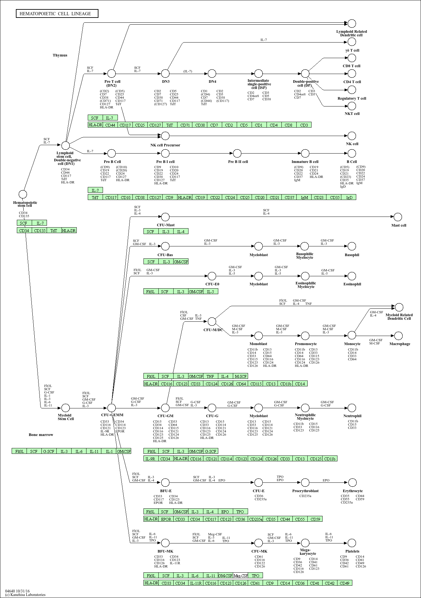
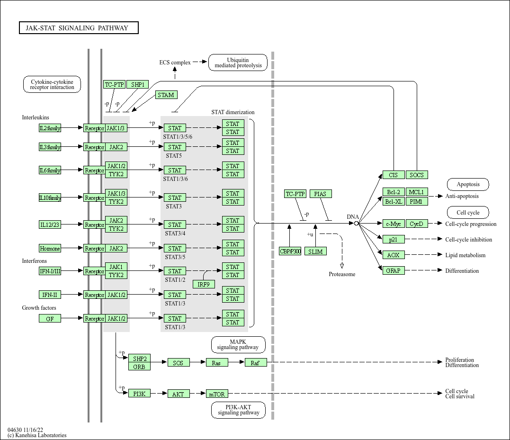
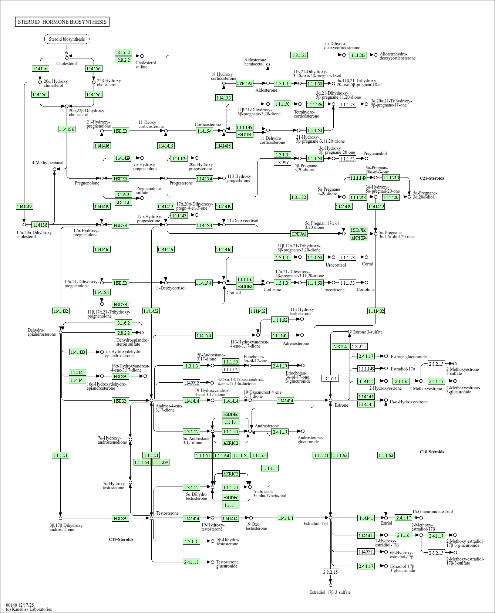
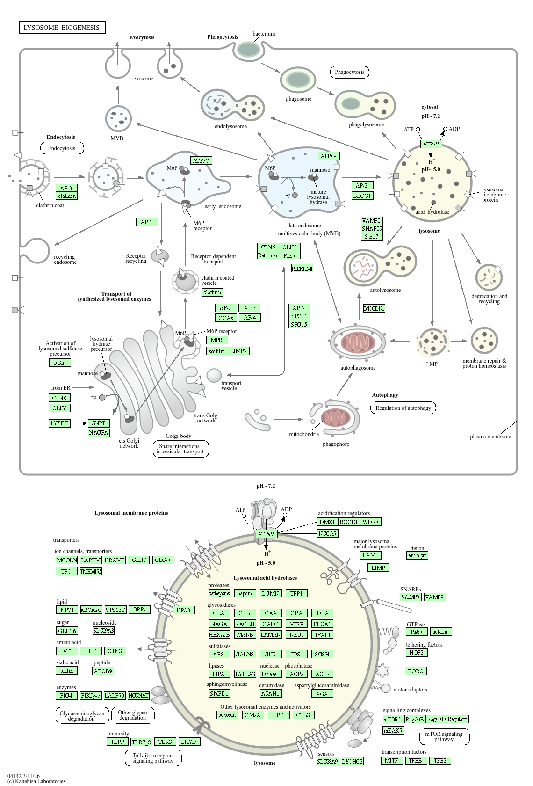
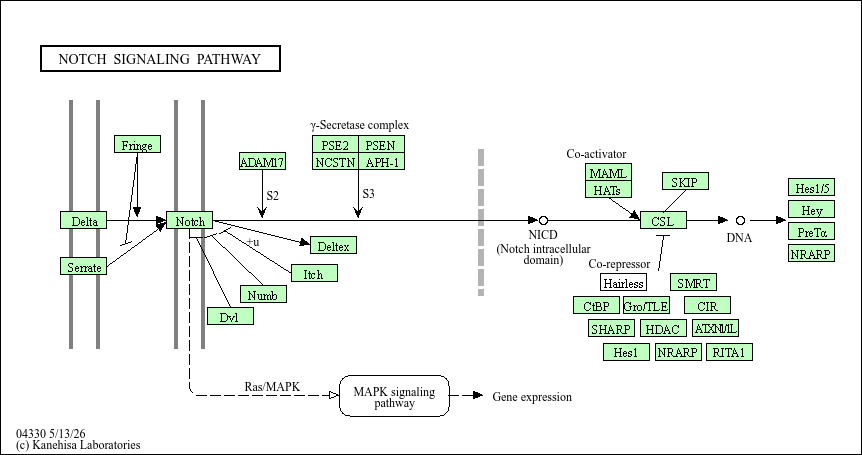
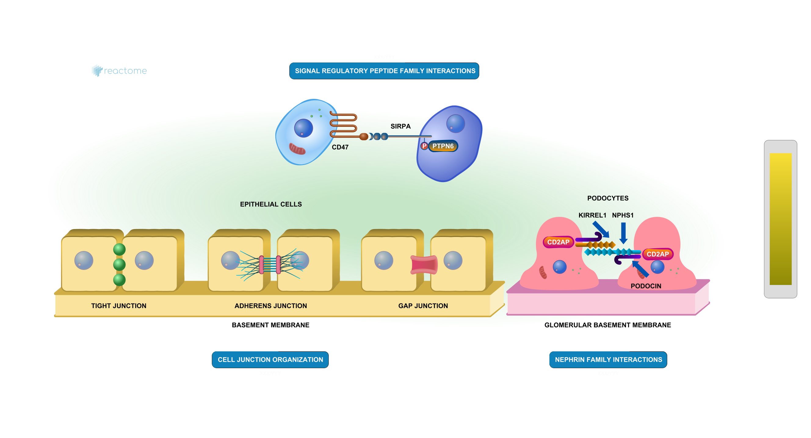

## Background

The authors report on differential analysis of lung fibroblasts in response to loss of the developmental transcription factor HOXA1. Their results and others indicate that HOXA1 is required for lung fibroblast and HeLa cell cycle progression. In particular their analysis show that "loss of HOXA1 results in significant expression level changes in thousands of individual transcripts, along with isoform switching events in key regulators of the cell cycle". 

## Data Import
Read counts and metdata CSV files

```{r import, message = FALSE}
library(DESeq2)

metaFile <- "GSE37704_metadata.csv"
countFile <- "GSE37704_featurecounts.csv"
```

## Setup DESeq object

```{r}
colData = read.csv(metaFile, row.names=1)
head(colData)
```

```{r}
countData = read.csv(countFile, row.names=1)
head(countData)
```

> Q. Complete the code below to remove the troublesome first column from countData

```{r}
# Note we need to remove the odd first $length col
countData <- as.matrix(countData[, -1])
head(countData)
```

> Q. Complete the code below to filter countData to exclude genes (i.e. rows) where we have 0 read count across all samples (i.e. columns). Tip: What will rowSums() of countData return and how could you use it in this context?

```{r}
countData <- countData[rowSums(countData) != 0, ]
head(countData)
```

```{r}
dim(countData)
```

## Run DESeq analysis pipeline

```{r}
dds = DESeqDataSetFromMatrix(countData = countData,
                             colData = colData,
                             design = ~condition)
dds = DESeq(dds)
dds
```

## Extract the results
Big table with log2 fold changes and p-values 

```{r}
res = results(dds)
head(res)
```

```{r}
summary(res)
```

## Data visualization
Volcano Plot

```{r}
library(ggplot2)

ggplot(res) +
  aes(log2FoldChange, -log(padj)) +
  geom_point(alpha = 0.3)
```

> Q. Improve this plot by completing the below code, which adds color, axis labels and cutoff lines:

```{r}
# Make a color vector for all genes
mycols <- rep("gray", nrow(res) )

# Color blue the genes with fold change above 2
mycols[ abs(res$log2FoldChange) > 2 ] <- "blue"

# Color gray those with adjusted p-value more than 0.01
mycols[ res$padj > 0.05 ] <- "gray"

ggplot(res) +
  aes(log2FoldChange, -log(padj)) +
  geom_point(col = mycols) +
  xlab("Log2(FoldChange)") +
  ylab("-Log(P-value)") +
  geom_vline(xintercept = c(-2,2), col = "red") +
  geom_hline(yintercept = -log(0.5), col = "red")
```

## Add Annotation data
Add gene symbol and entrez ids

> Q. Use the mapIDs() function multiple times to add SYMBOL, ENTREZID and GENENAME annotation to our results by completing the code below.

```{r}
library("AnnotationDbi")
library("org.Hs.eg.db")

columns(org.Hs.eg.db)

res$symbol = mapIds(org.Hs.eg.db,
                    keys=row.names(res), 
                    keytype="ENSEMBL",
                    column="SYMBOL",
                    multiVals="first")

res$entrez = mapIds(org.Hs.eg.db,
                    keys=row.names(res),
                    keytype="ENSEMBL",
                    column="ENTREZID",
                    multiVals="first")

res$genename =   mapIds(org.Hs.eg.db,
                    keys=row.names(res),
                    keytype="ENSEMBL",
                    column="GENENAME",
                    multiVals="first")

head(res, 10)
```

> Q. Finally for this section let's reorder these results by adjusted p-value and save them to a CSV file in your current project directory.

```{r}
res = res[order(res$pvalue),]
write.csv(res, file="deseq_results.csv")
```

## Pathway analysis
KEGG, GO, and REACTOME 

```{r, message = FALSE}
library(pathview)
library(gage)
library(gageData)

data(kegg.sets.hs)
data(sigmet.idx.hs)

# Focus on signaling and metabolic pathways only
kegg.sets.hs = kegg.sets.hs[sigmet.idx.hs]

# Examine the first 3 pathways
head(kegg.sets.hs, 3)
```

```{r}
foldchanges = res$log2FoldChange
names(foldchanges) = res$entrez
head(foldchanges)
```

```{r}
# Get the results
keggres = gage(foldchanges, gsets=kegg.sets.hs)
```

```{r}
attributes(keggres)
```

```{r}
# Look at the first few down (less) pathways
head(keggres$less)
```

```{r}
pathview(gene.data=foldchanges, pathway.id="hsa04110")
```


```{r, message = FALSE}
# A different PDF based output of the same data
pathview(gene.data=foldchanges, pathway.id="hsa04110", kegg.native=FALSE)
```

```{r}
## Focus on top 5 upregulated pathways here for demo purposes only
keggrespathways <- rownames(keggres$greater)[1:5]

# Extract the 8 character long IDs part of each string
keggresids = substr(keggrespathways, start=1, stop=8)
keggresids
```

```{r, message = FALSE}
pathview(gene.data=foldchanges, pathway.id=keggresids, species="hsa")
```











> Q. Can you do the same procedure as above to plot the pathview figures for the top 5 down-regulated pathways?

```{r}
keggrespathwaysdown <- rownames(keggres$less)[1:5]

# Extract the 8 character long IDs part of each string
keggresidsdown = substr(keggrespathwaysdown, start=1, stop=8)
keggresidsdown
```

```{r, message = FALSE}
pathview(gene.data=foldchanges, pathway.id=keggresidsdown, species="hsa")
```

### Gene Ontology (GO)

```{r}
data(go.sets.hs)
data(go.subs.hs)

# Focus on Biological Process subset of GO
gobpsets = go.sets.hs[go.subs.hs$BP]

gobpres = gage(foldchanges, gsets=gobpsets)

lapply(gobpres, head)
```

### Reactome Analysis

There is an R package for this analysis and a new-ish website that 

```{r}
sig_genes <- res[res$padj <= 0.05 & !is.na(res$padj), "symbol"]
print(paste("Total number of significant genes:", length(sig_genes)))
```

Example image of important pathway from Reactome Analysis website:



```{r}
write.table(sig_genes, file="significant_genes.txt", row.names=FALSE, col.names=FALSE, quote=FALSE)
```

> Q: What pathway has the most significant “Entities p-value”? Do the most significant pathways listed match your previous KEGG results? What factors could cause differences between the two methods?

The "Cell Cycle" pathway has the most significant "Entities p-value". The most significant pathways listed does not seem to match my previous KEGG results. This may because the two methods, Reactome and KEGG, organize biology differently. KEGG is known to group genes into broader metabolic and signaling pathways, whereas Reactome is known to separate processes into more detailed sub-steps. Reactome calculates with the overlap between the number of submitted genes and its pathway entities. KEGG calculates enrichment depending on its own gene sets. 

## Save our results

```{r}
write.csv(res, file="my_results.csv")
```

